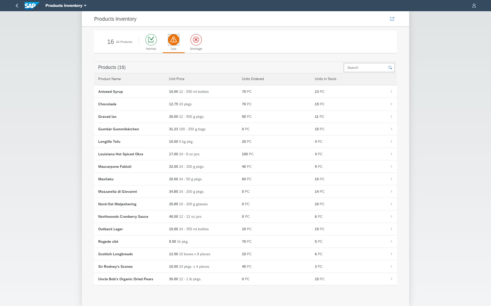
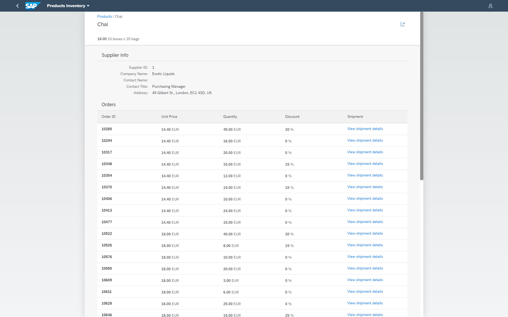

# DEV161 - Extend SAP S/4HANA with a Custom UI on SAP Cloud Platform

## Description

This repository contains the material for the SAP TechEd 2020 session called **DEV161 - Extend SAP S/4HANA with a Custom UI on SAP Cloud Platform**.

## Overview

This session introduces attendees to the end-to-end development flow of an SAP Fiori freestyle application.

Working in the IT department of your company, your mission, should you choose to accept it, is to develop an app that will help procurement identify the inventory levels of your company's products, and which orders will be impacted.

After a bit of thinking, you decided that the best approach would be to create an SAP Fiori freestyle app that follows the Worklist floorplan. Its main view will include a list of products, their inventory level, and the number of units per order. The details page will include the supplier information, and a list of orders that include the product.

At the end of the session, your application will look like this:

| Main View (Worklist) | Details View (Object)|
|:-----|:----------|
|     |     |

## Requirements

The requirements to follow the exercises in this repository are:
- Get a free trial account on SAP Cloud Platform; see this [tutorial](https://developers.sap.com/tutorials/hcp-create-trial-account.html).
- Create the *Northwind* destination within the Cloud Foundry environment; see this [tutorial](https://developers.sap.com/tutorials/cp-cf-create-destination.html).
- Enable SAP Business Application Studio for development; see this [tutorial](https://developers.sap.com/tutorials/appstudio-onboarding.html).
- Be excited about the power of SAP technologies to make your developer life easier.

## Exercises

- [Getting Started](exercises/ex0/)
    - [Exercise 0.1 - Customization](exercises/ex1#exercise-11-sub-exercise-1-description)
    - [Exercise 0.2 - Tips & Tricks (dotfiles, ...)](exercises/ex1#exercise-11-sub-exercise-1-description)
- [Exercise 1 - Create SAP Fiori Dev Space](exercises/ex1/)
    - [Exercise 1.1 - Logon](exercises/ex1#exercise-11---Logon)
    - [Exercise 1.2 - Create Dev Space](exercises/ex1#exercise-12---Create-Dev-Space)
    - [Exercise 1.3 - Launch the Development Environment](exercises/ex1#exercise-13---Launch-the-Development-Environment)
    - [Exercise 1.4 - Preparations for the next exercises](exercises/ex1#exercise-14---Preparations-for-the-next-exercises)
- [Exercise 2 - Customization](exercises/ex2/)
    - [Exercise 2.1 - Customization](exercises/ex2#exercise-21-sub-exercise-1-description)
    - [Exercise 2.2 - Exercise 2 Sub Exercise 2 Description(dotfiles, ...)](exercises/ex2#exercise-22-sub-exercise-2-description)
- [Exercise 3 - Project Setup](exercises/ex3/)
    - [Exercise 3.1 - Create a New Application from Template](exercises/ex3#exercise-31---Launch-Yeoman-UI-Generator)
    - [Exercise 3.2 - Install SAP Fiori tools for SAP Fiori freestyle app development](exercises/ex3#exercise-31---Install-SAP-Fiori-tools-for-SAP-Fiori-freestyle-app-development)
    - [Exercise 3.3 - Create Project Using SAP Fiori Worklist Application template](exercises/ex3#exercise-31---Create-Project-Using-SAP-Fiori-Worklist-Application-template)
    - [Exercise 3.4 - Open the Project's Workspace](exercises/ex3#exercise-31---Open-the-Project's-Workspace)
- [Exercise 4 - Test the Application with Mock Server](exercises/ex4/)
    - [Exercise 4.1 - Setup the Project to Auto-Refresh](exercises/ex4#exercise-41---Setup-the-Project-to-Auto-Refresh)
    - [Exercise 4.2 - Run the Application with Auto-Generated Mock Data](exercises/ex4#exercise-42---Run-the-Application-with-Auto-Generated-Mock-Data)
    - [Exercise 4.3 - Run the app with User Provided Mock Data](exercises/ex2#Exercise-43---Run-the-Application-with-User-Provided-Mock-Data)
- [Exercise 5 - Add Data Filters](exercises/ex5/)
    - [Exercise 5.1 - UI Modifications](exercises/ex5#exercise-51---UI-Modifications)
    - [Exercise 5.2 - Logic Modifications (Controller)](exercises/ex5#exercise-52---Logic-Modifications-(Controller))
    - [Exercise 5.3 - Run the App Locally in the Dev Space](exercises/ex5#exercise-53---Run-the-App-Locally-in-the-Dev-Space)
- [Exercise 6 - Connect to Backend](exercises/ex6/)
    - [Exercise 6.1 - Modify ui5.yaml](exercises/ex6#exercise-61---Modify-ui5yaml)
    - [Exercise 6.2 - Modify package.json](exercises/ex6#exercise-62---Modify-packagejson)
    - [Exercise 6.3 - Exercise 6.3 Modify webapp/manifest.json](exercises/ex6#exercise-63---Modify-webapp/manifestjson)
    - [Exercise 6.4 - Run the App Locally in the Dev Space](exercises/ex6#exercise-64---Run-the-App-Locally-in-the-Dev-Space)
- [Exercise 7 - Run the app on CF](exercises/ex7/)
    - [Exercise 7.1 - Configure the App to Use the CF Runtime](exercises/ex7#exercise-71---Configure-the-App-to-Use-the-CF-Runtime)
    - [Exercise 7.2 - Build for the CF Runtime](exercises/ex7#exercise-72-Build-for-the-CF-Runtime)
    - [Exercise 7.3 - Log in to CF](exercises/ex7#exercise-73---Log-in-to-CF)
    - [Exercise 7.4 - Deploy to CF](exercises/ex7#exercise-74---Deploy-to-CF)
    - [Exercise 7.5 - Run the App on CF](exercises/ex7#exercise-75---Run-the-App-on-CF)
- [Exercise 8 - Apply CI/CD to SAP Fiori Development on SAP Cloud Platform - GitHub Setup](exercises/ex8/)
    - [Exercise 8.1 - Create a GitHub Project](exercises/ex8#exercise-81-Create-a-GitHub-Project)
    - [Exercise 8.2 - Create Personal Access Token for GitHub](exercises/ex8#exercise-82-Create-Personal-Access-Token-for-GitHub)
    - [Exercise 8.3 - Add Git repository to Fiori project](exercises/ex8#exercise-83-Add-Git-repository-to-Fiori-project)
- [Exercise 9 - Apply CI/CD to SAP Fiori Development on SAP Cloud Platform - CICD Setup](exercises/ex9/)
    - [Exercise 9.1 - Enable SAP CP Continuous Integration and Delivery](exercises/ex9#exercise-91-Enable-SAP-CP-Contunuous-Integration-and-Delivery)
    - [Exercise 9.2 - Configure Credentials in SAP CP Continuous Integration and Delivery](exercises/ex9#exercise-92-Configure-Credentials-in-SAP-CP-Continuous-Integration-and-Delivery)
    - [Exercise 9.3 - Configure a job in SAP Cloud Platform Continuous Integration and Delivery](exercises/ex9#exercise-93-Configure-a-job-in-SAP-Cloud-Platform-Continuous-Integration-and-Delivery)
- [Exercise 10 - Apply CI/CD to SAP Fiori Development on SAP Cloud Platform - App Modification](exercises/ex10/)
    - [Exercise 10.1 - Make a Change in the Project](exercises/ex10#exercise-101Make-a-Change-in-the-Project)
- [Exercise 11 - Apply CI/CD to SAP Fiori Development on SAP Cloud Platform - CICD Monitoring](exercises/ex11/)
    - [Exercise 11.1 - Verify Build Success in SAP CP Continuous Integration and Delivery](exercises/ex11#exercise-111-Verify-Build-Success-in-SAP-CP-Continuous-Integration-and-Delivery)
    - [Exercise 11.2 - Access the Application](exercises/ex11#exercise-112-Access-the-Application)
- [Exercise 12 - Add Columns to Worklist](exercises/ex12/)
    - [Exercise 12.1 - Add Columns to Worklist](exercises/ex12#exercise-121---Add-Columns-to-Worklist)
    - [Exercise 12.2 - Run the App Locally in the Dev Space](exercises/ex12#exercise-122---Run-the-App-Locally-in-the-Dev-Space)
- [Exercise 13 - Add Supplier Info to Details Page](exercises/ex13/)
    - [Exercise 13.1 - UI Modifications](exercises/ex13#exercise-131---UI-Modifications)
    - [Exercise 13.2 - Run the App Locally in the Dev Space](exercises/ex13#exercise-132---Run-the-App-Locally-in-the-Dev-Space)
    - [Exercise 13.3 - Logic Modifications (Controller)](exercises/ex13#exercise-133---Logic-Modifications-(Controller))
    - [Exercise 13.4 - Run the App Locally in the Dev Space](exercises/ex13#exercise-134---Run-the-App-Locally-in-the-Dev-Space)
- [Exercise 14 - Add Breadcrumbs to the Details Page](exercises/ex14/)
    - [Exercise 14.1 - UI Modifications - Breadcrumbs](exercises/ex14#exercise-141---UI-Modifications---Breadcrumbs)
    - [Exercise 14.2 - Run the App Locally in the Dev Space](exercises/ex14#exercise-142---Run-the-App-Locally-in-the-Dev-Space)
- [Exercise 15 - Add Orders List to Details Page](exercises/ex15/)
    - [Exercise 15.1 - UI Modifications - Orders List](exercises/ex15#exercise-151---UI-Modifications---Orders-List)
    - [Exercise 15.2 - Formatter Modifications](exercises/ex15#exercise-152---Formatter-Modifications)
    - [Exercise 15.3 - Run the App Locally in the Dev Space](exercises/ex15#exercise-153---Run-the-App-Locally-in-the-Dev-Space)
- [Exercise 16 - Useful CF Commands](exercises/ex16/)
    - [Exercise 16.0 - Preparations](exercises/ex16#exercise-160---Preparations)
    - [Exercise 16.1 - cf help](exercises/ex16#Exercise-161---cf-help)
    - [Exercise 16.2 - cf logout](exercises/ex16#Exercise-162---cf-logout)
    - [Exercise 16.3 - cf html5-list](exercises/ex16#Exercise-163---cf-html5-list)
    - [Exercise 16.4 - cf mtas](exercises/ex16#Exercise-164---cf-mtas)
    - [Exercise 16.5 - cf undeploy](exercises/ex16#Exercise-165---cf-undeploy)
    - [Exercise 16.6 - cf deploy](exercises/ex16#Exercise-166---cf-deploy)
    - [Exercise 16.7 - Run the App on CF](exercises/ex16#Exercise-167---Run-the-App-on-CF)

 Start the exercises [here](exercises/ex1/).  

## How to obtain support

Support for the content in this repository is available during the actual time of the online session for which this content has been designed. Otherwise, you may request support via the [Issues](../../issues) tab.

## License
Copyright (c) 2020 SAP SE or an SAP affiliate company. All rights reserved. This file is licensed under the Apache Software License, version 2.0 except as noted otherwise in the [LICENSE](LICENSES/Apache-2.0.txt) file.
