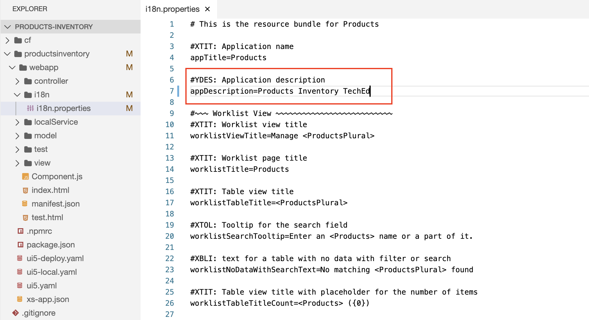

# Exercise 10 - Connect Your Project to SAP Cloud Platform Continuous Integration and Delivery - Update Internationalization (i18n)

In this exercise, we will create a project in a public GitHub repository in which to store your source code, enable SAP Cloud Platform Continuous Integration and Delivery, and configure and run a predefined continuous integration and delivery (CI/CD) pipeline that automatically tests, builds, and deploys your code changes.

## Exercise 10.7 Make a Change in Your Project

After completing these steps, you will have made a change in your project and thereby triggered SAP Cloud Platform Continuos Integration and Delivery.

1. In your development space in SAP Business Application Studio, make a small change (for example, in the `productsinventory/webapp/i18n/i18n.properties` file, change the `appDescription`).

2. Open the **Source Control: Git**.

3. Stage the changed file to the commit.

4. Specify your commit message. 

5. Commit the change.

6. Push the changes to GitHub.

This push event automatically triggers SAP Cloud Platform Continuous Integration and Delivery.

## Summary

You've created a project in GitHub to store your source code and successfully configured and run a predefined continuous integration and delivery pipeline that automatically builds, tests and deploys your code changes.

Continue to - [Exercise 11 - Useful CF Commands](../ex11/README.md).