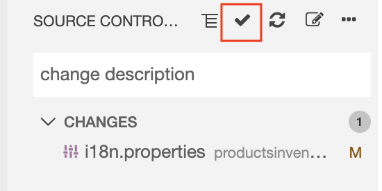

# Exercise 10 - Connect Your Project to SAP Cloud Platform Continuous Integration and Delivery - Update Internationalization (i18n)

In this exercise, you will make a simple change to your app and push the updated code to GitHub. This will trigger the pipeline that you configured previously. 

It is recommended that immediately after you push the code changes to GitHub, you proceed with the next exercise to create a project in a public GitHub repository in which you'll store the app's source code, enable SAP Cloud Platform Continuous Integration and Delivery, and configure and run a predefined continuous integration and delivery (CI/CD) pipeline that automatically tests, builds, and deploys your code changes.

## Exercise 10.1 - Make a Change in Your Project

After completing these steps, you will have made a change in your project and thereby triggered SAP Cloud Platform Continuos Integration and Delivery. The change is to replace all hard-coded app strings with internationalization (i18n) strings.

1. Expand the *webapp > i18n* folder, and click the *i18n.properties* file to open it.
        

2. Click [here](data/i18n.properties?raw=true) to access the `i18n.properties` file. This file contains all the changes you need to internationalize the app's hard-coded strings.
    >When working with github, if you want to open a link in a new tab, press [CTRL] and click the link.

3. Press [CTRL] + [A] and then [CTRL] + [C] to copy the file's content to the clipboard.

4. Go back to SAP Business Application Studio and replace the content of the `i18n.properties` file with the content of the `i18n.properties` file from github. Press [CTRL] + [A] to select the file's content in SAP Business Application Studio, press [DELETE], and then press [CTRL] + [V] to paste the content of the file from the clipboard.

2. Open the *Source Control: Git* view.
        

3. Stage the changed file.
        

4. Specify your commit message. 
        

5. Commit the change.
        

6. Push the changes to GitHub. This push event automatically triggers SAP Cloud Platform Continuous Integration and Delivery.
        

## Summary

You've created a project in GitHub to store your source code and successfully configured and run a predefined continuous integration and delivery pipeline that automatically builds, tests and deploys your code changes.

Continue to - [Exercise 11 - Connect Your Project to SAP Cloud Platform Continuous Integration and - Pipeline Monitoring and Results](../ex11/README.md).