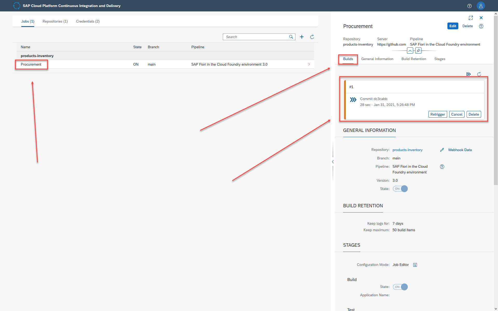
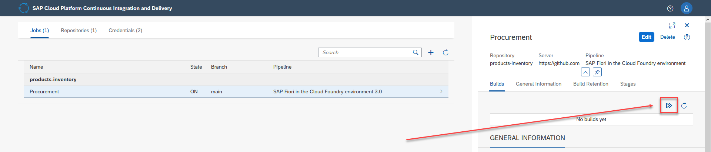
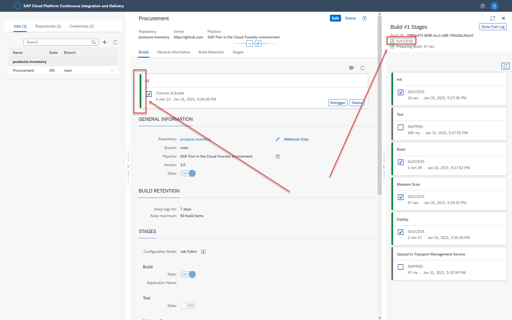

# Exercise 11 - Connect Your Project to SAP Continuous Integration and Delivery - Pipeline Monitoring and Results

In exercises 8 - 11, you will create a project in a public GitHub repository to which you'll store your source code, enable SAP Continuous Integration and Delivery, and configure and run a predefined continuous integration and delivery (CI/CD) pipeline that automatically tests, builds, and deploys your code changes.

In this exercise, you will monitor the running build of the predefined continuous integration and delivery (CI/CD) pipeline that you triggered previously by pushing code changes to the project's GitHub repository. The running build automatically tests, builds, and deploys your code changes.

## Exercise 11.1 - Verify the Success of Your Build

After completing these steps, you will have monitored the outcome of your job in SAP Continuous Integration and Delivery.

1. In the *Jobs* tab in SAP Continuous Integration and Delivery, click the *Procurement* job and verify that a new tile appears in the *Builds* view. This tile should be marked as running.
        

    >If no new tile appears after a few 10s of seconds, click *Trigger Build* to trigger the job manually.
    >    

2. Click the new tile to monitor the progress of the job. The specific job build view opens. The view presents the current state of the job build. You can click a specific stage of the job build to view its log. 
        

    >The view is refreshed approximately every 10 seconds. If it does not, you can click the refresh icon.

3. Wait until the job has finished, and verify that the build tile is marked as successful.
        

## Exercise 11.2 - Access the Deployed Application.

After completing these steps, you will have accessed your deployed application through the SAP BTP Cockpit.

1. To see the results of the deployment to Cloud Foundry, in the *SAP BTP Cockpit*, go to the Cloud Foundry space to which you deployed the app, and click the *Applications* tab. Click *products-inventory-router*, and then click the link in the *Application Routes* section.
         

2. Verify that the deployed application is running and showing the change that you've made.
         

## Summary

Nice job!!!

You created a repository in GitHub to store your source code and used the repository as a source code management system. You successfully configured a predefined continuous integration and delivery pipeline, and by pushing a code change of your app to your GitHub repostiroy, you triggered a build of the pipeline that automatically builds, tests, and deploys your app to your space in SAP BTP, Cloud Foundry runtime.

Continue to - [Exercise 12 - Add Columns to Worklist](../ex12/README.md).
