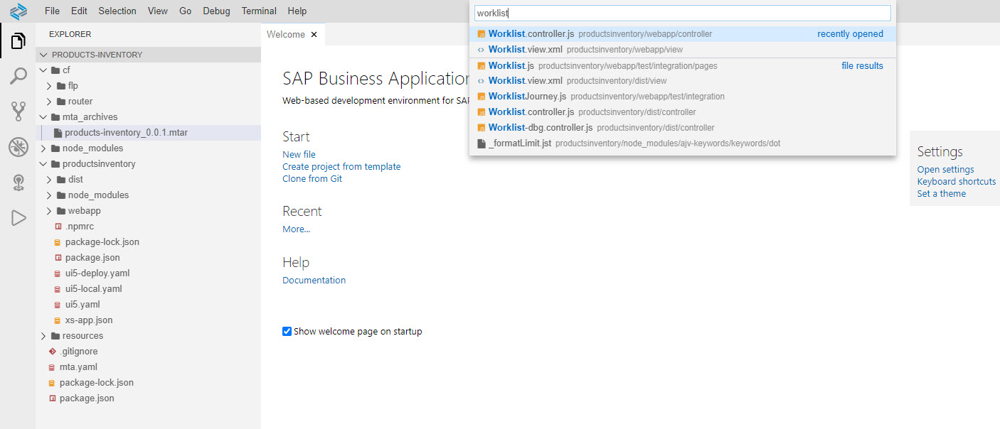
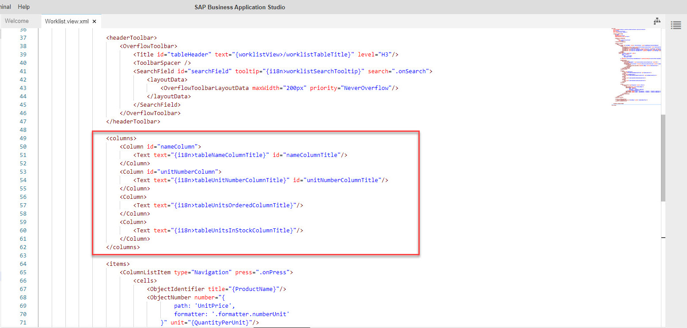

# Exercise 12 - Add Columns to Worklist

In this exercise, we will add columns to the products list view. This requires changes to the UI (view) and also to the view's logic.

## Exercise 12.1 UI Modifications

After completing these steps you will have modified the worklist view of the app to include filters. Some of the modifications are also needed in order for the logic to execute accordingly.

It is recommended that you type in most the code in order to experience the code editor's capabilities.

1. This time you'll use a new way of searching for a file using the *command palette*. From the main menu select *View | Find Command*, delete the `>`, and type *worklist*. A list of files that their name starts with *worklist* appears.
    <br><br><br><br>

2. Click *Worklist.view.xml* to open the file in the code editor. 
    <br><br><br><br>

3. Add the *Units Ordered* and *Units In Stock* columns to the table, and remove the `hAlign` property from the *unitNumberColumn* column (hover over the property to view its description). In the file locate the `<columns>` section and add/modify the following code:
    ```xml
                        <Column id="unitNumberColumn">
                            <Text text="{i18n>worklistTableUnitNumberColumnTitle}" id="unitNumberColumnTitle"/>
                        </Column>
                        <Column>
                            <Text text="{i18n>worklistTableUnitsOrderedColumnTitle}"/>
                        </Column>
                        <Column>
                            <Text text="{i18n>worklistTableUnitsInStockColumnTitle}"/>
                        </Column>
    ```

    <br><br><br><br>

4. So far you added the columns titles. Now it's time to add the data. Locate the `<items>` section below the `<columns>` section, and add the following code.
    ```xml
                                <ObjectNumber number="{path: 'UnitsOnOrder', formatter: 'formatter.numberUnit'}" unit="PC"></ObjectNumber>
                                <ObjectNumber number="{path: 'UnitsInStock', formatter: 'formatter.numberUnit'}" unit="PC"></ObjectNumber>
    ```

    <br><br><br><br>

## Exercise 12.2 - Run the App Locally in the Dev Space

After completing these steps you will have tested the app with data fetched from a real backend.

!!!If the preview does not response - probably need to unexpose ports.

1.	Right-click any folder within the productsinventory folder, e.g. *webapp* folder, and select *Preview Application*.
    <br><br><br><br>

2.	The *command palette* is opened with a list of npm scripts. Click *start* to run this script.
    <br><br><br><br>

    >A new browser tab is opened, where the FLP is run.

    >A new tab is opened in SAP Business Application Studio, where the log of running the app is presented.

    ><br><br><br><br>

3. Click the *Products Inventory* tile to launch the app.
    <br><br><br><br>

4. The app is run with data coming from the demo Northwind OData service that is provided by the OData organization.
    <br><br><br><br>


## Summary

With this, you have successfully completed adding columns to an SAPUI5 *Table* control. 

Continue to - [Exercise 13 - Add Supplier Info to Details Page](../ex13/README.md)
