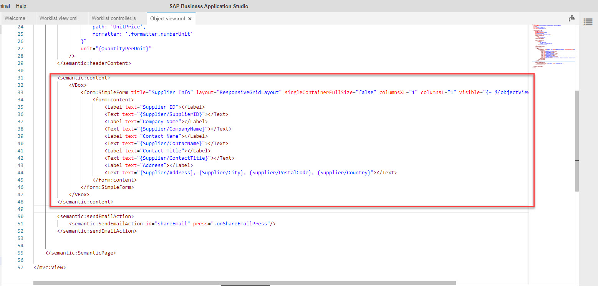
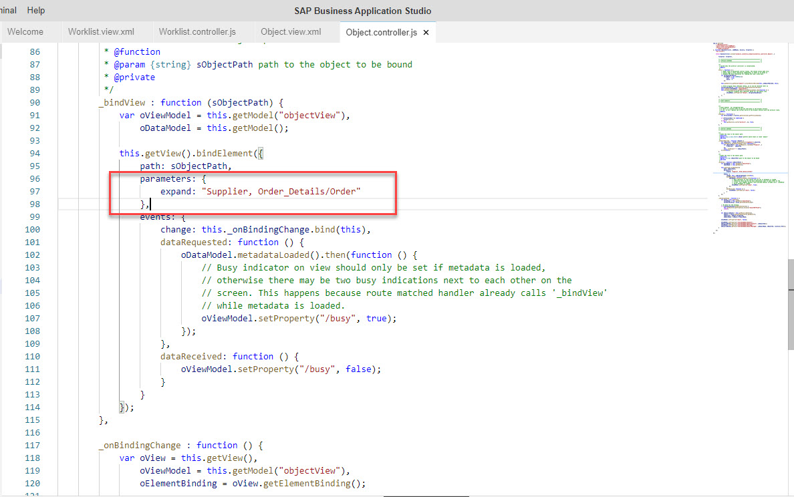
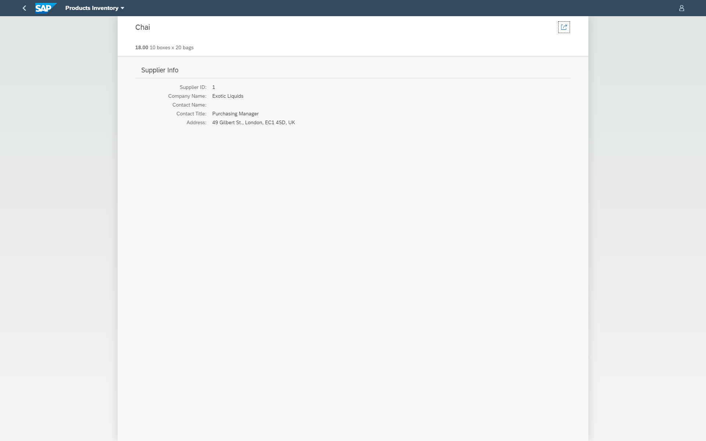

# Exercise 13 - Add Supplier Info to Details Page

So far we you improved the view that presented the list of products and thie key properties related to the business scenario at hand. in the next few exercises you'll improve the product's details view.

In this exercise, we will add supplier info to the product details view. This requires changes to the UI (view) and also to the view's logic.

## Exercise 13.1 - UI Modifications

After completing these steps you will have modified the worklist view of the app to include filters. Some of the modifications are also needed in order for the logic to execute accordingly.

It is recommended that you type in most the code in order to experience the code editor's capabilities.

1. In the locally running app, click a product to get to its details view.

    <br><br><br><br>

2. In SAP business Application Studio, open the file that contains the product's details - *Object.view.xml*.

3. Add an XML namespace for "sap.ui.layout.form".
    ```xml
        xmlns:form="sap.ui.layout.form"
    ```

    <br><br><br><br>

4. Below the `<semantic:headerContent>` section add a `<semantic:content>` section and in it a `<VBox>` element that contains a *SimpleForm* control, which will have the supplier details. 
    ```xml
        <semantic:content>
            <VBox>
                <form:SimpleForm title="Supplier Info" layout="ResponsiveGridLayout" singleContainerFullSize="false" columnsXL="1" columnsL="1" visible="{= ${objectView>/busy} ? false : true}">
                    <form:content>
                        <Label text="Supplier ID"></Label>
                        <Text text="{Supplier/SupplierID}"></Text>
                        <Label text="Company Name"></Label>
                        <Text text="{Supplier/CompanyName}"></Text>
                        <Label text="Contact Name"></Label>
                        <Text text="{Supplier/ContacName}"></Text>
                        <Label text="Contact Title"></Label>
                        <Text text="{Supplier/ContactTitle}"></Text>
                        <Label text="Address"></Label>
                        <Text text="{Supplier/Address}, {Supplier/City}, {Supplier/PostalCode}, {Supplier/Country}"></Text>
                    </form:content>
                </form:SimpleForm>
            </VBox>
        </semantic:content>

    ```

    <br><br><br><br>

## Exercise 13.2 - Run the App Locally in the Dev Space

After completing these steps you will have tested the view look & feel.

5.	Go to the tab where the app is running and refresh it (press [F5]). You can see the look & feel of how the supplier info will appear when you complete this exercise.
    <br><br><br><br>

## Exercise 13.3 - Logic Modifications (Controller)

After completing these steps you will have modified the logic of the worklist view of the app to present the list of products according to the selected filter.

It is recommended that you type in most the code in order to experience the code editor's capabilities.

6. In SAP business Application Studio, open the file that contains the product's details logic - *Object.controller.js*.

    <br><br><br><br>

7. Using the *Outline* pane, locate the *_bindView* fundction.

    <br><br><br><br>

8. Use OData's $expand option to retrieve the product's supplier and order details. You'll use the order_details information in a following exercise.
    ```javascript
                parameters: {
                    expand: "Supplier, Order_Details/Order"
                },
    ```

    <br><br><br><br>

## Exercise 13.4 - Run the App Locally in the Dev Space

After completing these steps you will have tested the view look & feel.

1.	Go to the tab where the app is running and refresh it (press [F5]). You can see the result of adding the supplier info to the product's details view.
    <br><br><br><br>


## Summary

With this, you have successfully completed adding cothe product's supplier info to the product's details view using OData's expand option.

Continue to - [Exercise 14 - Add Supplier Info to Details Page](../ex14/README.md)
