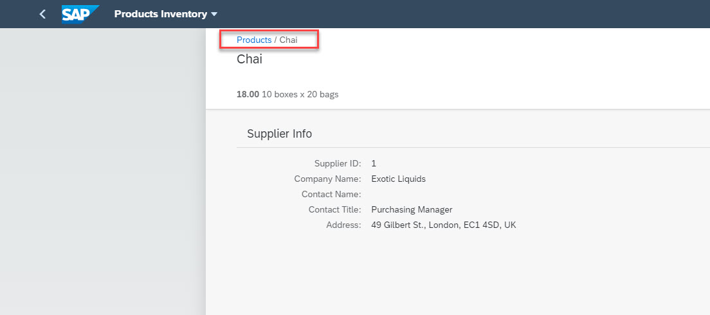

# Exercise 14 - Add Breadcrumbs to the Details Page

So far, you improved the view that presented the list of products and their key properties related to the business scenario at hand. In the next few exercises you'll improve the product's Details view.

In this exercise, you will improve the app navigation by adding breadcrumbs to the Details view.

## Exercise 14.1 - UI Modifications - Breadcrumbs

It is recommended that you type in most the code to experience the code editor's capabilities.

2. In SAP business Application Studio, go to `Object.view.xml` editor tab.

3. Add a *Breadcrumbs* control right below the `<semantic:titleHeading>` element.
    ```xml
            <semantic:titleBreadcrumbs>
                <Breadcrumbs currentLocationText="{ProductName}">
                    <Link press=".onNavBack" text="{i18n>breadcrumbsNavBackTitle}"></Link>
                </Breadcrumbs>
            </semantic:titleBreadcrumbs>

    ```

    <br><br><br><br>

## Exercise 14.2 - Run the App Locally in the Dev Space

After completing these steps, you will have tested the breadcrunms functionality.

4.	Go to the tab where the app is running, and refresh it (press [F5]). You can see that the breadcrumbs appear in the Details view, and you can use them to navigate back to the products Worklist view. Try it out!
    <br><br><br><br>


## Summary

With this, you have successfully completed adding breadcrumbs to the product's Details view, improving user experience and satisfaction.

Continue to - [Exercise 15 - Add Orders List to Details Page](../ex15/README.md)
