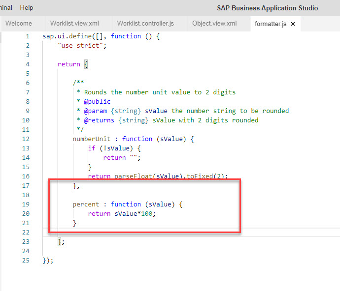

# Exercise 15 - Add Orders List to Details Page

So far we you improved the view that presented the list of products and thie key properties related to the business scenario at hand. in the next few exercises you'll improve the product's details view.

In this exercise, we will add a list of orders that include the product. This way the business user will immediately understand the business impact of the a product's inventory level.
This requires changes to the UI (view) and also some formatting enhancements.

## Exercise 15.1 - UI Modifications - Orders List

5. In SAP business Application Studio, go to *Object.view.xml* editor tab.

3. Add a *Table* control right below the *form* control you added in a previous exercise.
    ```xml
                <Table inset="false"
                    items="{Order_Details}"
                    visible="{= ${objectView>/busy} ? false : true}">
                    <headerToolbar>
                        <OverflowToolbar>
                            <Title id="tableHeader" text="{i18n>objectTableTitle}" level="H3"></Title>
                            <ToolbarSpacer />
                        </OverflowToolbar>
                    </headerToolbar>
                    <columns>
                        <Column>
                            <Text text="{i18n>objectTableOrderIDColumnTitle}"></Text>
                        </Column>
                        <Column>
                            <Text text="{i18n>objectTableUnitPriceColumnTitle}"></Text>
                        </Column>
                        <Column>
                            <Text text="{i18n>objectTableQuantityColumnTitle}"></Text>
                        </Column>
                        <Column>
                            <Text text="{i18n>objectTableDiscountColumnTitle}"></Text>
                        </Column>
                        <Column>
                            <Text text="{i18n>objectTableShipmentDetailsColumnTitle}"></Text>
                        </Column>
                    </columns>
                    <items>
                        <ColumnListItem type="Inactive">
                            <cells>
                                <ObjectIdentifier title="{OrderID}"/>
                                <ObjectNumber number="{
                                    path: 'UnitPrice',
                                    formatter: '.formatter.numberUnit'
                                    }" unit="EUR"></ObjectNumber>
                                <ObjectNumber number="{
                                    path: 'Quantity',
                                    formatter: '.formatter.numberUnit'
                                    }" unit="EUR"></ObjectNumber>
                                <ObjectNumber number="{
                                    path: 'Discount',
                                    formatter: '.formatter.percent'
                                    }" unit="%"></ObjectNumber>
                                <Link text="View shipment details"></Link>
                            </cells>
                        </ColumnListItem>
                    </items>
                </Table>
    ```

    <br><br><br><br>

## Exercise 15.2 - Formatter Modifications

After completing these steps you will have modified the way a number represeting percentile is presented on the view.

6. In SAP business Application Studio, open the file that handles formatting - *webapp > model > formatter.js*, and add the following code:
    ```javascript
		},

		percent : function (sValue) {
			return sValue*100;
		}

    ```

    <br><br><br><br>

## Exercise 15.3 - Run the App Locally in the Dev Space

After completing these steps you will have tested the fully developed app locally in your dev space.

1.	Go to the tab where the app is running and refresh it (press [F5]). You can see the result of adding the supplier info to the product's details view.
    <br><br><br><br>

    >Adding a shipment details view is out of scope of this workshop. You're encouraged to try it on your own.

## Summary

Congratulations!!!

With this, you have successfully completed the app development.
You're welcome to repeat the steps in exercise 7 to build, deploy, and run the app on your CF space.

Continue to - [Exercise 16 - Useful CF Commands](../ex16/README.md)
