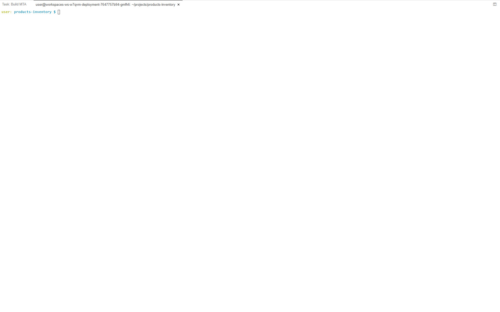
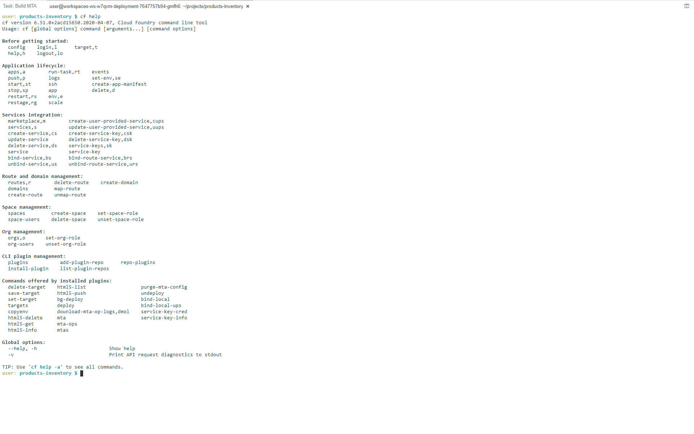
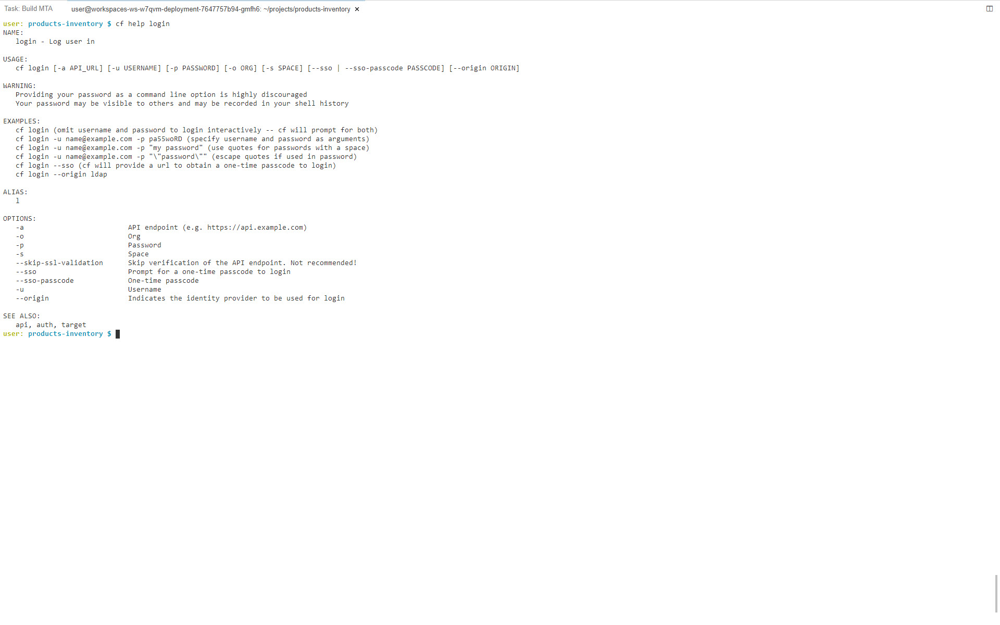
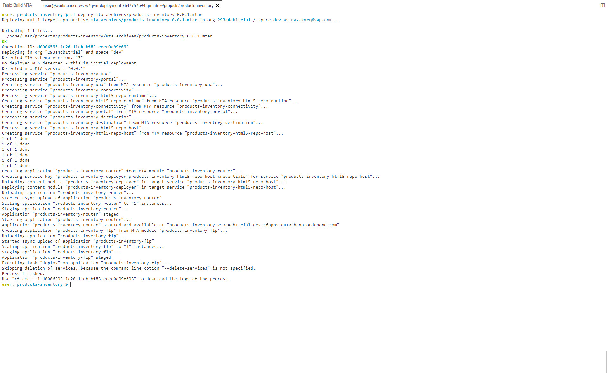
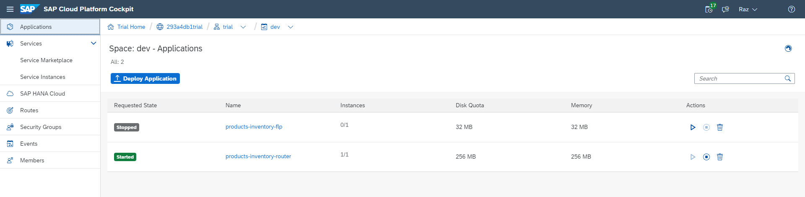
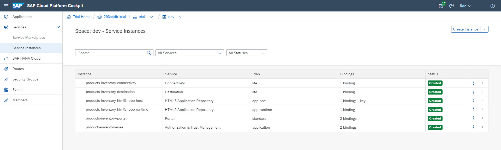

# Exercise 16 - Useful CF Commands

In this exercise, you will go through a basic set of CF commands that are useful in the context of SAP Fiori development.

## Exercise 16.0 - Preparations

After completing these steps you will know which CF commands are available, what they do and try out a few of the available commands.

1. Open a new terminal using *Terminal | New Terminal* or *[CTRL] + ~* keyboard shortcut.
    

2. Double click the terminal tab to maximize it.
    

## Exercise 16.1 - cf help

3. Execute *cf help* to get the list of all available commands.
    

4. To show a list of all available commands with a single line description for each command execute *cf help -a*.
    

    >Tip 1: Execute the *clear* command to cealr the terminal

    >Tip 2: Instead of executing *cf help -a*, execute *cf help -a | more. the commands will be printed to the terminal one screen at a time. To see the next line press the [ENTER] button. To see the next screen press the [SPACE] button.

5. Digging one level deeper, getting help for a spcific command, execute *cf help [COMMAND]* e.g. *cf help login*.
    

## Exercise 16.2 - cf logout

6. In a previous exercise we saw how to log in to CF using the *command palette*. In the last step we saw how to log in to CF using the command line. To log out from CF use *cf logout*. You'll get indication of successful log out both in the terminal as well as in the *status bar* at the bottom left of the screen.
    

## Exercise 16.3 - cf html5-list

7. To get the list of SAP Fiori / SAPUI5 deployed to the CF space you're logged in to, execute *cf html5-list*.
    
    >You need to be logged in to your CF space to perform this command.

## Exercise 16.4 - cf mtas

## Exercise 16.5 - cf undeploy

8. To undeploy a multi-target applications (MTA) deployed to the CF space you're logged in to, such as the app you've just deployed, execute *cf undeploy [mta id] --delete-services --delete-service-keys -f*. The *mta id* of the app you've just deployed appear in the output of the command you performed in the previous step. Therefore, if you want to undeploy the app, execute *cf undeploy products-inventory --delete-services --delete-service-keys -f*
    
    >In the SCP Cockpit, in the CF space, you can see that the app and all its bound sevice instances were removed.

    >    

    >    

## Exercise 16.6 - cf deploy

9. To deploy (or re-deploy) your MTA, execute *cf deploy MTA*. For this demo the MTA resides within the mta_archives folder. Therefore, execute *cf deploy mta_archives/products-inventory-0.0.1.mtar*.
    
    >In the SCP Cockpit, in the CF space, you can see that the app was deployed and all its sevice instances were created and binded.

    >  

    >  

## Exercise 16.7 - Run the App on CF

10. You're welcome to test-run the app deployed on CF as you did in a previous exercise.

## Summary

Congratulations, you completed the [Useful CF Commands](#useful-cf-commands) exercise!

It is a set of powerful tools that lets you interact with SAP Cloud Platform without leaving SAP Business Application Studio. This can save you a lot of time!

Continue to [Exercise 1 - Project Setup Using Business Application Studio](../ex1/README.md).
