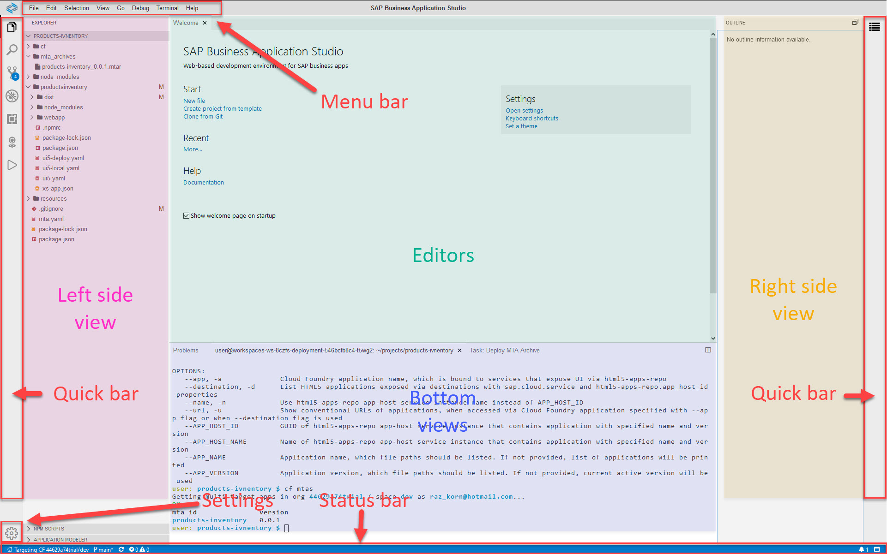

# Exercise 2 - BAS Tour (SAP Business Application Studio Tour)

In this exercise, you will familiarize yourself with SAP Business Application Studio.

## Exercise 2.1 - Dev Space Manager

After completing these steps, you will have known how to manage your dev spaces.
        

1. The most basic functionality of the *Dev Space Manager* is to create new dev spaces.
   >The maximum number of allowed dev spaces is 2 for trial accounts or 10 for productive accounts.

2. Once a dev space is created, its status is presented, e.g. *STOPPED*, *RUNNING*, *STARTING*. 

3. To access a dev space, click its name. The dev space needs to be in status *RUNNING*.
   >The maximum number of allowed dev spaces in status *RUNNING* is 1 for trial accounts and 2 for productive accounts.

4. For exisiting dev spaces, the following functionality is available:
- Start a dev space.
- Stop a dev space.
- Download a dev space content.
- Delete a dev space.
- Manage dev space additional extensions.

5. It's recommended to bookmark the *Dev Space Manager* URL, so it'll be easier for you to access your dev space manager. 
   >It's better to mark the dev space manager rather than a specific dev space, as dev spaces are automatically stopped after a period of time, making them inaccessible. The dev space manager link will remain active.

6. Find out more in the SAP Business Application Studio [documentation](https://help.sap.com/viewer/9d1db9835307451daa8c930fbd9ab264/Cloud/en-US/4142f786f3d345699c3d5fbebda5ded6.html).

## Exercise 2.2 - Integrated Development Environment (IDE) - The Big Picture

After completing these steps, you will have known how to navigate around the IDE.
        

1. On the left side you find a quick bar to open most important views.

2. Other views, such as an outline, a problems view and a terminal can be opened with the respective menu entry from the View menu.

3. You can drag tabs around to adapt your window layout.

4. The *Status Bar* provides you with important information such as the CF org/space the IDE is connected to, git information, problems in the projects, running tasks and notifications. It also provides quick launch of various operations, such as log in ot Cloud Foundry, open views and open/close the *Bottom View*.

6. Find out more on *IDE Tools* and SAP Business Application Studio *Productivity Tools* in the SAP Business Application Studio [documentation](https://help.sap.com/viewer/9d1db9835307451daa8c930fbd9ab264/Cloud/en-US/84be8d91b3804ab5b0581551d99ed24c.html).

## Exercise 2.3 - Customize Settings

After completing these steps, you will have know how to customize basic SAP Business Application Studio settings, and know where to look for more advanced settings.

1.	To set a new theme click the *Setting* icon and select *Color Theme*  or from the menu bar select *File | Settings | Color Theme* or click *Set a theme* in the Welcome screen. The Command Palette opens preseting a list of available themes for you to choose from.

2.	To set font click the *Setting* icon and select *Open Preferences*  or from the menu bar select *File | Settings | Open Preferences*. The *Preferences* tab opens in the *Editors* area. A comprehensive list of customization options appears. Filter the list for `font family`, and select `Editor`. You can set the font family for the editors. Select `Terminal` to set the font family for the terminal. The setting takes place immediately.

3.	You can follow the same flow to set the font size. Instead of filtering the list for `font family`, filter for `font size`. The setting takes place immediately.

4.	You can follow the same flow to set the font size. Instead of filtering the list for `font family`, filter for `font size`. The setting takes place immediately.

5.	The settings you made are only applicable to the dev space you're in. Making settings available across dev spaces is out side the scope of this session. You can find out more in DJ Adams excellent [video blog](https://www.youtube.com/watch?v=YrrxWdIjqEE).

## Summary

You've now familiarized yourself with the *Dev Space Manager* and the *Integrated Development Environment (IDE)*. You also know where to find additional information on SAP Business Application Studio and its tools.

Let's proceed and see all of this in action!

Continue to - [Exercise 3 - Create a New Application from Template ](../ex3/README.md)
