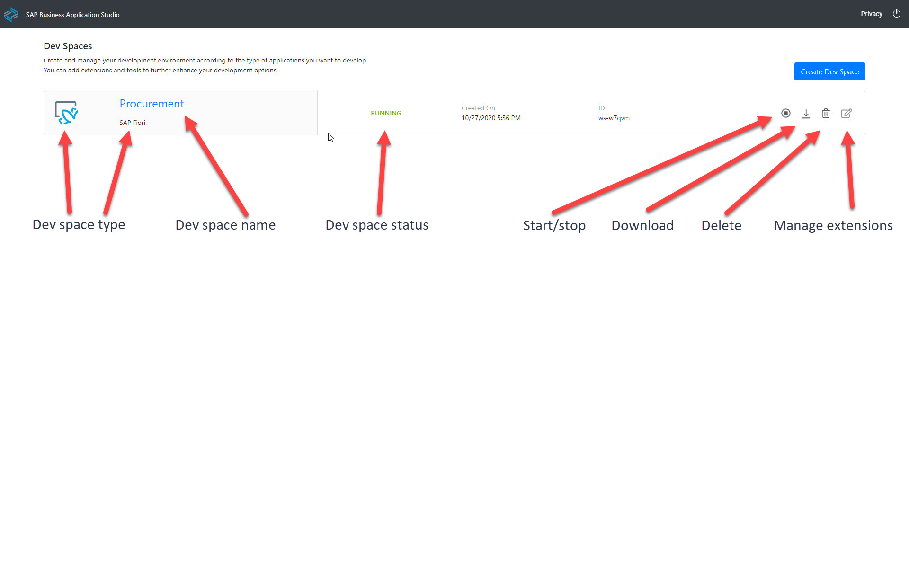
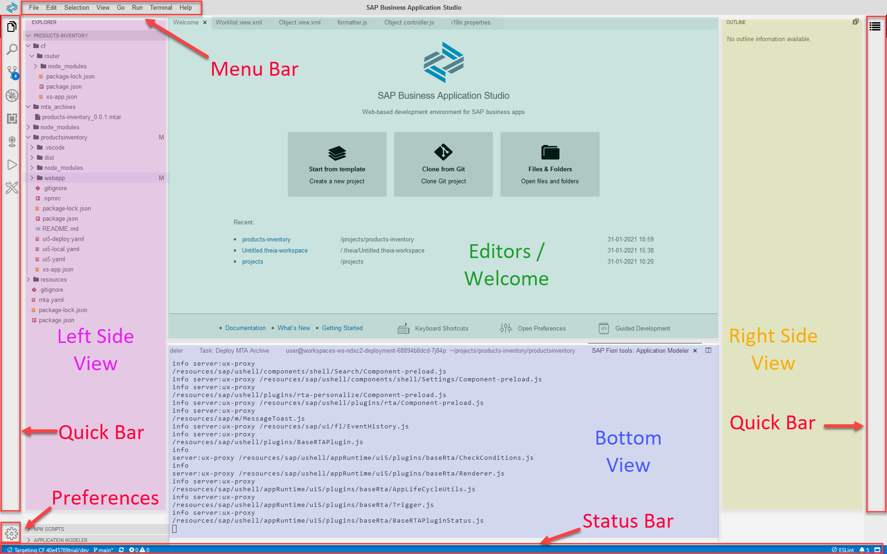
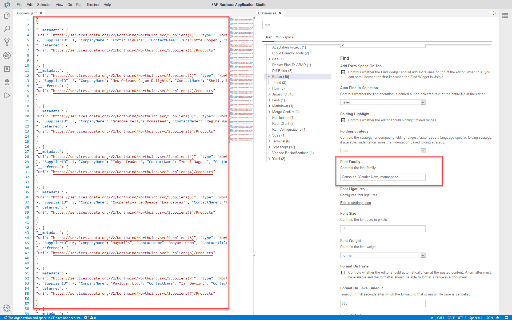
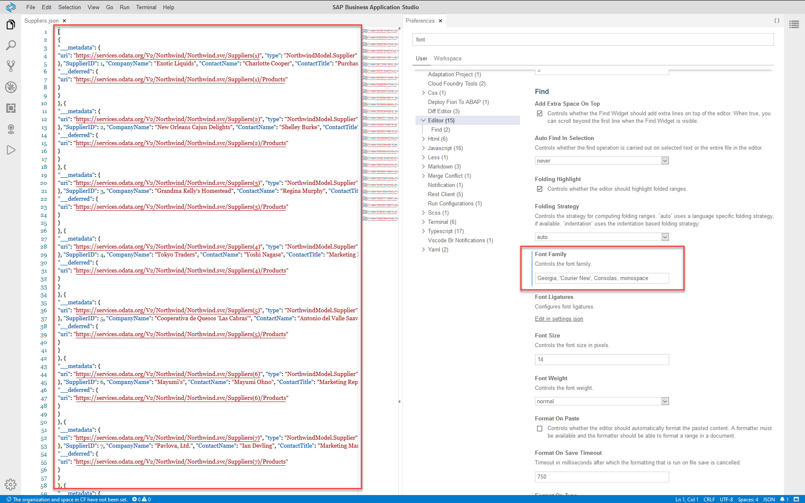
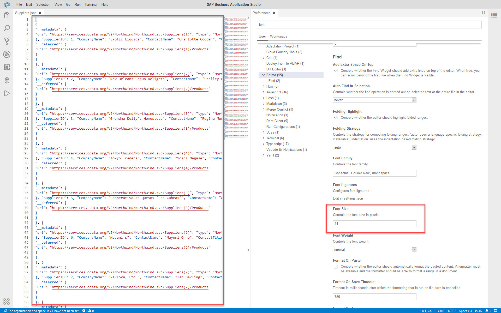
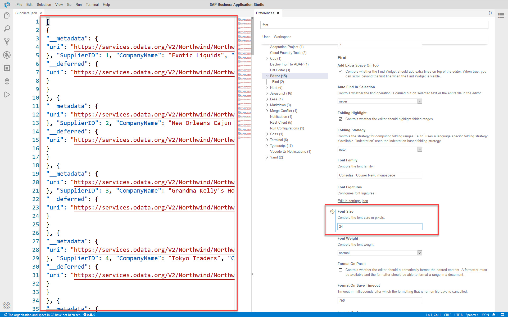
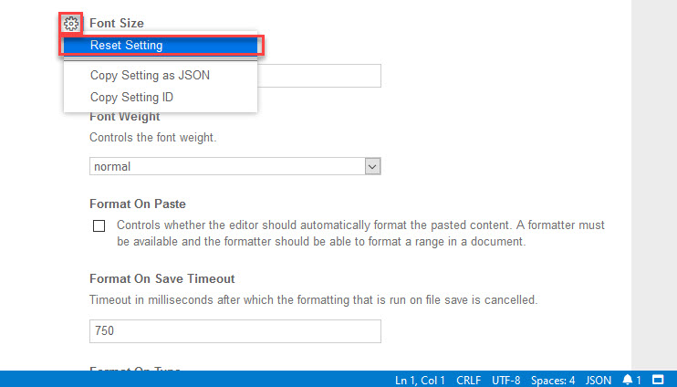

# Exercise 2 - BAS Tour (SAP Business Application Studio Product Tour)

In this exercise, you will familiarize yourself with SAP Business Application Studio.

## Exercise 2.1 - Dev Space Manager

After reading this information, you will know how to manage your dev spaces using the Dev Space Manager.
        

The most basic functionality of the *Dev Space Manager* is to create new dev spaces.
   >You can have a maximum of 2 dev spaces in trial accounts or 10 dev spaces in productive accounts.

A dev space can be in any of the following states: *STOPPED*, *RUNNING*, , *STARTING* or *ERROR*. 

To access a dev space, it needs to be in the *RUNNING* state. 
   >You can have a maximum of 1 running dev spaces in trial accounts or 2 running dev spaces in productive accounts.

From the Dev Space Manager you can perform the following actions:
- Start a dev space.
- Stop a dev space.
- Download the content of a dev (available for dev space states *RUNNING* or *ERROR*).
- Delete a dev space.
- Manage the additional extensions of a dev space.

It is recommended to bookmark the *Dev Space Manager* URL, so it'll be easier for you to access your dev space manager once you have started working in the IDE. 
   >It is better to mark the dev space manager rather than a specific dev space, because dev spaces are automatically stopped after a period of time, making them inaccessible. The dev space manager link will remain active.

To access a dev space, click its name.

Find out more about managing your dev spaces in the SAP Business Application Studio [documentation](https://help.sap.com/viewer/9d1db9835307451daa8c930fbd9ab264/Cloud/en-US/4142f786f3d345699c3d5fbebda5ded6.html).

## Exercise 2.2 - Integrated Development Environment (IDE) - The Big Picture

After reading this, you will know how to navigate the IDE.
        

On the left side you find a quick bar to open most important views.

Other views, such as the outline, the problems view, and the terminal can be opened from the respective entry in the **View** menu.

You can drag tabs around to adapt your window layout.

The *Status Bar* provides you with important information such as the Cloud Foundry org/space the IDE is connected to, Git information, problems in the projects, running tasks, and notifications. It also provides quick launch of various operations, such as login to Cloud Foundry, opening views, and opening or closing the *Bottom View*.

Find out more about [IDE Tools]( https://help.sap.com/viewer/9d1db9835307451daa8c930fbd9ab264/Cloud/en-US/780ba0f7049248c782de1f7f66b8b391.html) and SAP Business Application Studio [Productivity Tools]( https://help.sap.com/viewer/9d1db9835307451daa8c930fbd9ab264/Cloud/en-US/0fba8c673d11414dabb0a521a88f990a.html) in the SAP Business Application Studio documentation.

## Exercise 2.3 - Customize Settings

After completing these steps, you will know how to customize basic SAP Business Application Studio settings, and know where to look for more advanced settings.

1.	You can set a new theme in one of the following ways:
      - Click the *Settings* icon and select *Color Theme*.
      - From the menu bar, select *File | Settings | Color Theme*.
      - Welcome screen, click *Set a theme*. 

       The command palette opens, showing a list of available themes for you to choose from.

2.	You can change the fonts in the IDE in one of the following ways:
      - Click the *Settings* icon and select *Open Preferences*.
      - From the menu bar, select *File | Settings | Open Preferences*. 
   
       The *Preferences* tab opens in the *Editors* area. A comprehensive list of customization options appears. 
      - To set the font family for the editors, filter the list for `font family`, and select `Editor`. 
      - To set the font family for the terminal, filter the list for `font family`, and select `Terminal`. 

       | Default Font Family Setting | Adding Georgia Font Family |
       |:-----|:----------|
       |     |     |

       >The `font family` setting contains a list of font families. Based on the font families installed on your machine, the first match in the list will be used. You can change the order of the font families in the list or add additional font families to the list.

       >The setting takes place immediately.

3.	You can follow the same flow to set the font size. Instead of filtering the list for `font family`, filter for `font size`. The setting takes place immediately.
       >The default `font size` is 14 pixels. Change it to a different value, e.g. 24 pixels, and see the effect. 

       | Default Font Size Setting | Font Size Setting 24 pixels |
       |:-----|:----------|
       |     |     |

4. Click the *cogwheel icon | Reset Setting* to revert to the deafulat setting.
      

5.	The settings are only applicable to the dev space you're in. Making settings available across dev spaces is outside the scope of this session. You can find out more in DJ Adams' excellent [video blog](https://www.youtube.com/watch?v=YrrxWdIjqEE).

## Summary

You've now familiarized yourself with the *Dev Space Manager* and the *Integrated Development Environment (IDE)*. You also know where to find additional information on SAP Business Application Studio and its tools.

Let's proceed and see all of this in action!

Continue to - [Exercise 3 - Create a New Application from Template](../ex3/README.md)
