# Exercise 3 - Create a New Application from Template

In this exercise, you will learn how to create an SAP Fiori application for freestyle development. The application will follow the SAP Fiori Worklist floorplan.

## Exercise 3.0 - Preparation

Create a folder that will contain the app's project.

1. From the SAP Business Application Studio menu bar select *File | New Folder*.
    >Using information in the popup message, verify that the new folder will be created in */home/user/projects*. If a different path is presented, it's most probably due to a flie or folder being selected. Close the *New Folder* dialog, press [CTRL] and click the selected file or folder, and repeat this step.
        

2. Name the folder *products-inventory*, and click *OK*.
        

## Exercise 3.1 - Launch Yeoman UI Generator

The easiest way to create an SAP Fiori app for freestyle development from scratch is to create it from a template. In this step you'll install the extension that contains high-productivity tools for SAP Fiori freestyle development.
   >In this exercise you'll use the new tooling for SAP Fiori freestyle development. In the future this tooling will be available out-of-the-box as part of the SAP Fiori dev space.

   >In most cases you'll conitnue the development of an existing application. To continue developing an existing application, the best practice is to use Git source code management.

1. From the menu bar, select *View | Find Command* to open the Command Palette.
      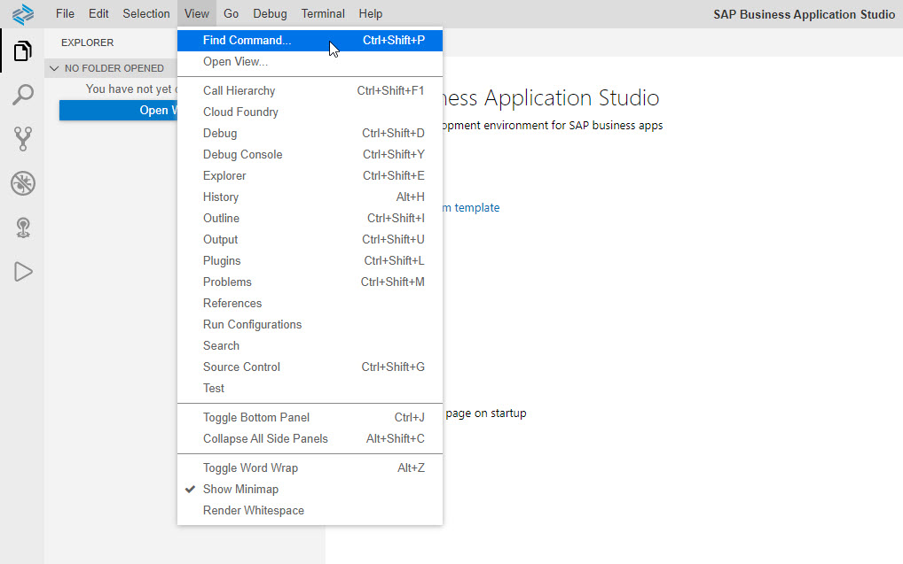  

2. Type *yeo* in the Command Palette input field to filter the *Yeoman UI Generators* command. Press [ENTER] or click *Yeoman UI Generators* to execute the command.
      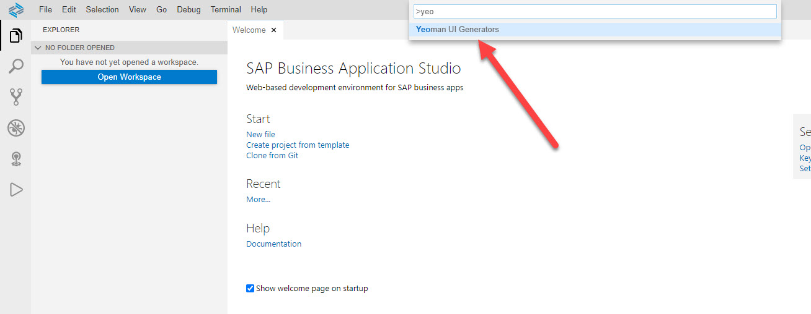  

## Exercise 3.2 - Install SAP Fiori tools for SAP Fiori freestyle app development

SAP Fiori tools include high productivity tools, such as templates, wizards, and editors for developing both freestyle and SAP Fiori elements apps.

1. Click *Explore and Install Generators...* to find and install the SAP Fiori freestyle app templates. 
      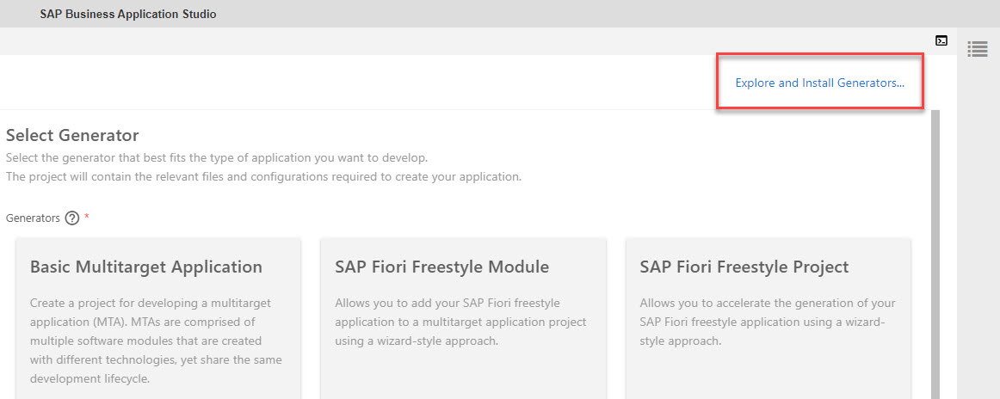  
    >You may be prompted to accept the legal terms.
    >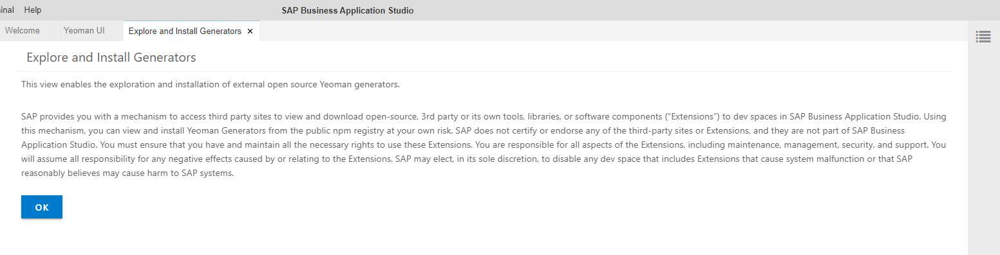  
    
2. Search for *fiori* yeoman generators, locate the *@sap/generator-fiori-freestyle* generator, and click *Install*. Wait until the installation is complete.
      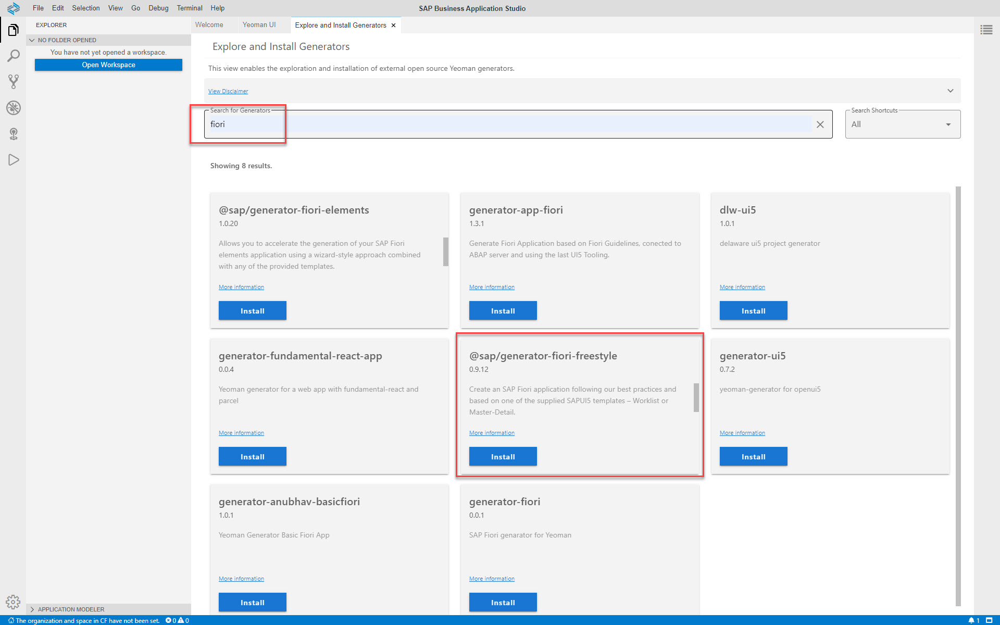  

    Installing:
      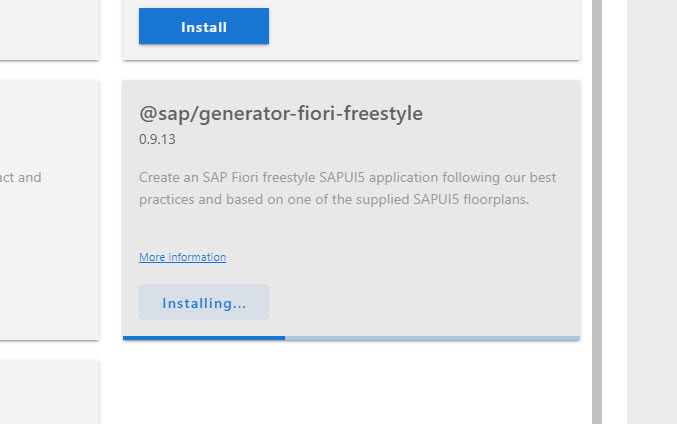  

    Installation complete:
      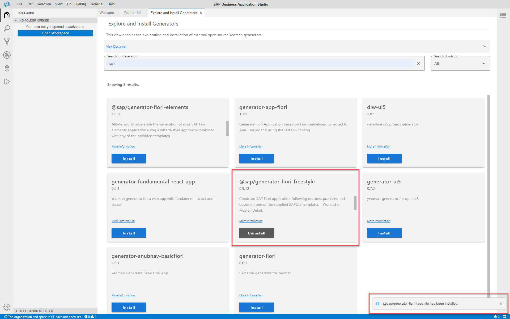  

3. Close the *Explore and Install Generators* tab and, in the *Yeoman UI* tab, scroll down to find the *SAP Fiori freestyle SAPUI5 application* generator. Select it, and click *Next*.
      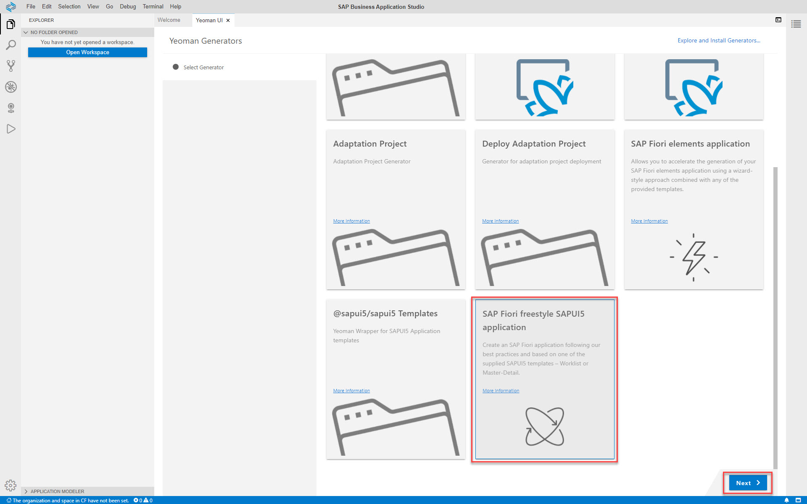  

## Exercise 3.3 - Create a Project Using the SAP Fiori Worklist Application Template

You'll use the worklist template available from SAP Fiori tools to create the app.
   >To exit the wizard without generating the project, close the *Yeoman UI* tab.

   >Using the Project Creation wizard, you can click *Back* to go back to the previous step, or you can click on a specific wizard step.

1. Select the *SAP Fiori Worklist Application* floorplan, and click *Next*.
      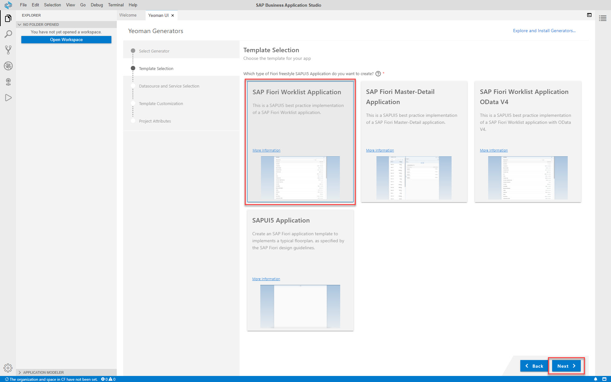  

2. Select *Upload a Metadata Document* as the datasource.
    >*Upload a Metadata Document* option is used to present the capability to decouple development of an SAP Fiori app from its backend.
      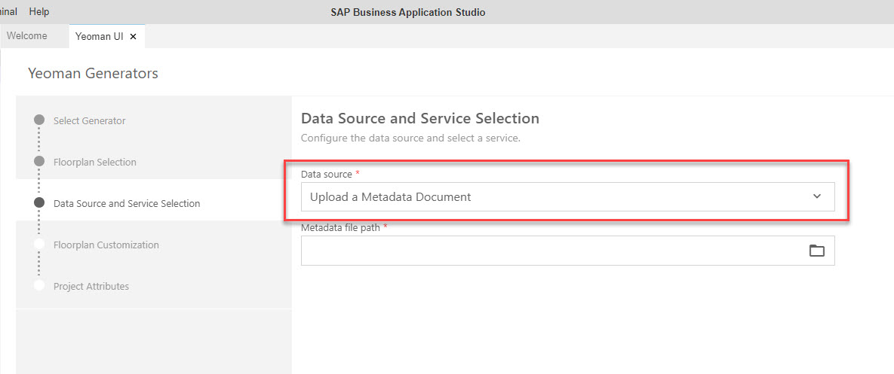  

3. To select the *Metadata file path*, click the `folder` icon, expand `home > user > projects > data`, select `metadata.xml`, and click *Open*.
      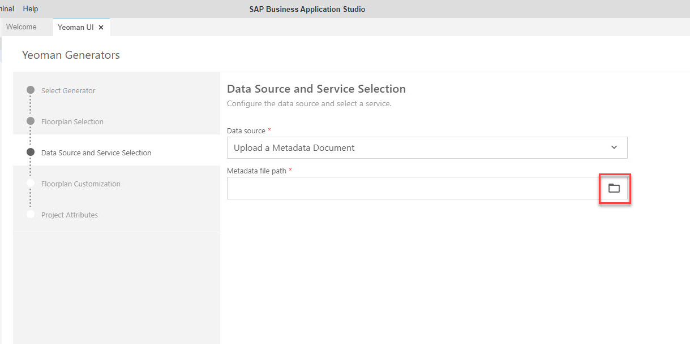  
      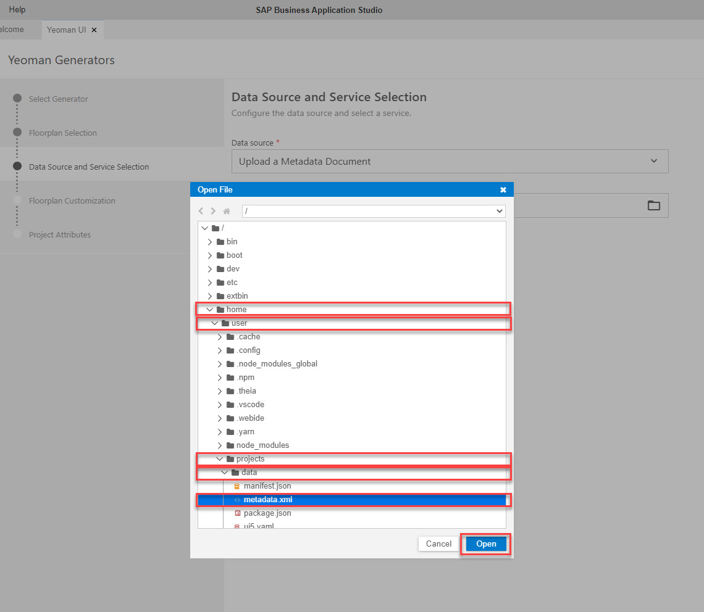  
      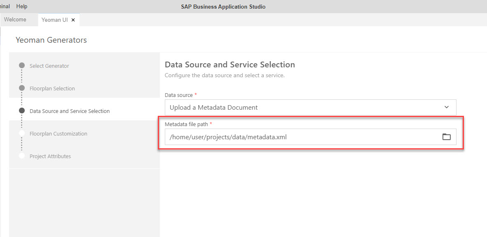  

4. Click *Next*.

5. For *Floorplan Customization*, select the following, and click *Next*.
    >You can start typing the value to filter the list of options.

    | Step | Parameter | Value |
    |:-----|:----------|:------|
    | A | Object Collection | **Products** |
    | B | Object Collection Key | **ProductID** |
    | C | Object Identifier | **ProductName** |
    | D | Object Number | **UnitPrice** |
    | E | Object Unit Of Measure | **QuantityPerUnit** |

      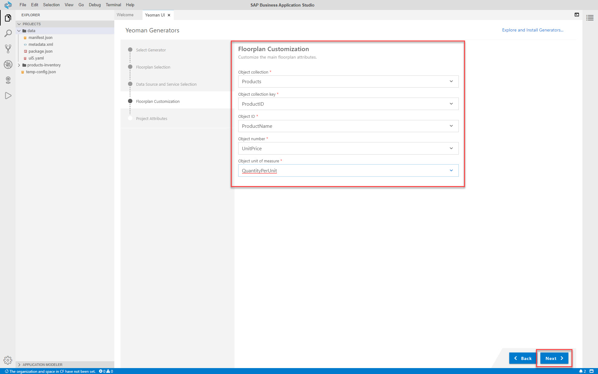  

6. For *Project Attributes*, select the following, and click *Finish*.

    | Step | Parameter | Value |
    |:-----|:----------|:------|
    | A | Module name | **productsinventory** |
    | B | Application title | **Products Inventory** |
    | C | Application namespace | **products.inventory** |
    | D | Description | **An SAP Fiori freestyle app to manage products inventory (demo)** |
    | E | Project folder path | `/home/user/projects/products-inventory` |
    | F | Configure advanced options?  | **No** (default) |

7. Wait for the project to generate. Once it is generated, the *Yeoman UI* tab closes, and a notification "The project has been generated. What would you like to do with it?" appears at the bottom-right of the page. Click *Open in New Workspace*.
      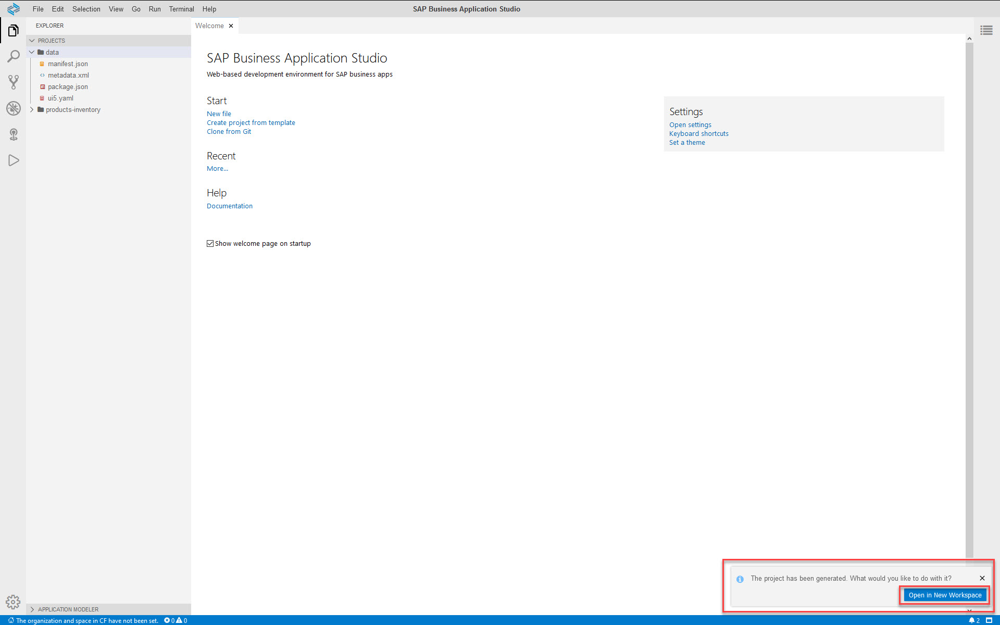  

    >It's best practice to do your development either in a single project (single root) workspace or a multi-root workspace. In this exercise, you'll develop in a single project workspace environment. In a later exercise, you'll learn about multi-root workspaces.

    >If you have not opened the project in a new workspace: From the menu bar, select *File | Open Workspace...*, select *products-inventory*, and click *Open*.
    > 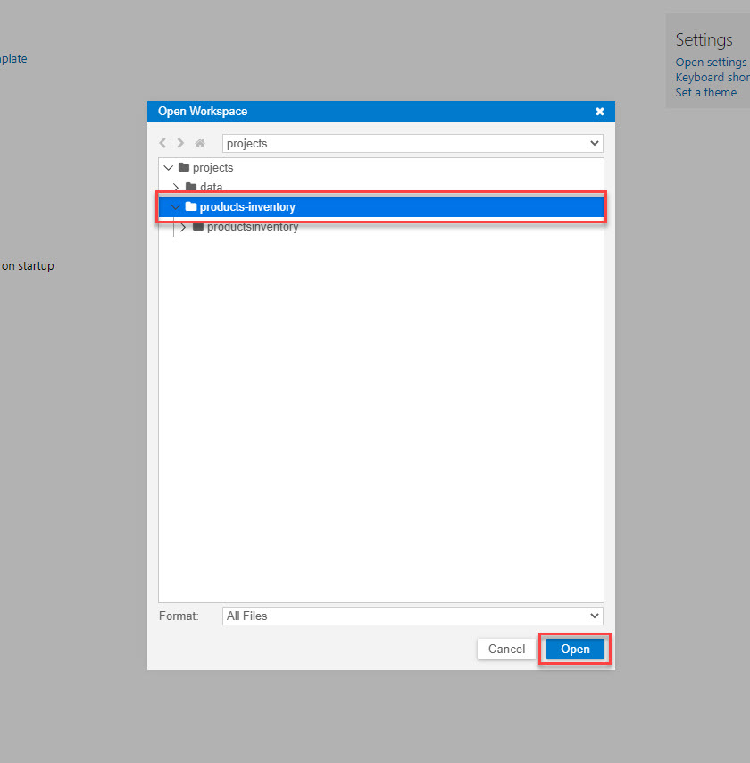  

8. SAP Business Applications Studio reloads with an open workspace containing the *products-inventory* project. 
    >Tip 1: You can click *>* or *V* in the *Explorer* view to expand or collapse the folders.
    >  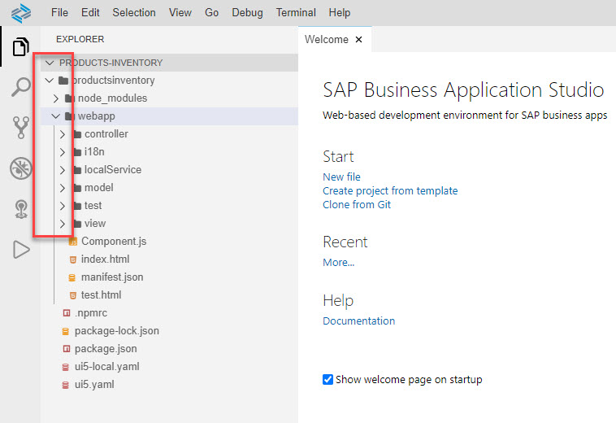  

    >Tip 2: Click on any icon in the side panel to expand or collapse the relevant view. This gives additional screen real estate when needed. Only one view can be open at a time.
    >  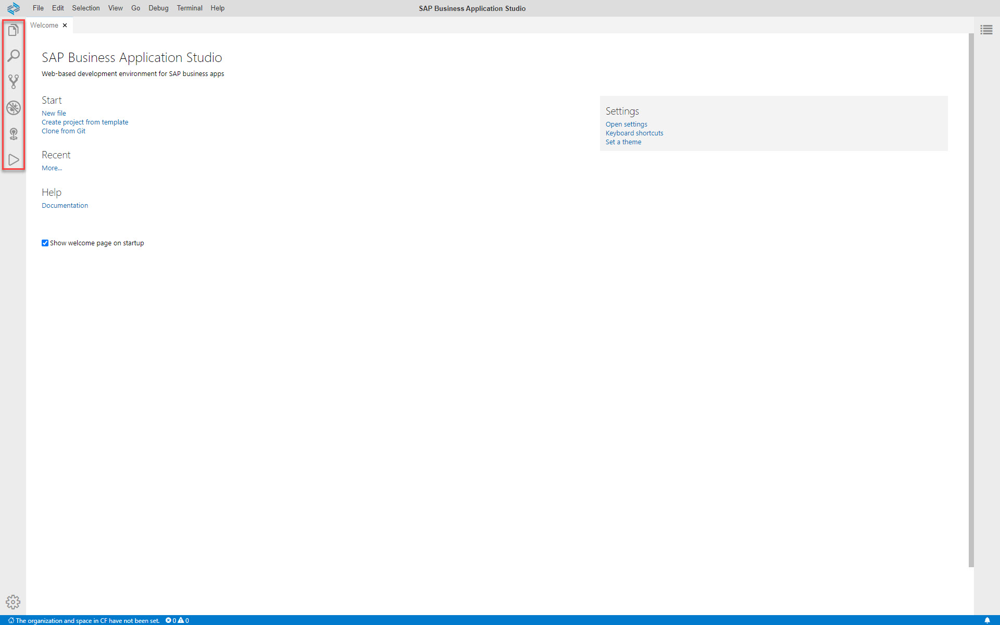  

    >You can also create a project using the Yeoman wizard from the terminal.

## Summary

You've now successfully completed the development of an SAP Fiori app using SAP Business Application Studio.

In this exercise, you learned about high productivity tools that are available out-of-the-box in SAP Business Applications Studio, such as templates and wizards, command palette, and more.

Continue to - [Exercise 4 - Test the Application with Mock Data ](../ex4/README.md)
