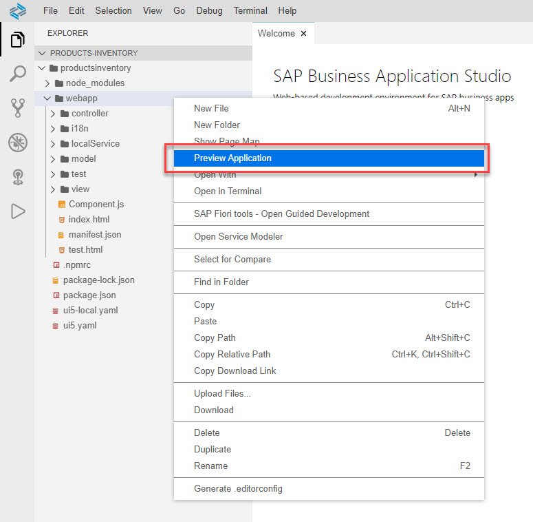
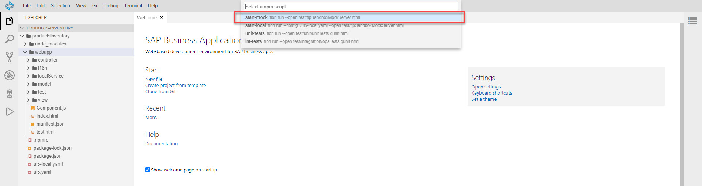
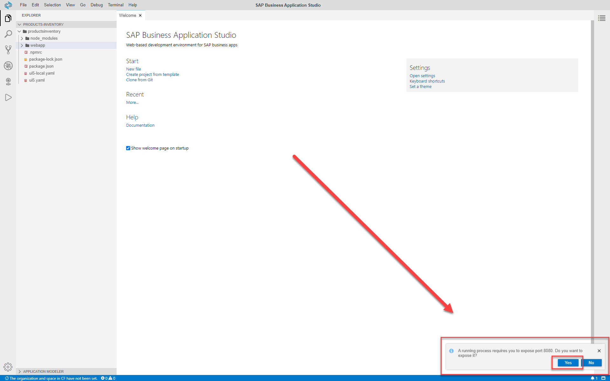
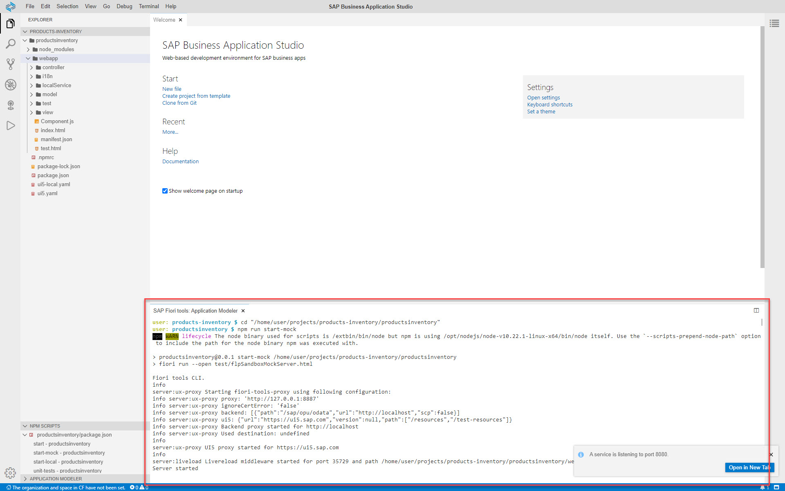
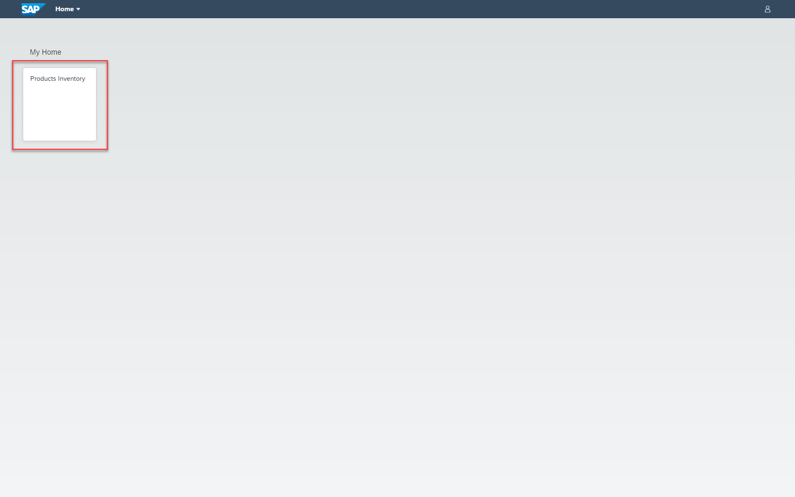
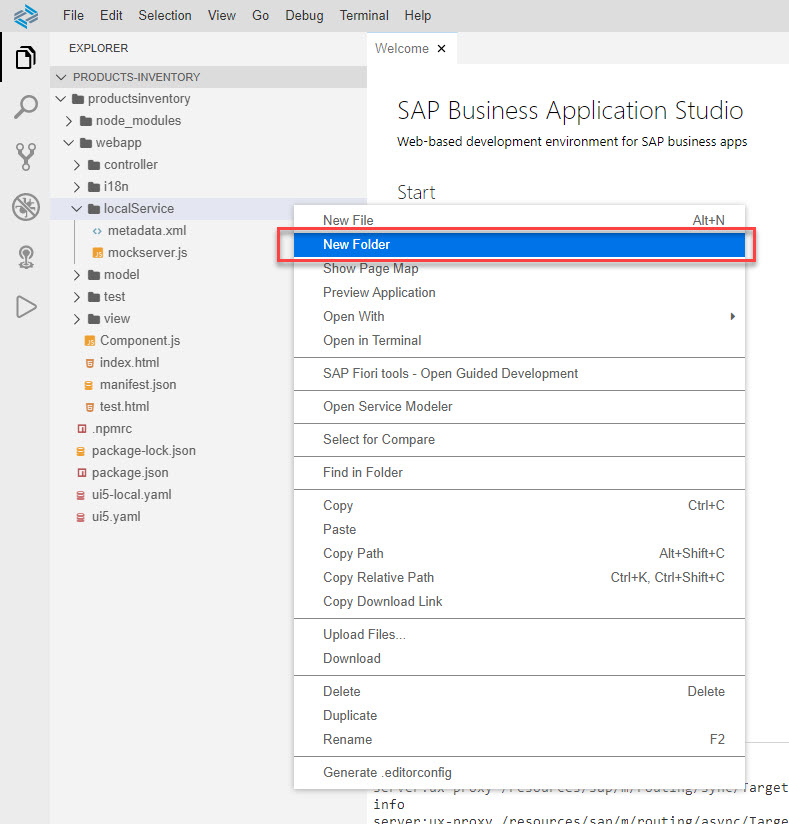
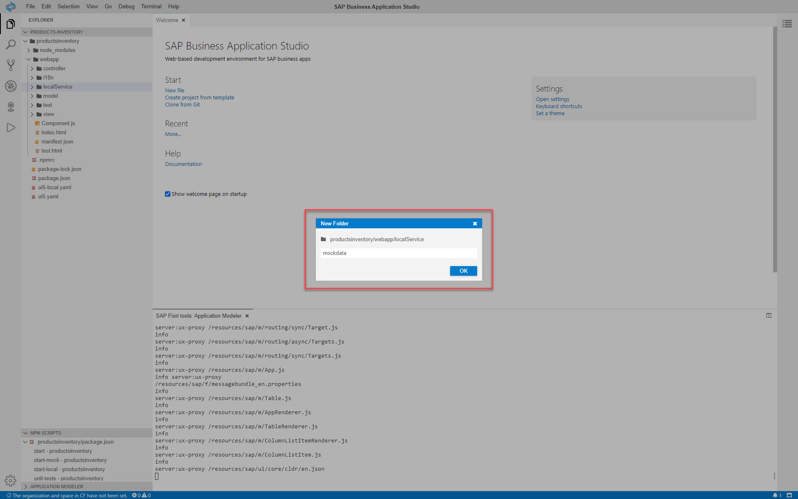
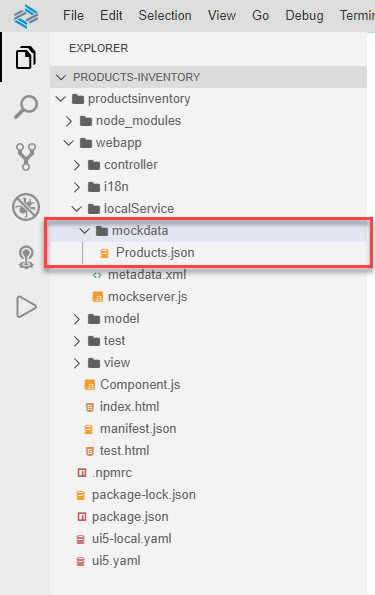

# Exercise 4 - Test the Application with ש Mock Server

In this exercise, you will test the application using mock data. This capability is very useful when decoupling frontend development from backend development. It's also useful for debugging.

## Exercise 4.1 - Set Up the Project to Auto-Refresh

TBD

## Exercise 4.2 - Run the Application with Auto-Generated Mock Data

After completing these steps, you will have tested the app with mock data that was generated by the integrated mock server.

!!!If the preview does not respond, you probably need to unexpose ports.

1.	Right-click any folder within the `productsinventory` folder, e.g. the *webapp* folder, and select *Preview Application*.
        

2.	The command palette opens with a list of `npm` scripts. Click *start-mock* to run this script.
        

    >You may receive notifications at the bottom right of the screen asking you to expose ports. Click *Yes*.
    >    

    >A new browser tab opens showing the FLP.

    >A new tab opens in SAP Business Application Studio where you can see the log of the running app.
    >    

3. Click the *Products Inventory* tile to launch the app.
        

4. The app is run with mock data generated by the mock server.
        

## Exercise 4.3 - Run the Application with User-Provided Mock Data

After completing these steps, you will have tested the app with mock data that you provided to the integrated mock server.

5.	Expand the `webapp` folder, right-click the `localService` folder and select *New Folder*.
        

6. Name the folder *mockdata*, and click *OK*.
        

7. Expand the `localService` folder.

8. Click [here](data/Products.json?raw=true) to access the *Products* collection mock data.

9. Right-click the data area, and select *save as...*.

10. Choose the folder where the file will be saved (*Downloads* is the default folder). Use `Products.json` as the *File name*, and click *Save*.
    >The default file extension for this operation is `txt`. Make sure you change it to `json`.

11. Open the folder where you saved the file.

12. Drag and drop the file to the `mockdata` folder you created in SAP Business Application Studio.
        

    >Follow the same steps for [Order_Details](data/Order_Details.json?raw=true), [Orders](data/Orders.json?raw=true), [Suppliers](data/Suppliers.json?raw=true), which will be used at a later stage of the workshop.

12. Go to the app's tab and refresh it (F5). The app presents the mock data you provided.
        

## Summary

Well done!

You've now test run your app locally in the dev space using two mock data options: (1) mock data that is auto-generated by the mock server, and (2) mock data that you provided to the mock server.

Continue to - [Exercise 5 - Add Data Filters ](../ex5/README.md)
