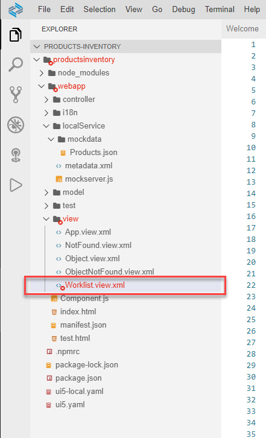
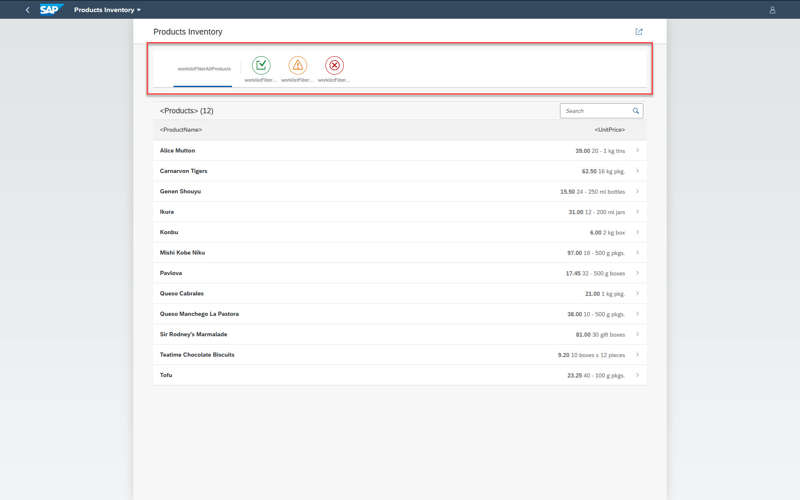

# Exercise 5 - Add Data Filters

In this exercise, you will add filters to the app that will filter the list of products according to their invetory level - Shortage, Low, and Normal. This requires changes to the UI (view) and also to the view's logic.

## Exercise 5.1 UI Modifications

After completing these steps you will have modified the worklist view of the app to include filters. Some of the modifications are also needed in order for the logic to execute accordingly.

It is recommended that you type in most of the code in order to experience the code editor's capabilities.

1. Choose *webapp > view* and click the *Worklist.view.xml* file.
    <br><br><br><br>
    >The *Worklist.view.xml* file is opened in a code editor tab.
    ><br><br>

    >Tip 1: You can get additional screen real-estate for the code editor tab by closing the *Explorer* pane. You can get even more real-estate by double clicking the tab's title.

    >Tip 2: Hovering over a control or a control property pops up a tooltip with information on it as well as link to its API Reference, which is opened on a new browser tab.
    ><br><br><br>

2. Add an *IconTabBar* conotrl before the *Table* control.
```XML
            <IconTabBar id="iconTabBar" select=".onFilterSelect" class="sapUiResponsiveContentPadding">
                <items>
                </items>
            </IconTabBar>
```

3. Between `<items>` and `</items>` type `<`. The code completion kicks in.
    <br><br><br><br>

    >Tip 1: You can select which control to use using the mouse or by using the arrow keys on the keyboard.

    >Tip 2: You can get more information on a control by clicking the (i) icon to the right of the control or using [CTRL] + [SPACE] on the keyboard.

4. Select the *IconTabFilter* control, and use [CTRL] + [SPACE] to view a list of its properties.
    <br><br><br><br>

    >Tip 1: You can filter the list of properties by typing part of it.

    >Tip 2: You can select which property to use using the mouse or by using the arrow keys on the keyboard.

    >Tip 3: You can get more information on a property by clicking the (i) icon to the right of the control or using [CTRL] + [SPACE] on the keyboard.

5. Select the *showAll* property.
    <br><br><br><br>

6. Even control properties can have their value selected from a list. Delete the *false* value and use [CTRL] + [SPACE] to present the list of avialble values.
    <br><br><br><br>

7. Proceed until you have the following code in place:
```XML
            <IconTabBar>
                <items>
                    <IconTabFilter showAll="true" count="{worklistView>/productsCount}" text="i18n>productTitle" key="all"></IconTabFilter>
                    <IconTabSeparator ></IconTabSeparator>
                    <IconTabFilter icon="sap-icon://complete" iconColor="Positive" text="Normal" key="Normal"></IconTabFilter>
                    <IconTabFilter icon="sap-icon://message-warning" iconColor="Critical" text="Low" key="Low"></IconTabFilter>
                    <IconTabFilter icon="sap-icon://message-error" iconColor="Negative" text="Shortage" key="Shortage"></IconTabFilter>
                </items>
            </IconTabBar>

```

   <br><br><br><br>

8. You probably noticed that the *Worklist.view.xml* file is marked as error, including its folders hierarchy, as well as indications in the *Status Bar*.
   <br><br><br><br>

   <br><br><br><br>

9. Open the *Problems* tab by either clicking the problems indication area in the status bar or from the menu bar selecting *View | Problems*.
   <br><br><br><br>

10. According to the problem description *The aggregation \"content\" has cardinality of 0..1 and may only contain one element*. Therefore, wrap the *IconTabBar* and *Table* controls in a `<VBox>` element, and indent accordingly.
```XML
        <semantic:content>
            <VBox>
                <IconTabBar>
                    <items>
                        <IconTabFilter showAll="true" count="{worklistView>/productsCount}" text="i18n>productTitle" key="all"></IconTabFilter>
                        <IconTabSeparator ></IconTabSeparator>
                        <IconTabFilter icon="sap-icon://complete" iconColor="Positive" text="Normal" key="Normal"></IconTabFilter>
                        <IconTabFilter icon="sap-icon://message-warning" iconColor="Critical" text="Low" key="Low"></IconTabFilter>
                        <IconTabFilter icon="sap-icon://message-error" iconColor="Negative" text="Shortage" key="Shortage"></IconTabFilter>
                    </items>
                </IconTabBar>
                <Table id="table" width="auto" items="{
                        path: '/Products',
                        sorter: {
                            path: 'ProductName',
                            descending: false
                        }
                    }" noDataText="{worklistView>/tableNoDataText}" busyIndicatorDelay="{worklistView>/tableBusyDelay}" growing="true" growingScrollToLoad="true" updateFinished=".onUpdateFinished">

                    <headerToolbar>
                        <OverflowToolbar>
                            <Title id="tableHeader" text="{worklistView>/worklistTableTitle}" level="H3"/>
                            <ToolbarSpacer />
                            <SearchField id="searchField" tooltip="{i18n>worklistSearchTooltip}" search=".onSearch">
                                <layoutData>
                                    <OverflowToolbarLayoutData maxWidth="200px" priority="NeverOverflow"/>
                                </layoutData>
                            </SearchField>
                        </OverflowToolbar>
                    </headerToolbar>

                    <columns>
                        <Column id="nameColumn">
                            <Text text="{i18n>tableNameColumnTitle}" id="nameColumnTitle"/>
                        </Column>
                        <Column id="unitNumberColumn" hAlign="End">
                            <Text text="{i18n>tableUnitNumberColumnTitle}" id="unitNumberColumnTitle"/>
                        </Column>
                    </columns>

                    <items>
                        <ColumnListItem type="Navigation" press=".onPress">
                            <cells>
                                <ObjectIdentifier title="{ProductName}"/>
                                <ObjectNumber number="{
                                        path: 'UnitPrice',
                                        formatter: '.formatter.numberUnit'
                                    }" unit="{QuantityPerUnit}"/>
                            </cells>
                        </ColumnListItem>
                    </items>
                </Table>
            </VBox>
        </semantic:content>
```

11. Test-tun the app locally to see the UI changes. All you need to do is to refresh the tab where the app is already running.
   <br><br><br><br>

    >Clicking the filters has no impact as the logic was not implemented. This will be the next step in the exercise.


## Exercise 5.2 Logic Modifications (Controller)

After completing these steps you will have modified the logic of the worklist view of the app to present the list of products according to the selected filter.

It is recommended that you type in most the code in order to experience the code editor's capabilities.

12. Choose *webapp > controller* and click the *Worklist.controller.js* file.
    <br><br><br><br>
    >The *Worklist.controller.js* file is opened in a code editor tab.
    ><br><br>

13. Click *Outline* button at the top-right of the window to open the outline pane. locate the *onUpdateFinished* function and click it in order for the code editor to focus on this function.
    <br><br><br><br>

14. The following code will add the total products count as a property to the model. This property is presented at the top left of the view when clicking the *showAll* filter. Add it just below the end of the variables declaration section (*var* statement).
```javascript
            //set products count
            this.getModel("worklistView").setProperty("/productsCount", iTotalItems);
```

   <br><br><br><br>

15. Refresh the app to see the effect of this change.
   <br><br><br><br>

16. Now it's time to handle the user action of clicking the filters. In the Outline pane click the *onRefresh* function, and add the following code above this function.

```javascript
        onFilterSelect: function(oEvent){
            var oTable = this.byId("table");
            var sKey = oEvent.getParameter("key");
            var oFilter = this._createFilterByTabKey(sKey);
            var oBinding = oTable.getBinding("items");
            oBinding.filter(oFilter);
        },

        _createFilterByTabKey: function(sKey){
            switch(sKey) {
                case "Normal":
                    return new Filter("UnitsInStock", FilterOperator.GT, 15);
                case "Low":
                    return new Filter("UnitsInStock", FilterOperator.BT, 1, 15);
                case "Shortage":
                    return new Filter("UnitsInStock", FilterOperator.LE, 0);
                default: 
                return [];
            }
        },

```

   <br><br><br><br>

## Exercise 5.3 - Run the App Locally in the Dev Space

15. Refresh the app's tab for the changes to take effect. Click the various filters and see how the list of products changes according to the selected filter.
   <br><br><br><br>

16. Close the *Outline* pane and all open tabs in the editors section.

    >Tip: To close all open tabs, right-click one of the tab's titile and select *Close All*. Explore this to see additional options.


## Summary

With this, you have successfully completed the development of an SAP Fiori app using SAP Business Application Studio, including test-running the app locally in the dev space. In this exercise, you learned about high productivity tools that are available out-of-the-box in SAP Business Applications Studio, such as: code completion, API reference, outline, problems view, and more.

Continue to - [Exercise 6 - Connect to Backend](../ex6/README.md)
