# Exercise 6 - Connect to Backend

In this exercise, you will connect the app to a real backend. You will use the *Northwind* demo service that is available from the OData organization.


## Exercise 6.0 Preparations

1.	Hover over the workspace title in the *Explorer* view, click the `...` and select *Add Folder to Workspace...*.
    <br><br>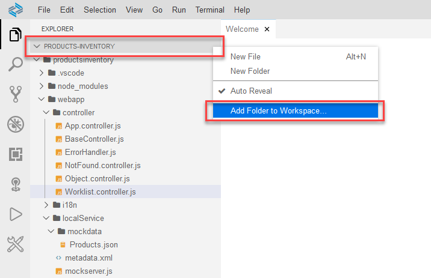<br><br>

    >You can also search for this command in the Command Palette. From the menu bar, select *View | Find Command* to open the Command Palette.
    <br><br><br><br>

2. Select *projects > data*, and click *Open*.
    <br><br>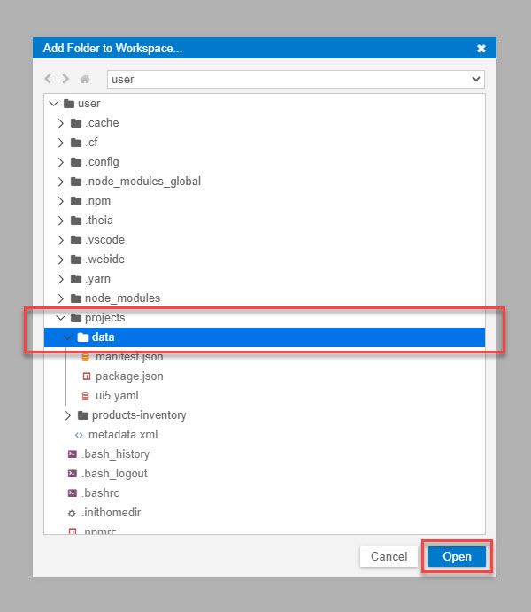<br><br>

3. When prompted "A workspace with multiple roots was created. Do you want to save your workspace configuration as a file?", click *No*. 
    <br><br>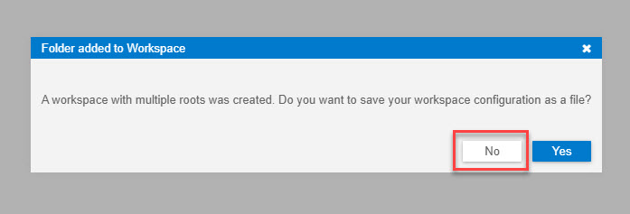<br><br>

    >In the *Explorer* view, you can see that the name of the workspace changed to *UNTITLED (WORKSPACE)* and an additional project called *data* was added to this workspace. Expand the *data* project. This project contains the files you uploaded at the end of exercise 1,  which you will use in this exercise.
    ><br><br>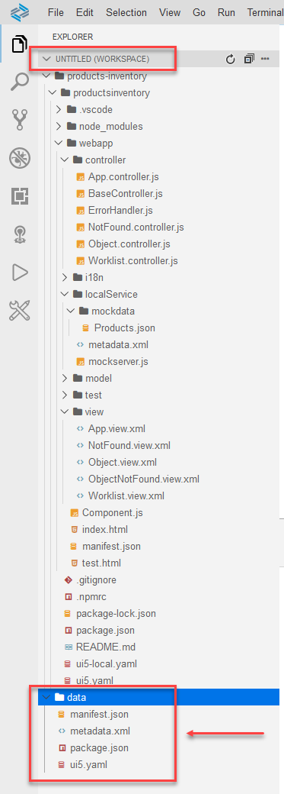<br><br>

    >You can choose to have multiple projects residing in a multi-root workspace. In this case, each project is a root in the workspace. There is a `.vscode` folder for each project, and the developer can view more than one project at a time in the workspace. In multi-root, you can save the settings, launch, and task configurations per workspace so that they affect all projects within it. You can find out more about *Workspaces* in the SAP Business Application Studio [documnetation](https://help.sap.com/viewer/9d1db9835307451daa8c930fbd9ab264/Cloud/en-US/0919ce1ca4a342628e49c0f5e9c8cdcf.html).

## Exercise 6.1 - Modify the `ui5.yaml` file

4. Select the two `ui5.yaml` files, the one in the app and the one in the *data* project: Press [CTRL] + click each of them. Make sure that only these two files are selected.
    >To deselect a file or folder, Press [CTRL] + click it.

    <br><br>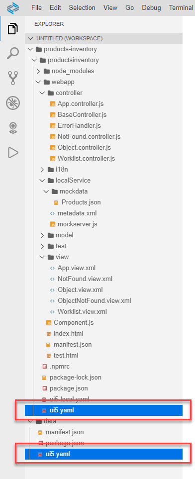<br><br>

5. To compare the two files side-by-side, right-click one of the selected `ui5.yaml` files and select *Compare with Each Other*.
    <br><br>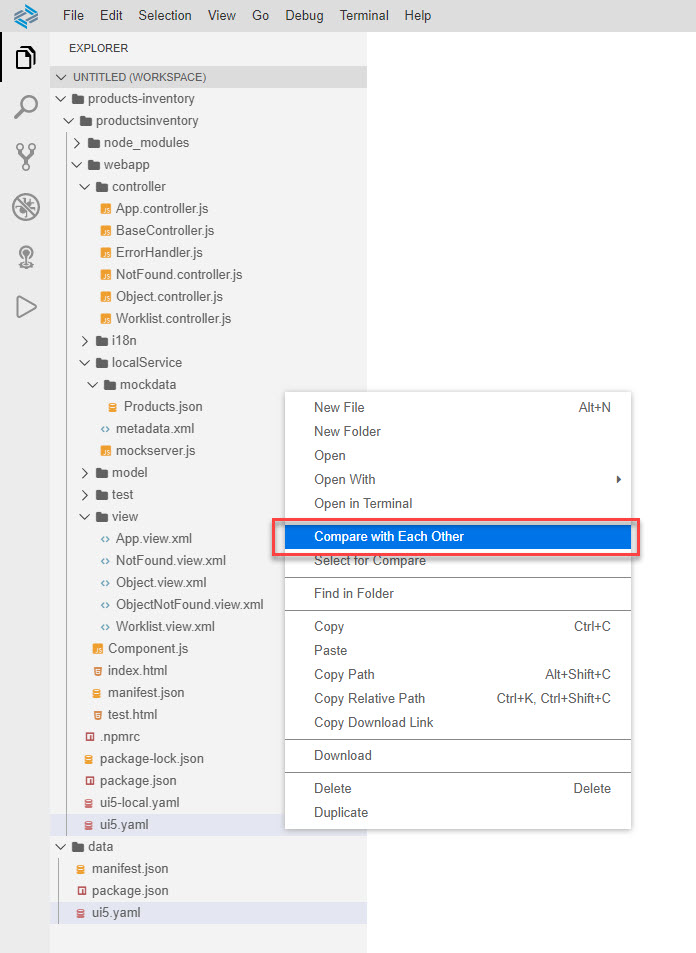<br><br>

6. A file compare editor with both files opens.
    <br><br><br><br>

    >Tip 1: The order you selected the files affects which file appears on the left (the file selected second) and which file appears on the right (the file selected first).

    >Tip 2: Hovering your mouse over the tab's title provides a tooltip that indicates which file is opened where.

    >Tip 3: The gutter on the right-hand side indicates which part of the file is presented, the cursor's location, and where the differences between the files are.

7. Copy the following lines from the file in the *data* project to the file in the app.
    ```json
        - path: /V2
          url: https://services.odata.org
    ```
    
    >As the files are now identical, there should be no diff indications.
    ><br><br>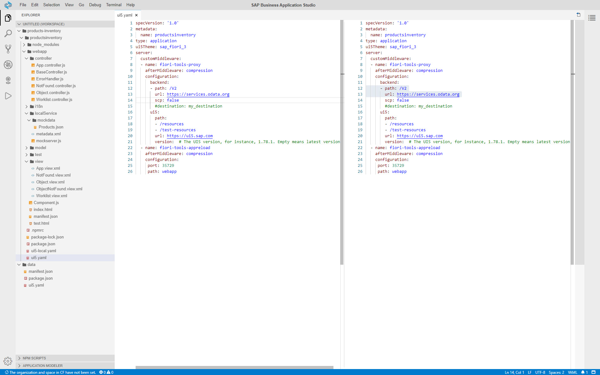<br><br>

## Exercise 6.2 - Modify package.json

8. Follow the same steps as in the previous sub-exercise, but for the *package.json* file. The only difference is the *start* script. This is what the updated `scripts` section should look like in the app's `package.json` file.
    ```json
        "scripts": {
                "start": "fiori run --open test/flpSandbox.html",
                "start-mock": "fiori run --open test/flpSandboxMockServer.html",
                "start-local": "fiori run --config ./ui5-local.yaml --open test/flpSandboxMockServer.html",
                "unit-tests": "fiori run --open test/unit/unitTests.qunit.html",
                "int-tests": "fiori run --open test/integration/opaTests.qunit.html",
                "build": "rimraf dist && ui5 build -a --include-task=generateManifestBundle generateCachebusterInfo",
                "deploy": "fiori add deploy-config"
        },
    ```

## Exercise 6.3 - Modify `webapp/manifest.json`

8. Follow the same steps as in the previous sub-exercise, but for the `manifest.json` file. The only differece is the `uri` for the `mainService` in the `dataSources` section. This is what the updated `dataSources` section should look like in the app's `manifest.json` file.
    ```json
		"dataSources": {
			"mainService": {
				"uri": "/V2/Northwind/Northwind.svc/",
				"type": "OData",
				"settings": {
					"odataVersion": "2.0",
					"localUri": "localService/metadata.xml"
				}
			}
		}
    ```

## Exercise 6.4 - Run the App Locally in the Dev Space

After completing these steps, you will have tested the app with data fetched from a real backend.

1.	Right-click any folder within the `productsinventory` folder, e.g. the `webapp` folder, and select *Preview Application*.
    <br><br>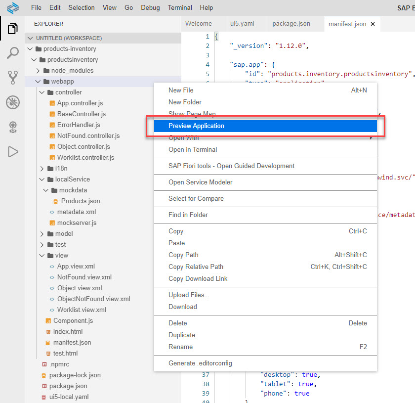<br><br>

2.	The command palette opens with a list of options. Click *start* to run this script.
    <br><br>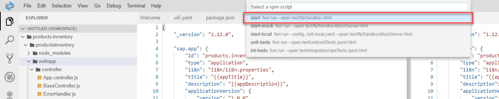<br><br>

    >You may receive notifications at the bottom right of the screen asking you to expose ports (8081, 35XXX). Click *Yes*.

    >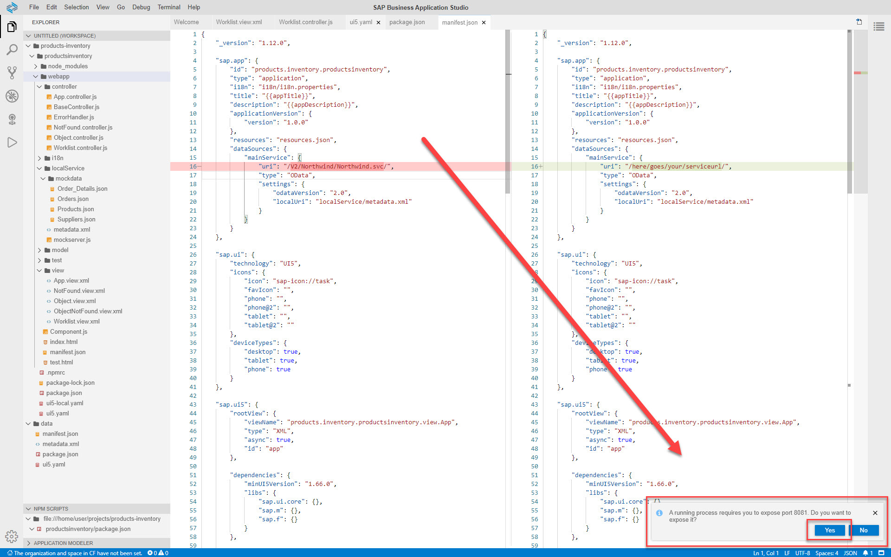<br><br>

    >A new browser tab opens, containing the SAP Fiori launchpad.

    >If the browser tab does not open, or a notification "You have exceeded the number of ports you can expose" appears at the bottom-right of the page, you may need to unexpose ports. Select the *Ports: Unexpose* option in the command palette (View | Find Command) to unexpose a port that is in an *[Active]* state. Repeat this procedure until no more than two ports are in *[Active]* state, and try again.

    >A new tab opens in SAP Business Application Studio, showing the log of the running app.

    >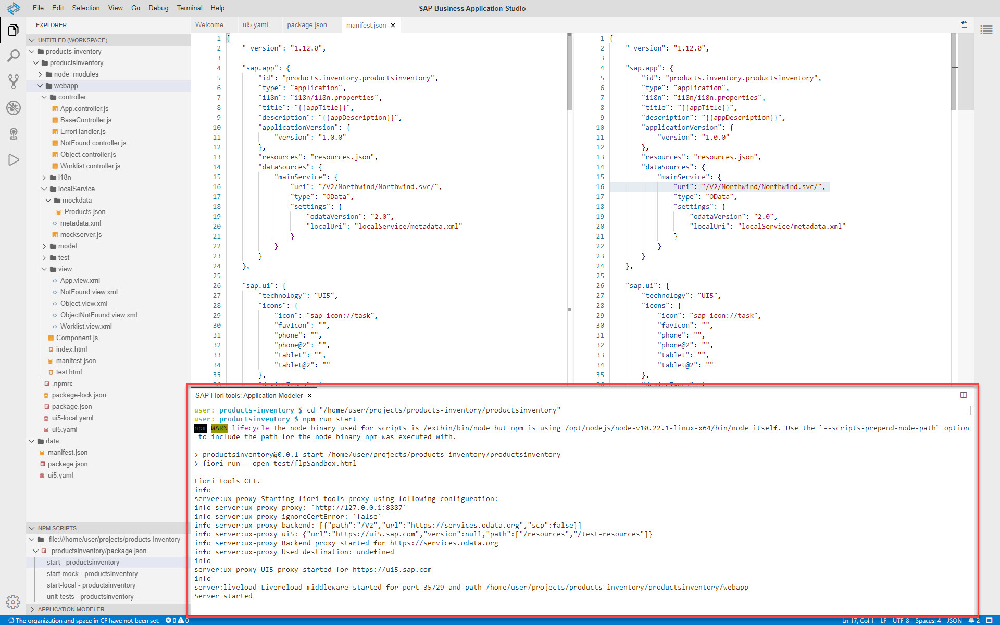<br><br>


3. Click the *Products Inventory* tile to launch the app.
    <br><br>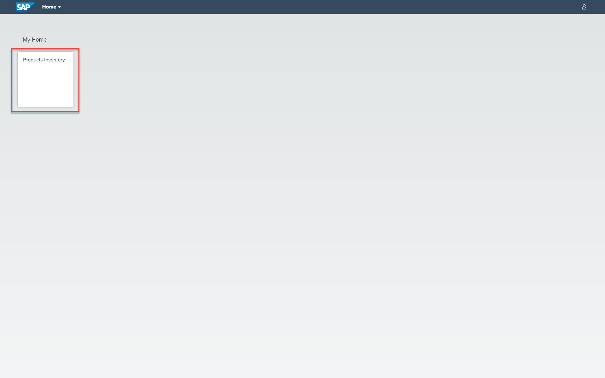<br><br>

4. The app is run with data coming from the demo *Northwind OData service* that is provided by the OData organization.
    <br><br>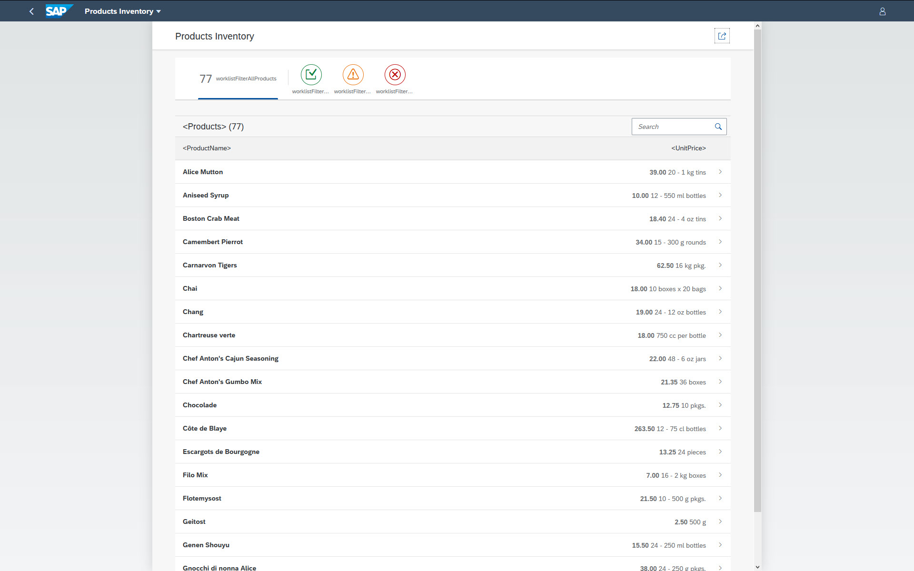<br><br>

    >You can observe that the data is different from the mock data you provided. It contains more products, and their inventory level is different.

## Exercise 6.5 - Remove the *data* project from the Workspace

1. Right-click the *data* project folder and select *Remove Folder from Workspace*.
    <br><br>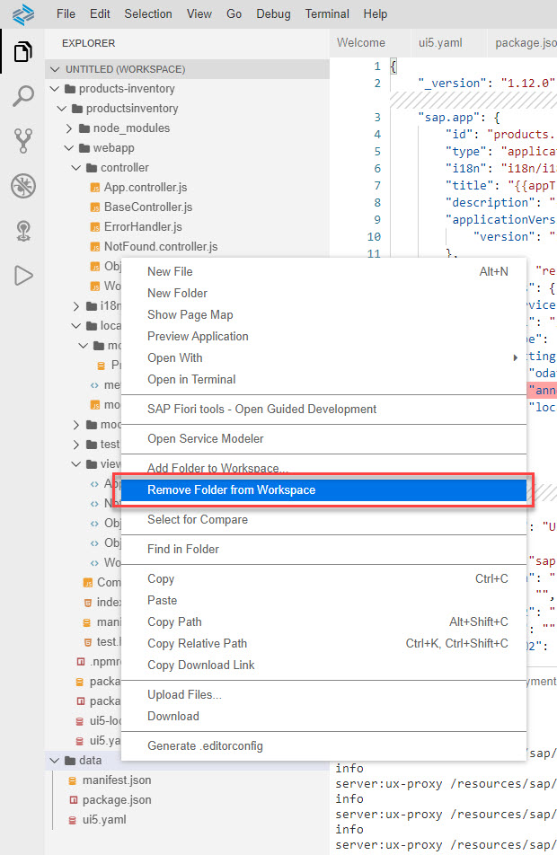<br><br>

2. A confirmation popup appears. Verify that only the *data* folder appears in the message, and click *OK*.
    <br><br>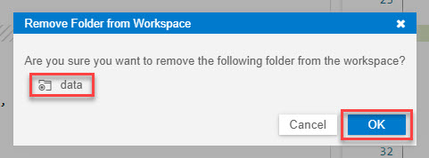<br><br>

    >The data project is removed from the workspace. The multi-root workspace is still there.
    ><br><br>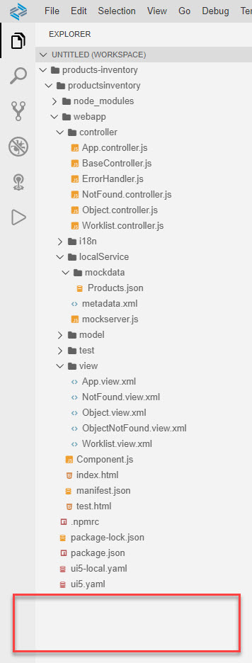<br><br>

    >Since you did not save the workspace configuration, if you open the app project as a workspace (*File | Open Workspace*, select *products-inventory*, and click *Open*), the multi-root workspace is removed.
    ><br><br>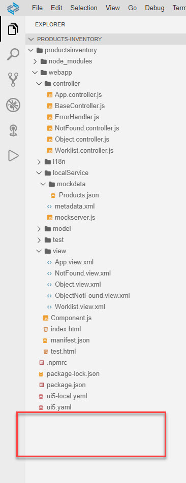<br><br>


## Summary

With this, you have successfully connected you app to a real backend system. You now have the option to test run the app against a real backend or to test run it with mock data (auto generated or user provided).

You also learned about single-root workspaces and multi-root workspaces. In this exercise you used *Untitled Workspace*. You can find out how to work with persistent multi-root workspaces in the SAP Business Application Studio [documentation](https://help.sap.com/viewer/9d1db9835307451daa8c930fbd9ab264/Cloud/en-US/0919ce1ca4a342628e49c0f5e9c8cdcf.html). 

Continue to - [Exercise 7 - Run the app on CF](../ex7/README.md)
