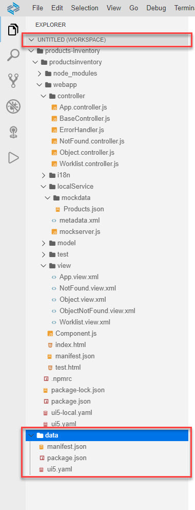

# Exercise 6 - Connect to Backend

In this exercise, we will connect the app to a real backend. We will use the *Northwind* demo service that is available from the OData organization.


## Exercise 6.1 Preparations

1.	Right-click an empty space in the *Explorer* pane *Add Folder to Workspace...*.
    <br><br><br><br>

2. Select *projects > data*, and click *Open*.
    <br><br><br><br>

3. Click *No* for the popup "A workspace with multiple roots was created. Do you want to save your workspace configuration as a file?". 
    <br><br><br><br>

    >In the *Explorer* pane you can see that the name of the workspace changed to *UNTITLED (WORKSPACE)* and an additional "project" *data* was added to this workspace. Expand the *data* project. It contains the files we uploaded at the end of ex1, and which we are going to use in this exerices.
    ><br><br><br><br>

    > TBD: EXplain a bit on multi-root

## Exercise 6.1 - Modify ui5.yaml

4. Select the two ui5.yaml files, the one in the app and the one in the *data* "project". Press [CTRL] + click each of them. Make sure that only these two files are selected.
    >To deselect a file or foder, Press [CTRL] + click it.

    <br><br><br><br>

5. To compare the two files side-by-side, right-click one of the selected ui5.yaml files and select *Compare with Each Other*.
    <br><br><br><br>

6. A file compare editor with both files is opened.
    <br><br><br><br>

    >Tip 1: The order you selected the files affects which file appears on the left-hand side and which file appears on the right-hand side.

    >Tip 2: Mouse hover over the tab's title provides a tooltip that indicates which file is opened where.

    >Tip 3: The gutter on the right-hand side indicates which part of the file is presented, the cursor's location, and where diffs between the files exist.

7. Copy the following lines from the file in the data project to the file in the app.
    ```json
        - path: /V2
          url: https://services.odata.org
    ```
    
    >As the files are now identical, there are no indications on diffs.
    ><br><br><br><br>

## Exercise 6.2 - Modify package.json

8. Perform the same steps as in the previous sub-exercise, but for *package.json*. The only diff is the *start* script. Following is how the updated scripts section should be for the app's *package.json*.
    ```json
        "scripts": {
                "start": "fiori run --open test/flpSandbox.html",
                "start-mock": "fiori run --open test/flpSandboxMockServer.html",
                "start-local": "fiori run --config ./ui5-local.yaml --open test/flpSandboxMockServer.html",
                "unit-tests": "fiori run --open test/unit/unitTests.qunit.html",
                "int-tests": "fiori run --open test/integration/opaTests.qunit.html",
                "build": "rimraf dist && ui5 build -a --include-task=generateManifestBundle generateCachebusterInfo",
                "deploy": "fiori add deploy-config"
        },
    ```

## Exercise 6.3 - Modify webapp/manifest.json

8. Perform the same steps as in the previous sub-exercise, but for *manifest.json*. The only diff is the *uri* for the *mainService* in the *dataSources* section. Following is how the updated *dataSources** section should be for the app's *manifest.json*.
    ```json
		"dataSources": {
			"mainService": {
				"uri": "/here/goes/your/serviceurl/",
				"type": "OData",
				"settings": {
					"odataVersion": "2.0",
					"localUri": "localService/metadata.xml"
				}
			}
		}
    ```

## Exercise 6.4 - Run the App Locally in the Dev Space

After completing these steps you will have tested the app with data fetched from a real backend.

!!!If the preview does not response - probably need to unexpose ports.

1.	Right-click any folder within the productsinventory folder, e.g. *webapp* folder, and select *Preview Application*.
    <br><br><br><br>

2.	The *command palette* is opened with a list of options. Click *start* to run this script.
    <br><br><br><br>

    >You may receive notifications at the bottom right of the screen asking you to expose ports. click *Yes*.

    ><br><br>

    >A new browser tab is opened, where the FLP is run.

    >A new tab is opened in SAP Business Application Studio, where the log of running the app is presented.

    ><br><br>


3. Click the *Products Inventory* tile to launch the app.
    <br><br><br><br>

4. The app is run with data coming from the demo Northwind OData service that is provided by the OData organization.
    <br><br><br><br>

    >You can observe that the data is different than the mock data you provided. It contains more products, and their inventory level is different, i.e. the products when filtered are the same.

## Exercise 6.5 - Remove the data "project" from the Workspace

1. Right-click the *data* "project" folder and select *Remove Folder from Workspace*.
    <br><br><br><br>

2. A confirmation popup appears. Verify that only the *data* folder appears in the message. Click *OK*.
    <br><br><br><br>

    >The data "project" was removed from the workspace. The multi-root workspace is still there.
    ><br><br><br><br>

    >Since you did not save the workspace configuration, if you open the app project as a workspace (*File | Open Workspace > products-inventory > Open*), the multi-root workspace is removed.
    ><br><br><br><br>


## Summary

With this, you have successfully connected you app to a real backend system. You now have the option to test run the app against a real backend or to test run it with mock data (auto generated or user provided).

Continue to - [Exercise 7 - Run the app on CF](../ex7/README.md)
