# Exercise 7 - Run the app on Cloud Foundry

In this exercise, you will create the app's deployment artifacts, deploy the app to Cloud Foundry, and test run the app on Cloud Foundry.

## Exercise 7.1 - Configure the App to Use the Cloud Foundry Runtime

After completing these steps, you will know how to prepare the app for deployment to the Cloud Foundry runtime, and use the Cloud Foundry command line tools as well as SAP Cloud Platform cockpit.

1. Open a new terminal using *[CTRL] + ~ keyboard* shortcut or *Terminal | New Terminal* from the menu bar.
<br><br>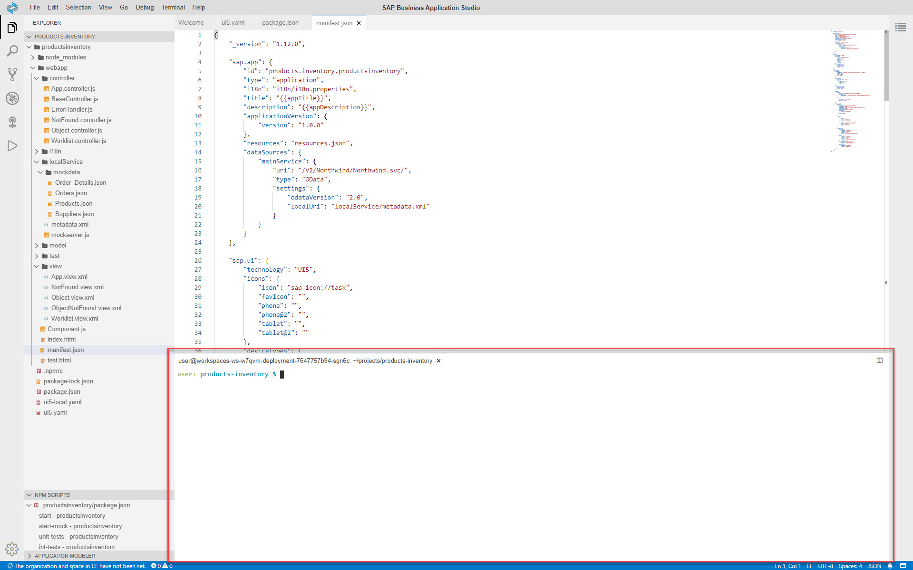<br><br>

    > Tip: You can toggle maximize the view, in this case the terminal, by double-clicking its tab header.

2. Change directory to the `productinventory` folder:
<br><br>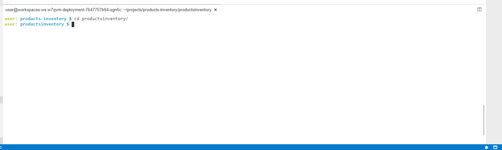<br><br>

    ```Shell/Bash
    cd productsinventory
    ```

    > Tip: You can use auto-complete to enhance your productivity, e.g. in the terminal, type *cd pro* and press [TAB] to auto-complete.


3. Prepare the app for deployment to Cloud Foundry. The preparation includes two steps: 
a) Generating the deployment artifacts and turning the app into a multi target application (MTA).
b) Generating the SAP Fiori launchpad. 
Both parts are executed using the following command:
<br><br>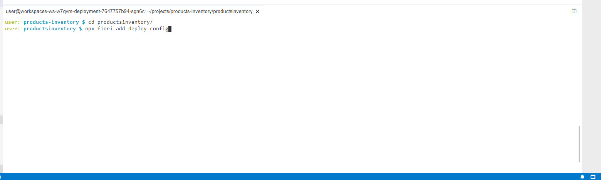<br><br>

    ```Shell/Bash
    npx fiori add deploy-config
    ```

4. For the *Adding deploy-config to the project.* step, select the following:

    | Step | Parameter | Value |
    |:-----|:----------|:------|
    | A | Please choose the target | *Cloud Foundry* |
    | B | Generate project artifacts in root folder: /home/user/projects/products-inventory? | *Yes* (default) |
    | C | Enter MTA ID | *products-inventory* (default) |
    | D | Enter MTA Description | *SAP Fiori Freestyle Demo* |
    | E | Enter MTA Version | *0.0.1* (default) |
    | F | Destination name | *northwind* (case sensitive) |

    <br><br>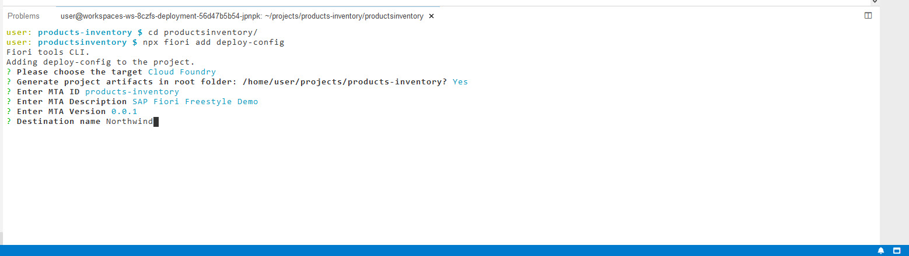<br><br>

    >After you complete the above, a script runs and you'll enter the SAP Fiori launchpad configuration step.
    ><br>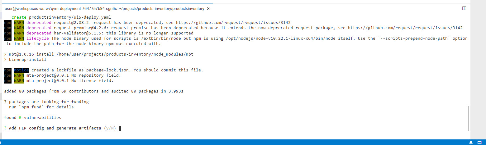<br><br>

5. To configure the SAP Fiori launchpad (FLP), select the following:

    | Step | Parameter | Value |
    |:-----|:----------|:------|
    | A | Please choose the targetAdd FLP config and generate artifacts | *Y* |
    | B | Semantic Object | *prinSO* |
    | C | Action | *display* (default) |
    | D | Title | *Products Inventory* (default) |
    | E | Subtitle (optional) | *Fiori Rocks!* (default) |

    <br><br>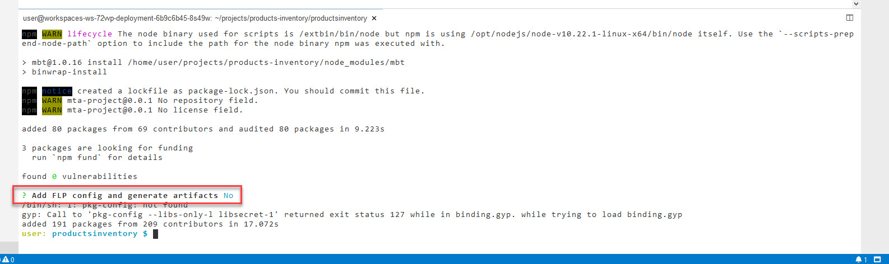<br><br>

    >After you complete the above, a script runs and the FLP is added to the project.
    ><br>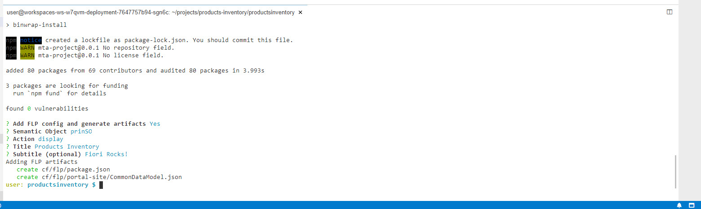<br><br>

    >As a result of executing the `npx` command, you'll see that the project structure was updated accordingly.
    ><br>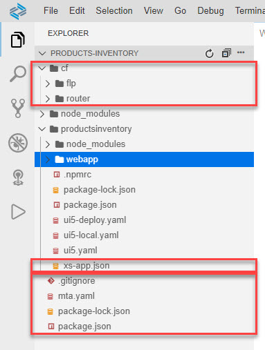<br><br>

## Exercise 7.2 - Build for the Cloud Foundry Runtime

6. To build the app for deployment, right-click the `mta.yaml` file, and select *Build MTA*.
    <br><br>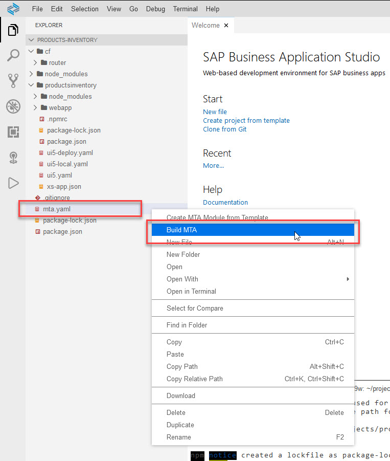<br><br>

    >The task is run in a new tab called *Task: Build MTA*.
    ><br>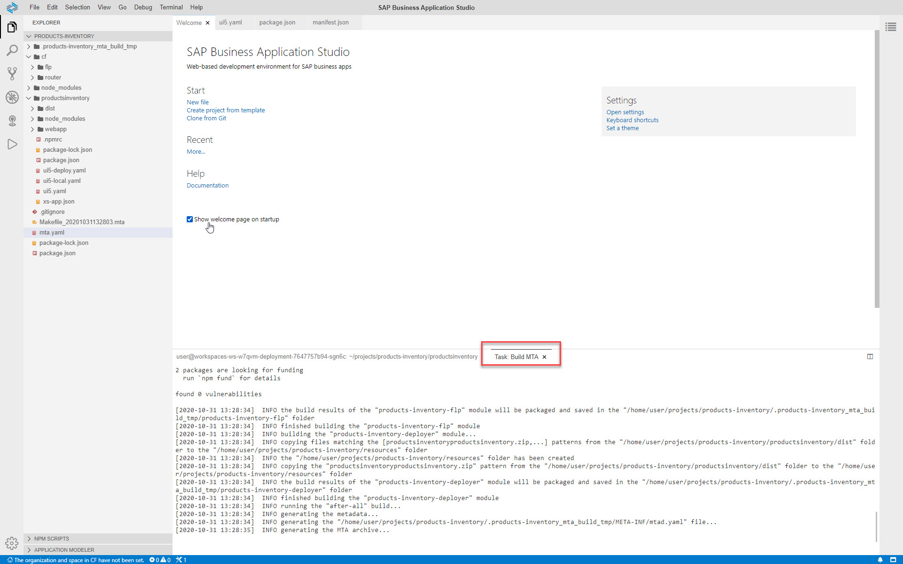<br><br>

    >When the build task is complete, additional artifacts are added to the project. The artifact that is used for deployment is the MTA archive (MTAR) `product-inventory_0.0.1.mtar`.
    ><br>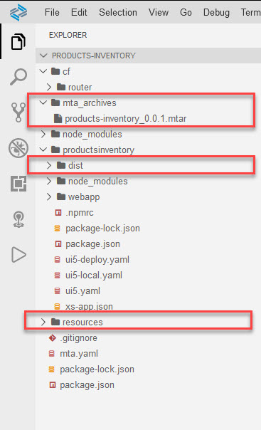<br><br>

## Exercise 7.3 - Log in to Cloud Foundry

7. Before deploying the app to Cloud Foundry, take a look at what your Cloud Foundry space looks like. Log in to your trial account and enter your Cloud Foundry organization (SAP Cloud Foundry subaccount) and the space to which you'll deploy the app. A new Cloud Foundry space should look as follows:
    <br><br>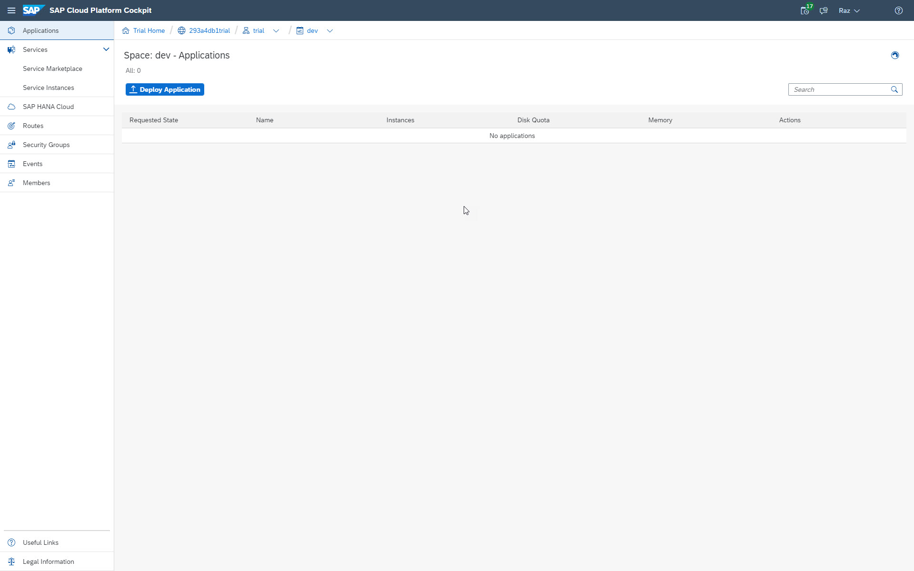<br><br>
    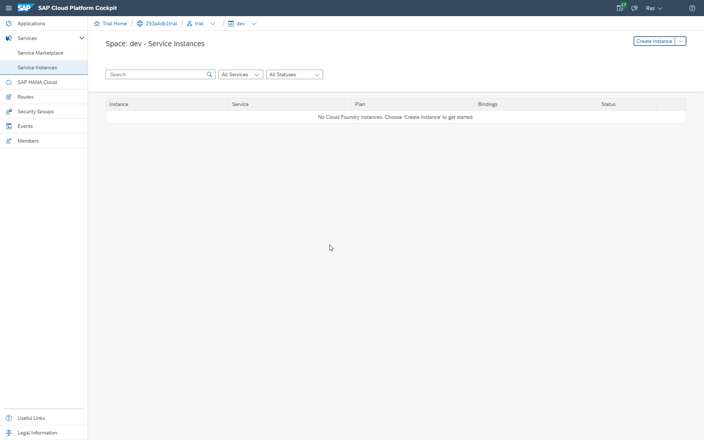<br><br>

8. Log in to the Cloud Foundry space to which you'll deploy the app. From the menu bar, select *View | Find Command* to open the command palette.
<br><br>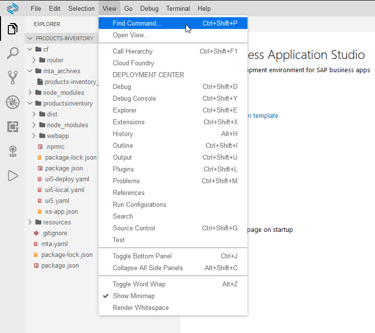<br><br>

    >You can also log in to Cloud Foundry by clicking the Home icon at the left-hand side of the status bar or, in the terminal, execute the *cf login* command and follow the same steps.

9. Select the command *CF: Login to cloud foundry*.
<br><br>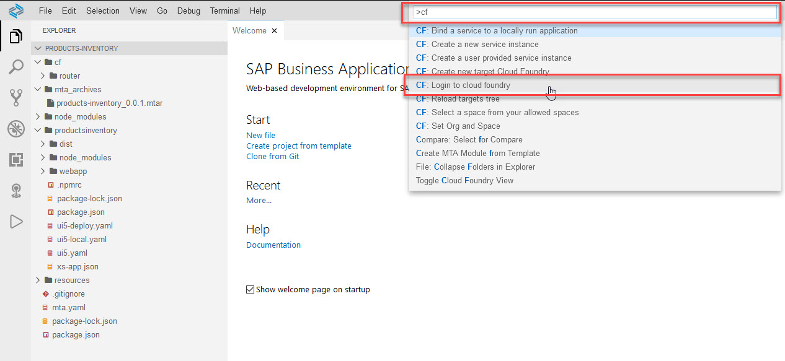<br><br>

    >Type *cf* to filter commands.

10. When prompted, provide your credentials, select the API endpoint, organization, and space for your project.

    >The Cloud Foundry organization and space appear in the status line at the bottom left part of the screen.
    ><br>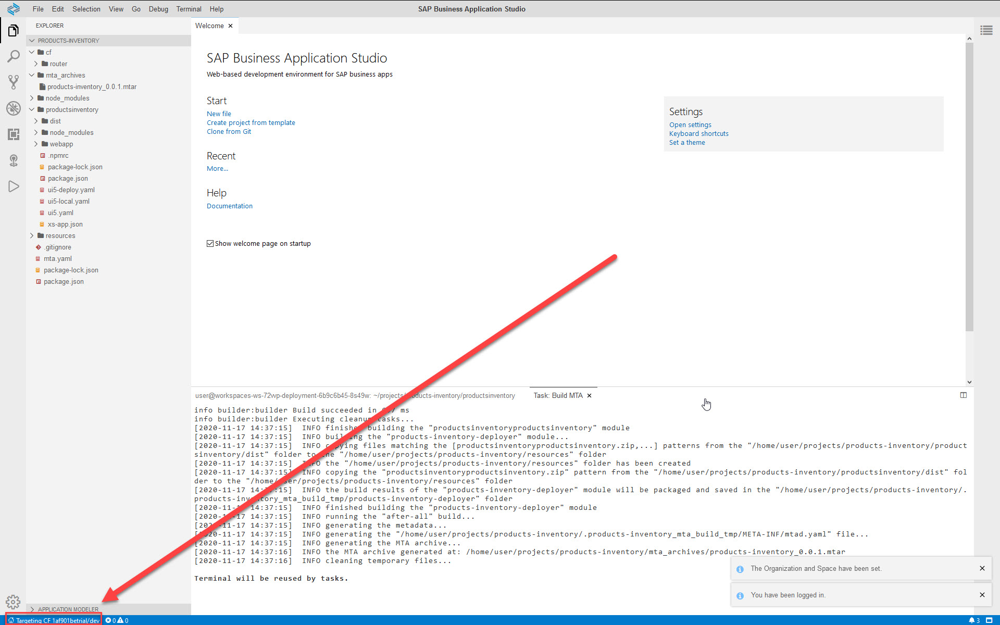<br><br>

## Exercise 7.4 - Deploy to Cloud Foundry

11. To deploy the app to Cloud Foundry, right-click the `products-inventory_0.0.1.mtar` file, and select *Deploy MTA Archive*.
    <br><br>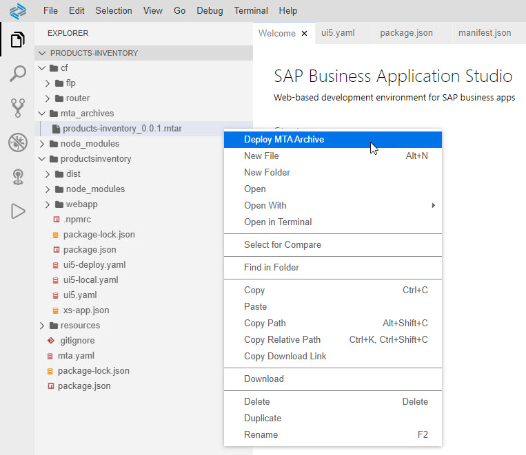<br><br>

    >The task is re-using the *Task: Build MTA* tab and changes its title to *Task: Deploy MTA Archive*.
    ><br>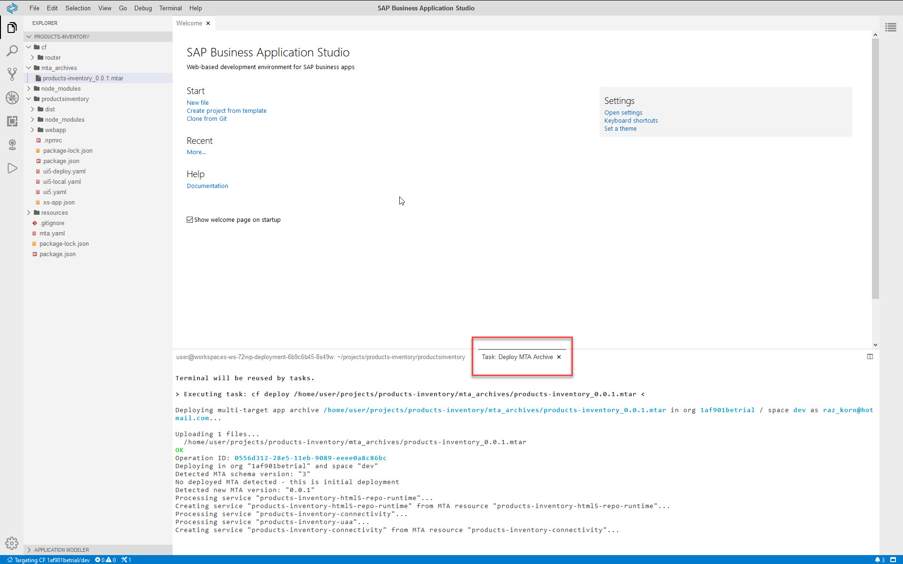<br><br>

    >You can follow the deployment progress both in the *Task: Deploy MTA Archive* tab and in the *SAP Cloud Platform Cockpit*.

12. To see the results of the deployment to Cloud Foundry, go to the *Cloud Foundry* tab. Your Cloud Foundry space should look as follows:
    <br><br>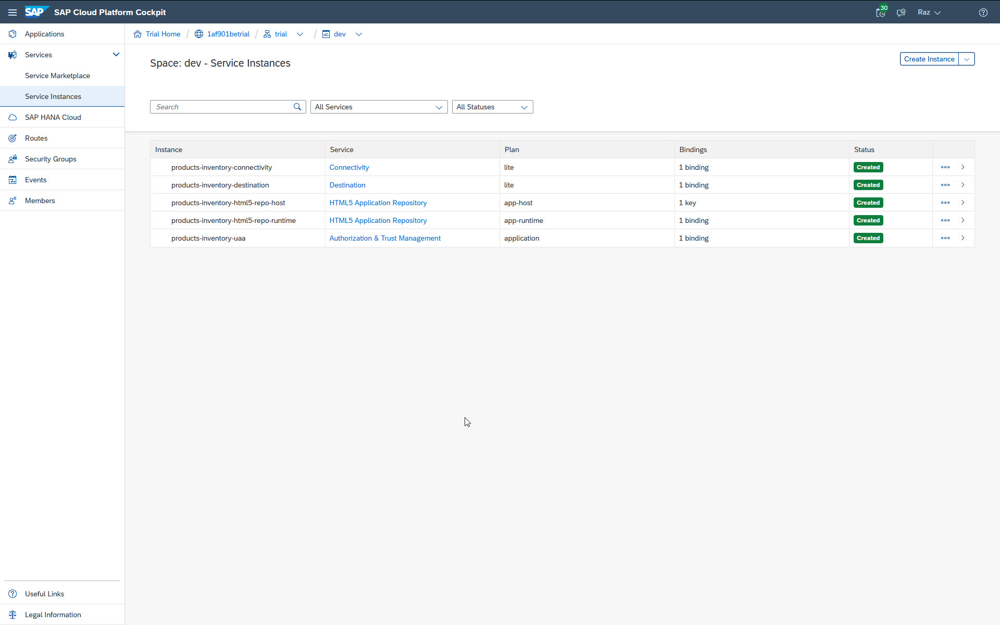<br><br>
    <br><br>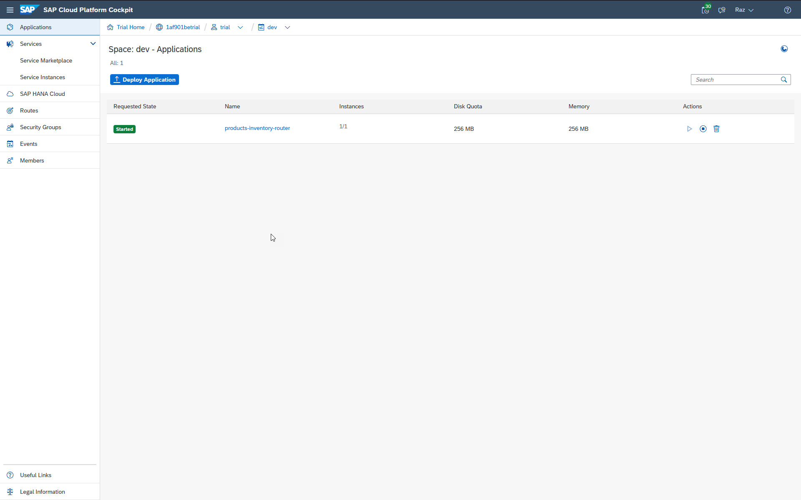<br><br>

## Exercise 7.4 - Run the App on Cloud Foundry

13. To run the application on Cloud Foundry, in the *SAP Cloud Platform Cockpit*, go to the Cloud Foundry space to which you deployed the app, and click the *Applications* tab. Click *products-inventory-router*, and then click the link in the *Application Routes* section.
    <br><br>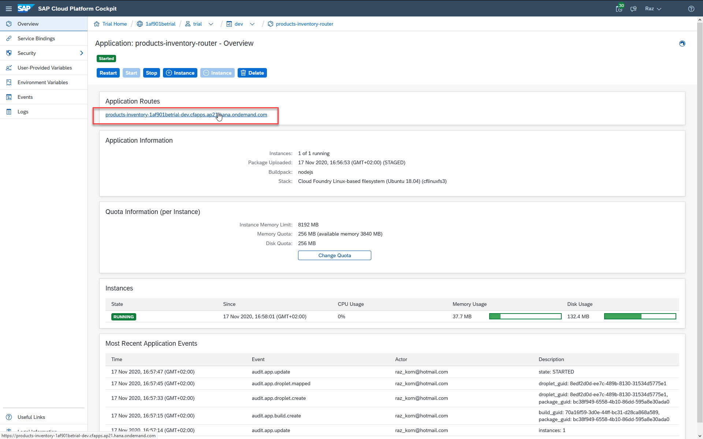<br><br>

14. SAP Fiori launchpad comes up with your application tile.
    <br><br>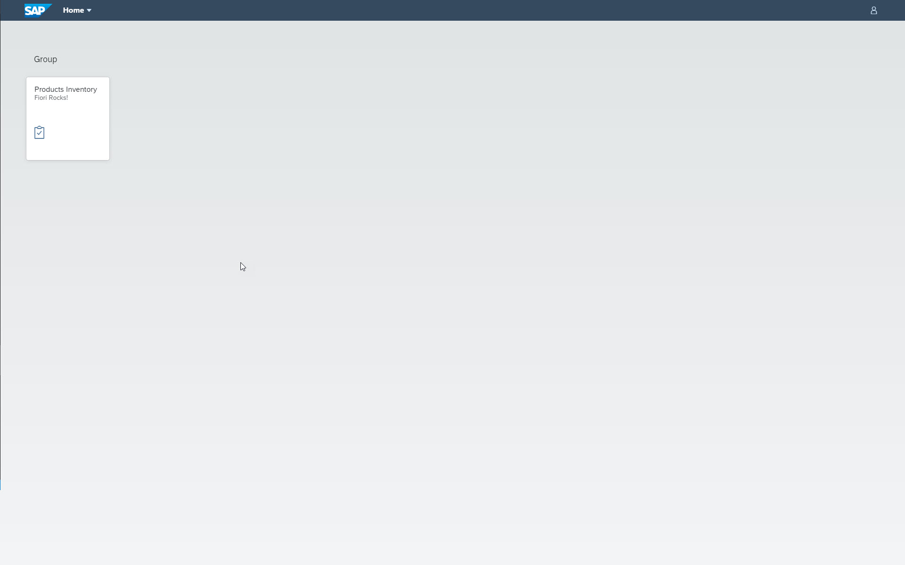<br><br>

15. Click the application tile. You should see the app running on Cloud Foundry.
    <br><br>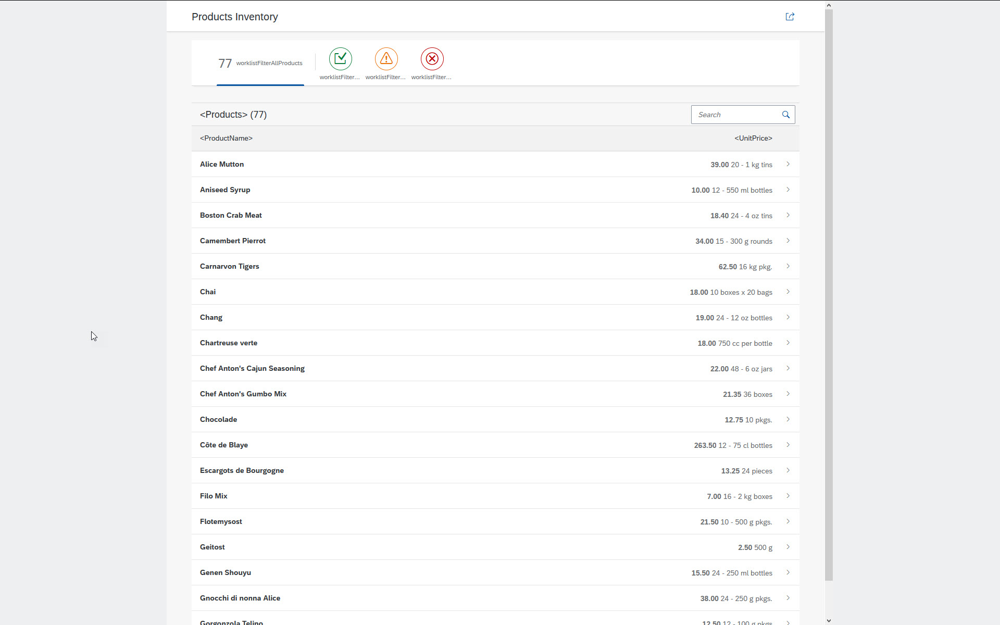<br><br>

## Summary

Congratulations, you completed the [Run the app on Cloud Foundry](#Run-the-app-on-CF) exercise!

With this, you have successfully completed the deployment of your SAP Fiori app to SAP Cloud Platform using SAP Business Application Studio.

In this exercise, you used high productivity tools that are available out-of-the-box in SAP Business Applications Studio that make it easy to build and deploy applications as well as work in the Cloud Foundry environment.

You reached a major milestone of this session, the full app lifecycle: creation, enhancement, connection to a backend system, testing with mock data and real data, build, deployment to Cloud Foundry, and running the app on Cloud Foundry. 

You're awesome!

Continue to [Connect Your Project to SAP Cloud Platform Continuous Integration and Delivery - Github Setup](../ex8/README.md).
