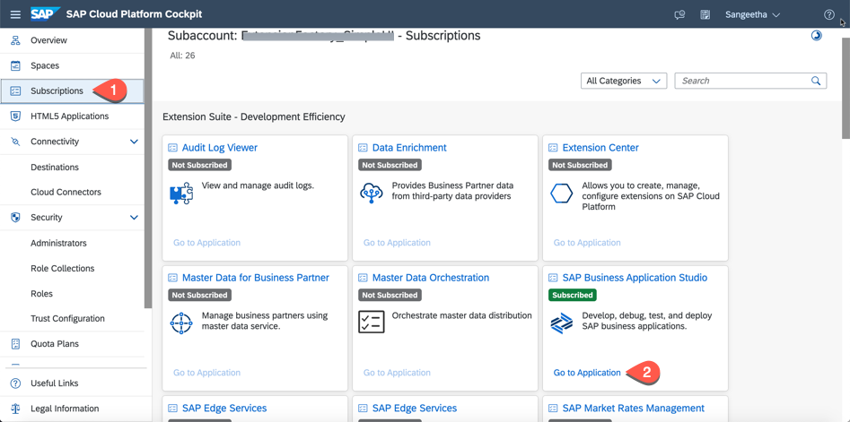
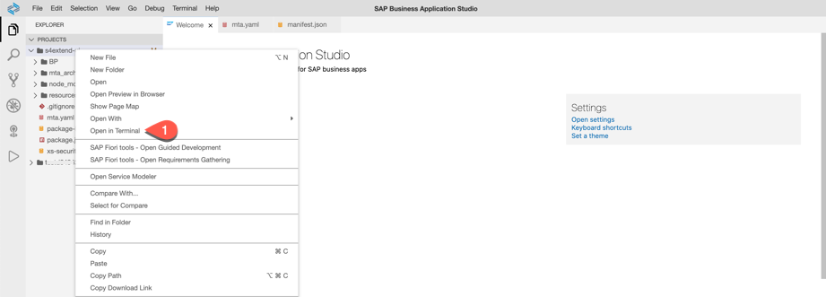

# Exercise 8 - Connect Your Project to SAP Cloud Platform Continuous Integration and Delivery - Github Setup

In this exercise, we will create a project in a public GitHub repository in which to store your source code, enable SAP Cloud Platform Continuous Integration and Delivery, and configure and run a predefined continuous integration and delivery (CI/CD) pipeline that automatically tests, builds, and deploys your code changes.

## Exercise 8.1 Create a GitHub Repository

After completing these steps, you will have created a public GitHub repository, in which you can store the source code of your project. **Note:** For this execise, you need to have a GitHub user.

1. Open and sign in to https://github.com/.

2. In the **Repositories** tab, choose **New** to create a new repository.

   
3. As **Repository name**, enter *products-inventory*. Don't check any of the **Initialize this repository with** checkboxes.

4. Choose **Create repository**.


5. Copy the HTTPS URL of your newly created GitHub repository.


## Exercise 8.2 Create a Personal Access Token for GitHub

After completing these steps, you will have created a personal access token to authenticate against GitHub.

To create a personal access token, which you can use instead of a password, follow the steps described in [Creating a personal access token](https://docs.github.com/en/github/authenticating-to-github/creating-a-personal-access-token).


## Exercise 8.3 Connect Your GitHub Repository with Your SAP Fiori Project

After completing these steps, you will have added your SAP Fiori project sources to your GitHub repository.

1. Log in to your SAP Cloud Platform account.

2. Navigate to your subaccount and choose **Subscriptions**.

3. Search for *Business Application Studio* and choose **Go to Application**.

As a result, you're prompted to log in through your custom identity provider.

4. Log in to the application using your custom identity provider credentials.

5. Open the previously created workspace with your SAP Fiori application.

6. Open a new terminal and navigate to your project root folder.


7. Enter your email address and username. You can use the email address that you've used to register your GitHub account:
   ```
   git config --global user.email "you@example.com"
   git config --global user.name "Your Name"
   ```
7. To initialize a GitHub repository and add the project sources to it, execute the following commands:

    ```
    git init
    git add .
    git commit -m "Push project content to github"
    ```

8. Now, add your copied GitHub repository URL from exercise 8.1 as remote repository:

   ```
   git remote add origin <copied Git repository url.git>
   ```

9. Push the commit with your project content to this GitHub repository:

   ```
   git push -u origin main
   ```

10. When prompted, enter your GitHub username and password (or your personal access token).


## Summary

You've created a project in GitHub to store your source code and successfully configured and run a predefined continuous integration and delivery pipeline that automatically builds, tests and deploys your code changes.

Continue to - [Exercise 9 - Useful CF Commands](../ex9/README.md).
