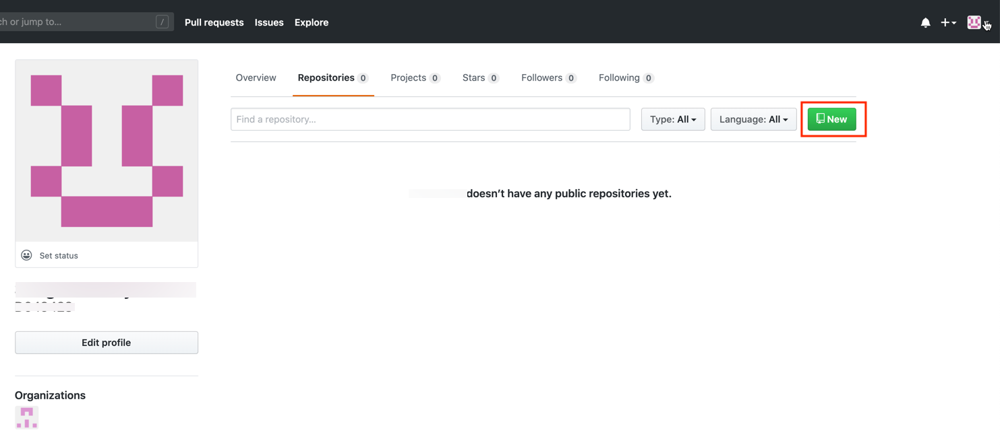
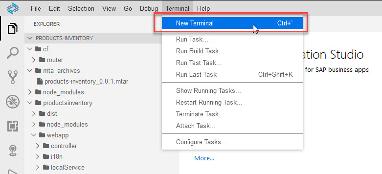
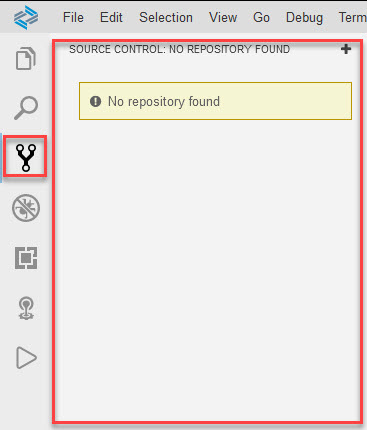
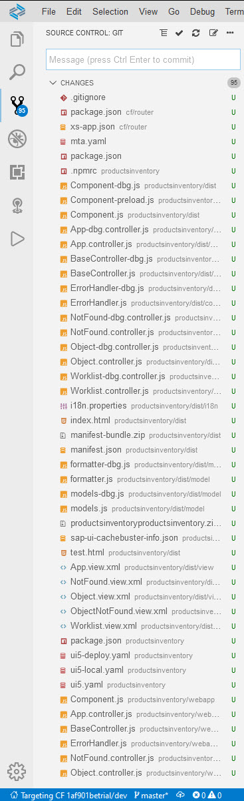
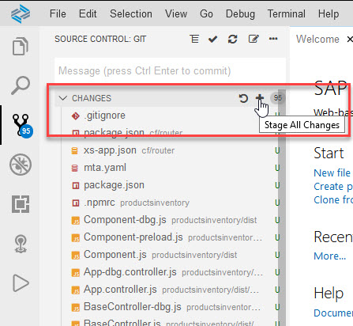
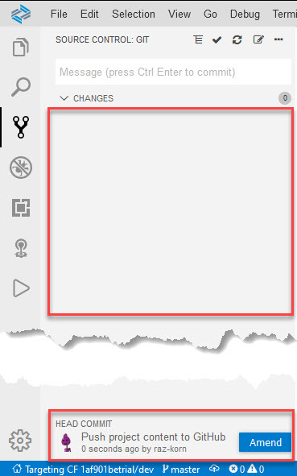
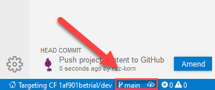

# Exercise 8 - Connect Your Project to SAP Cloud Platform Continuous Integration and Delivery - GitHub Setup

In the following exercises (exercises 8 - 11), you will create a project in a public GitHub repository to which you'll store your source code, enable SAP Cloud Platform Continuous Integration and Delivery, and configure and run a predefined continuous integration and delivery (CI/CD) pipeline that automatically tests, builds, and deploys your code changes.

## Exercise 8.1 Create a GitHub Repository

After completing these steps, you will have created a public GitHub repository to which you'll store the source code of your project.          
   >For this exercise, you need to have a GitHub user.

1. Open and sign in to [GitHub]( https://github.com/).

2. In the *Repositories* tab, choose *New*.
   <br><br><br><br>
   
3. As *Repository name*, enter *products-inventory*. Don't select any of the *Initialize this repository with...* checkboxes.

4. Choose *Create repository*.
   <br><br><br><br>

5. Copy the HTTPS URL of your newly created GitHub repository.
   <br><br><br><br>


## Exercise 8.2 Create a Personal Access Token for GitHub

After completing these steps, you will have created a personal access token to authenticate against GitHub.

To create a personal access token, which you can use instead of a password, follow the steps described in [Creating a personal access token](https://docs.github.com/en/github/authenticating-to-github/creating-a-personal-access-token).


## Exercise 8.3 Connect Your GitHub Repository with Your SAP Fiori Project

After completing these steps, you will have added your SAP Fiori project sources to your GitHub repository.

1. In SAP Business Application Studio, open a new terminal, and navigate to your project's root folder, `products-inventory`. It is the default folder when opening a new terminal.
   <br><br><br><br>

2. Configure your GitHub user information. Enter your email address and user name. You can use the email address that you used to register your GitHub account:
   ```
   git config --global user.email "you@example.com"
   git config --global user.name "Your Name"
   ```

3. For some operations Git will need your credentials. Configure Git to ask your credentials only once, when you run the first Git operation that requires credentials. 
   ```
   git config --global credential.helper 'cache --timeout=3600'
   ```

   >Using the above configuration, Git stores your Git credentials in an ephemral storage. If you stop or restart the dev space or the timeout expires, you'll need to re-enter your credentials the next time a Git operations requires them.

   >We chose to use this mode in this session, mainly due to its simplicity. There are other options to avoid inputtng your credentials repeatedly, such as `ssh`, `.netrc`, `git config --global credential.helper store`.

4. Click *Source Control* to open the Git view.
   <br><br><br><br>

5. Click the `+` icon at the top-right of the Git view to initialize a local GitHub repository.
   <br><br><br><br>


6. Hover over the `CHANGES` title, and click the `+` icon to stage all changes. 
   <br><br><br><br>

   >You'll see that the `U` (Updated) file decoration changed to `A` (Added to staging).

7. Add the message *Push project content to GitHub* to the *Message* box, and press [CTRL] + [ENTER] or click the `v` icon, to commit.
   <br><br><br><br>

   > The Git view is cleared, and at the bottom of the view `HEAD COMMIT` is created.
   ><br><br>


8. In the terminal, link the local git repository to the remote GitHub repository that you created in exercise 8.1. 
   >Replace `<remote GitHub repository url>` with the repository URL from GitHub.

   ```
   git remote add origin <remote GitHub repository url>
   ```

8. In the terminal, change the project's branch name in the local repository to *main*.
   >The local repository default name is `master` (You can see it on the left side of the Status Bar). Best practice is to use `main`.

   ```
   git branch -M main
   ```

   ><br><br>

9. In the terminal, push the commit with your project content to the remote GitHub repository:
   ```
   git push -u origin main
   ```

10. When prompted, enter your GitHub user name and for password use your personal access token.
   >Until the credentials timeout expires or dev space stop, you will not need to input your credentials.

## Summary

You've created a project in GitHub and stored in it your app's source code.

Continue to - [Exercise 9 - Connect Your Project to SAP Cloud Platform Continuous Integration and Delivery Service - Setup the Service](../ex9/README.md).
