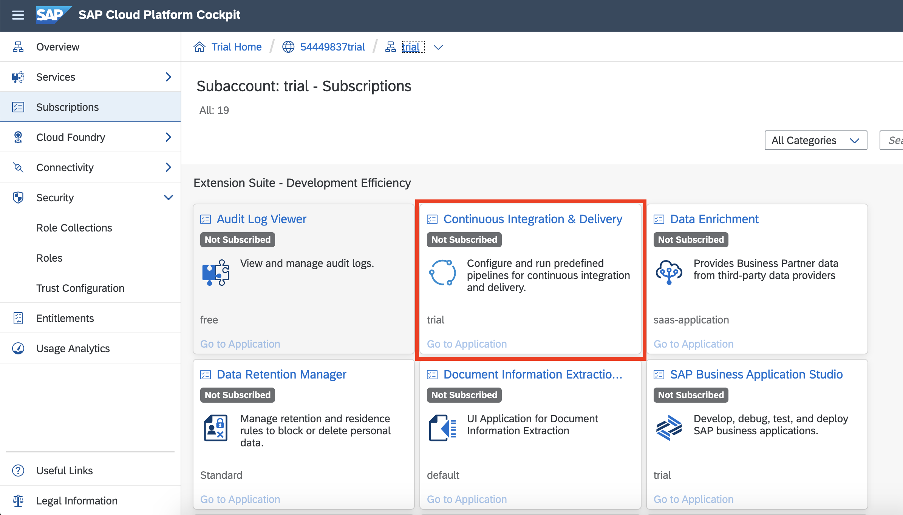
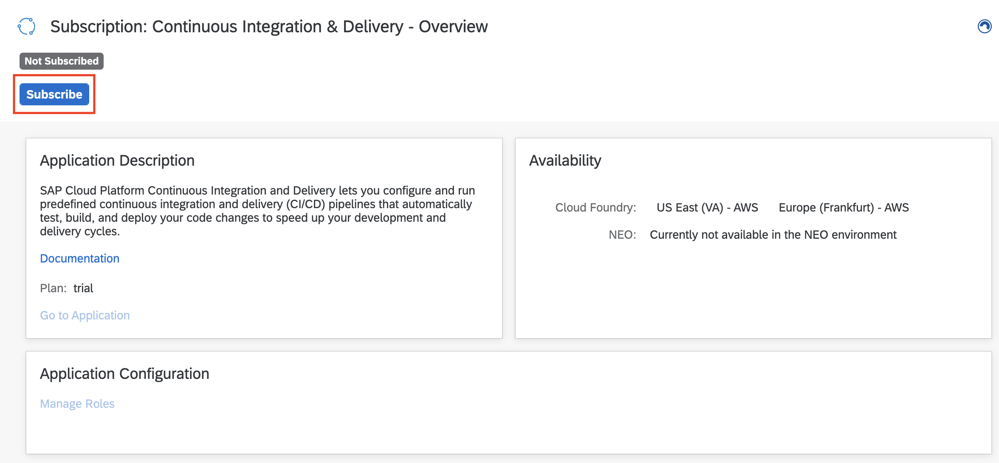
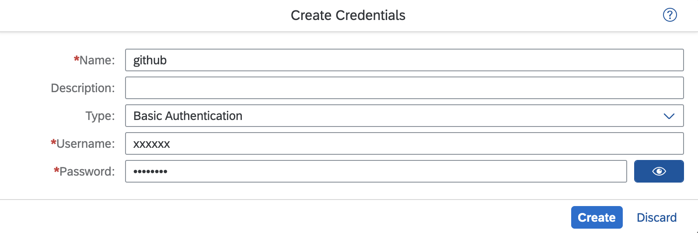
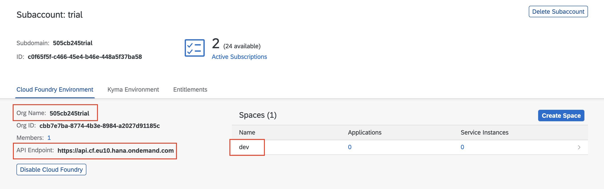
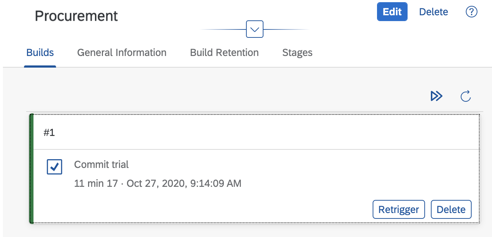
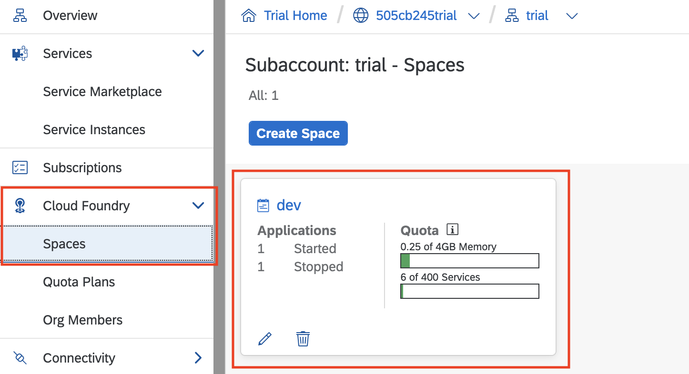

# Exercise 8 - Connect your project to SAP CP Continuous Integration and Delivery 

In this exercise we will create a project in the public GitHub where you can store the source code, enable `SAP CP Continuous Integration and Delivery` to configure and run predefined continuous integration and delivery (CI/CD) pipeline that automatically test, build, and deploy your code changes to speed up your development and delivery cycles.

## Exercise 8.1 Create a GitHub Project 

After completing these steps you will have created a repository in the public GitHub where you can store the source code of your project. You need to have a user in the public GitHub to execute the steps below.

1. Open https://github.com/ and sign in with your user.

2. Click on *New* in the 'Repository' tab to create a new repository.

   
3. Enter the name of the repository. Use 'products-inventory'. Do not check the checkbox 'Intialize this repository with a README'.
4. Click on create repository.


5. Copy the github url of the newly created Git repository.


## Exercise 8.2 Create Personal Access Token for GitHub

After completing these steps you will have created a personal access token to authenticate against GitHub.


1. Refer to the public Git Hub link and create a [Personal Access Token](https://docs.github.com/en/github/authenticating-to-github/creating-a-personal-access-token).

## Exercise 8.3 Add Git repository to Fiori project

After completing these steps you will have added your project sources to a GitHub Repository.

1. Login to your SAP Cloud Platform account.
2. Goto your Subaccount and click on Subscriptions.
3. Search for **Business Application Studio** and click on 'Go to Application'.


4. You would be prompted with a login screen of the custom Identity Provider what you have configured.
5. Login to the Application using your custom Identity Provider credentials.
6. Open the previously created workspace with the Fiori application.
7. Open a new terminal and navigate to project root folder.


8. Enter your email address and User name to be used by Git. You can use the email address which you have used to register the Git account.
   ```
   git config --global user.email "you@example.com"
   git config --global user.name "Your Name"
   ```
7. Perform the following commands to initialize a Git repository and add the sources to it:

	```
    git init
    git add .
    git commit -m "Push project content to github"
    ```

8. Now take the copied Git Repository URL which you created and copied in step 'Create a GitHub Project' and add this URL pointing as the remote repository.

   ```
   git remote add origin <copied Git repository url.git>
   ```

9. Let us push the commit with project contents to this Git Repository.

   ```
   git push -u origin main
   ```

10. When prompted, enter your Git Username and Password (or Token).

## Exercise 2.4 Enable SAP CP Continuous Integration and Delivery

After completing these steps you will have subscribed to SAP Cloud Platform Continuous Integration and Delivery and will have asigned the `Administrator` role to your user.

1.	Open-up your SAP Cloud Platform trial account.
You will see the SAP Cloud Platform Continuous Integration and Delivery in the Subscriptions Tab.


2. Click on the service and subscribe to it.


3. Grant your user the `CICD Service Administrator` role by executing the following steps:
- In your subaccount in the SAP Cloud Platform cockpit, choose `Security`, then click on `Trust Configuration`.
- Choose the name of your identity provider.
- Enter your e-mail address.
- Choose `Show Assignments`.
If the user is new to the subaccount, choose Add User in the Confirmation dialog.
- Choose `Assign Role Collection`.
- From the dropdown list, select the `CICD Service Administrator` role.

## Exercise 2.5 Configure Credentials in SAP CP Continuous Integration and Delivery

After completing these steps you will have created credentials for connecting `SAP Cloud Platform Continuous Integration and Delivery` to other services.

1. Access SAP Cloud Platform Continuous Integration and Delivery in the SAP Cloud Platform cockpit.

- In your subaccount in the SAP Cloud Platform cockpit, choose 'Subscriptions'.
- In the SaaS Applications category, choose Continuous Integration & Delivery.
- Choose Go to Application.
- Use your credentials to log on to the application.


2. Create Credentials to connect to GitHub to clone the sources. This step is only needed if your GitHub repository is `private` else you can skip this step.

- Choose the ‘Credentials’ tab and click '+'. 
  
  - For 'Name', freely choose a name for your credential, which is unique in your subaccount on SAP Cloud Platform. In this example - 'github' 
  - For 'Type', select 'Basic Authentication'.
  - For 'Username', enter your Github user name.
  - For 'Password', use the personal access token which you created in the Github in previous step.


3. Create Credentials to deploy to CP, Cloud Foundry Environment.
- Choose the ‘Credentials’ tab and click '+'. 

  - For 'Name', freely choose a name for your credential, which is unique in your subaccount on SAP Cloud Platform. In this example - 'cfdeploy' 
  - For 'Type', select 'Basic Authentication'.
  - For 'Username', enter your Cloud Platform Cockpit user name.
  - For 'Password', use the password for Cloud Platform password.


## Exercise 2.6 Configure a job in SAP Cloud Platform Continuous Integration and Delivery

After completing these steps you will have configured a job in `SAP Cloud Platform Continuous Integration and Delivery`.

1. In the Jobs tab in `SAP Cloud Platform Continuous Integration and Delivery`, choose '+' (Create Job).


2. Fill in the general information
- For 'Job Name', Freely choose a job name that is unique in your subaccount on SAP Cloud Platform - for in this example 'RiskManagment'.
- For 'Repository URL', Enter the URL of your GitHub repository.
- For 'Repository Credentials', enter the Credentials name to access your GitHub Repository, created in 2.5. 
Leave empty if your GitHub repository is public.
- For 'Branch', enter the GitHub branch from which you want to receive push events.
- For "Pipeline", choose `sap-ui5-cf`.


- Scroll down to the 'Tasks'. By default, the Build task is ‘ON’.


- Change the Deploy State ‘ON’.
Get the org name, space name and apiEndpoint values from your Cloud Platform Cockpit in your account and fill them in.
 

- Choose the cloud credentials created in the previous step named 'cfdeploy'.
- Choose 'Create'


3. Whenever you create the first job in a GitHub repository, the Webhook Creation pop-up appears, which provides you with the data needed to define a webhook in GitHub. Alternatively, in the Jobs tab in SAP Cloud Platform Continuous Integration and Delivery, open the detail view of an existing job and under General Information, choose Webhook Data.


4. In your project in GitHub, open the Settings tab.
5. From the navigation pane, choose Webhooks.
6. Choose Add webhook.
[Webhook](./images/GH_webhook.png)
7. Enter the Payload URL, Content type, and Secret from the Webhook Creation pop-up in SAP Cloud Platform Continuous Integration and Delivery. For all other settings, leave the default values.
8. Choose Add webhook.


## Exercise 2.7 Make a Change in the Project.
1. Go to your repository in GitHub.
2. Change one file.
3. Commit the change to `GitHub`.


## Exercise 2.8 Verify Build Success in SAP CP Contunuous Integration and Delivery.

After completing these steps you will learn how to monitor the outcome of a job in `SAP Cloud Platform Continuous Integration and Delivery`.

1. In the Jobs tab in `SAP Cloud Platform Continuous Integration and Delivery`, select your job and verify a new tile appears in the Builds view of your job marked as 'Running'.


- In other case, trigger manually the job by pressing the 'Trigger Build' button.


2. Wait until the job has finished and verify the build tile has been marked as 'Successful'.


## Exercise 2.9 Access the Application.

1. Go to 'Cloud Foundry' tab for your trial account and select the 'Spaces'.


2. Select the space.

3. Verify the 'Procurement' Application has been deployed 

4. Verify the deployed application is running and showing its Home Screen.


## Summary

You've now created a project in the public GitHub where you stored the source code, successfully configured and ran predefined continuous integration and delivery pipeline that automatically build, test and deploy your code changes.

