# Exercise 9 - Connect Your Project to SAP Continuous Integration and Delivery Service - Set Up the Service

In exercises 8 - 11, you will create a project in a public GitHub repository to which you'll store your source code, enable SAP Continuous Integration and Delivery, and configure and run a predefined continuous integration and delivery (CI/CD) pipeline that automatically tests, builds, and deploys your code changes.

In this exercise, you will enable the SAP Continuous Integration and Delivery service, and create and configure a predefined continuous integration and delivery (CI/CD) pipeline that automatically tests, builds, and deploys your code changes.

## Exercise 9.0 - SAP Continuous Integration and Delivery - Preparations

If your trial subaccount does not have the Continuous Integration & Delivery service tile (see [Exercise 9.1 - Enable SAP Continuous Integration and Delivery > Step 1](#exercise-91---enable-sap-continuous-integration-and-delivery)), you need to entitle SAP Continuous Integration and Delivery: 

1. Open the Entitlements menu.
    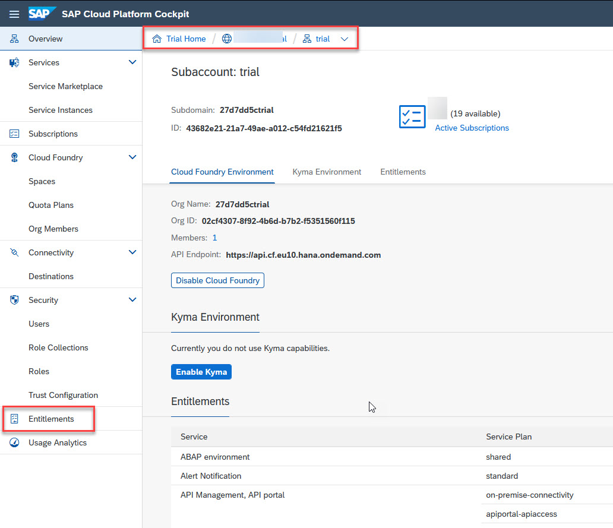  

2. Click *Configure Entitlements*, then click *Add Service Plans*.
      
   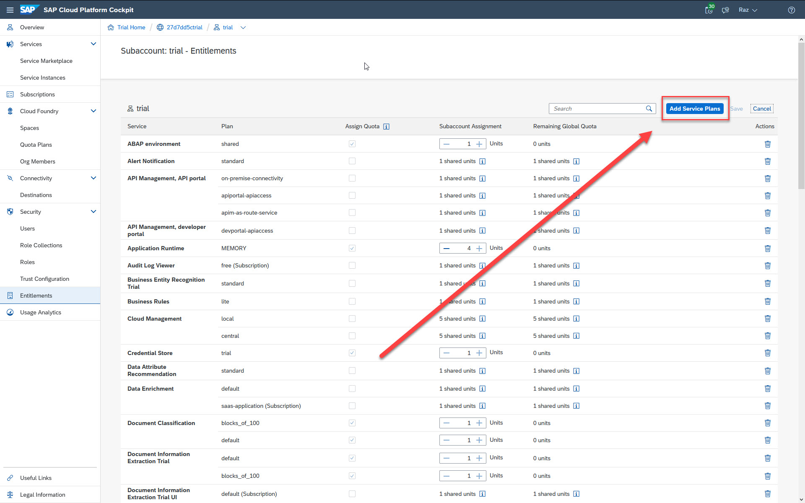  
   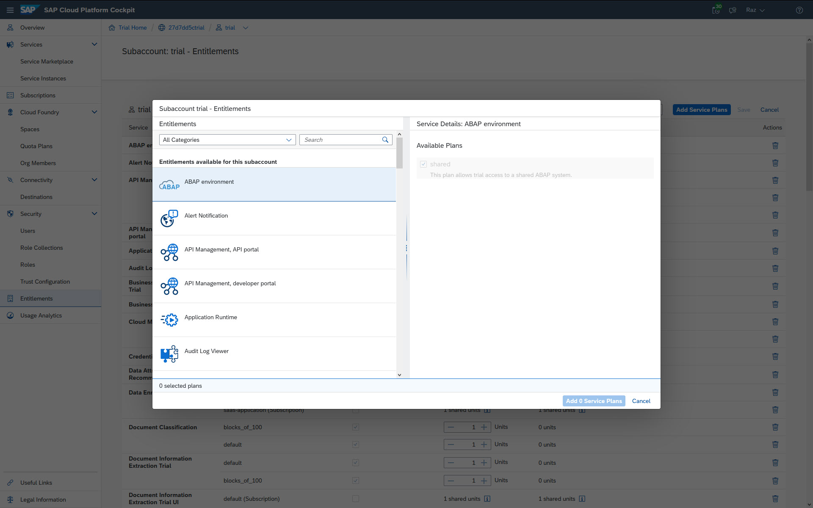  

3. Search for Continuous Integration & Delivery, and click it.
    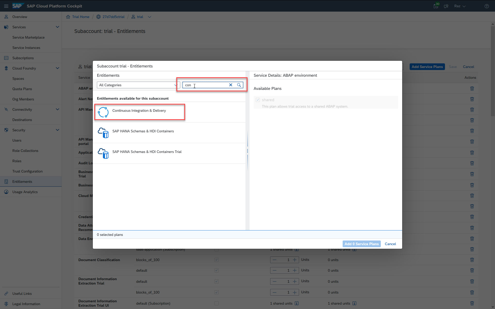  

4. Select the `trial (Subscription) Trial Plan`, and click *Add 1 Service Plans*.
    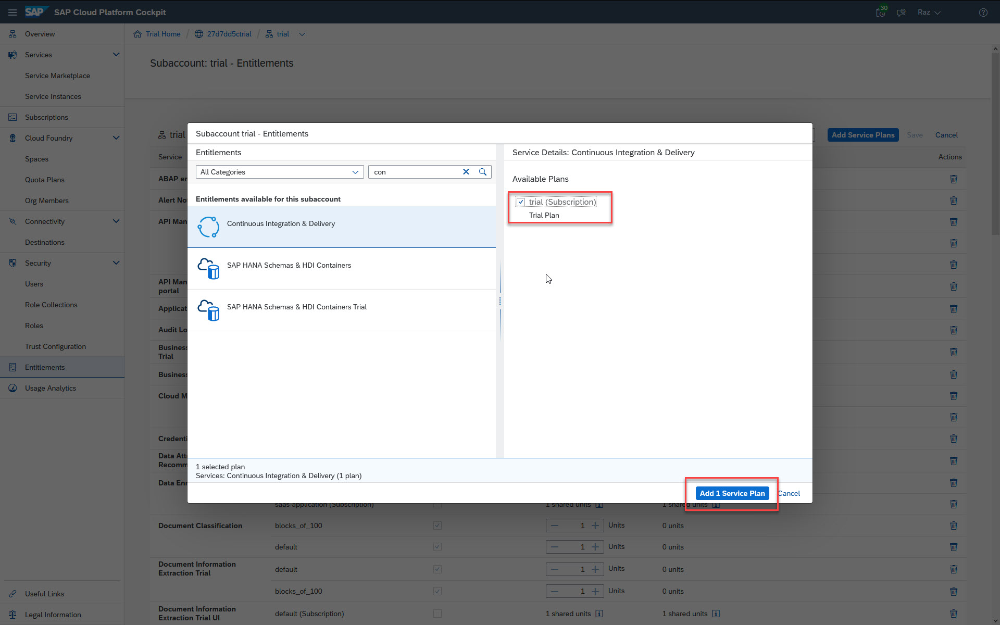  

5. Click *Save*.
    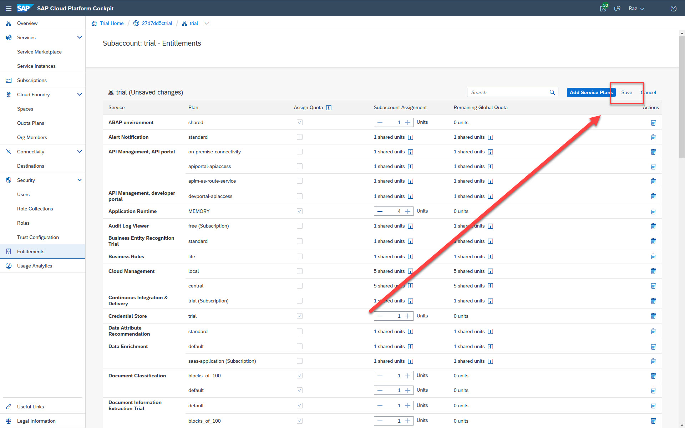  

6. Going back to the Subscriptions of your subaccount, you are able to see SAP Continuous Integration and Delivery service tile.

## Exercise 9.1 - Enable SAP Continuous Integration and Delivery

After completing these steps, you will have subscribed to SAP Continuous Integration and Delivery and assigned the *Administrator* role to your user.

1. In your SAP BTP trial subaccount, navigate to the *Subscriptions* tab.
Here, you can find the Continuous Integration & Delivery service.
    >If you cannot find the Continuous Integration & Delivery service tile, perform the steps in the [preparations](#exercise-90---sap-continuous-integration-and-delivery---preparations) exercise.
  
       

2. Click the service tile, and then click *Subscribe*.
      

3. In your SAP BTP subaccount, click *Security* → *Trust Configuration*.
    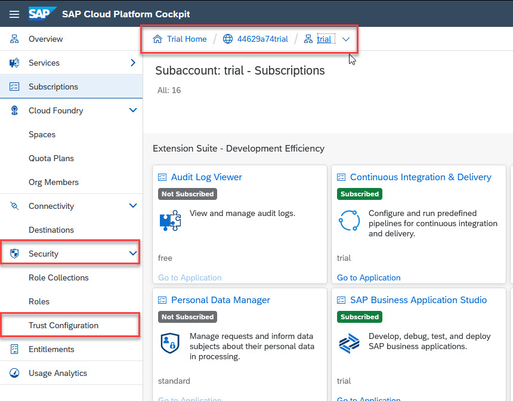  

4. Click the name of your identity provider.
    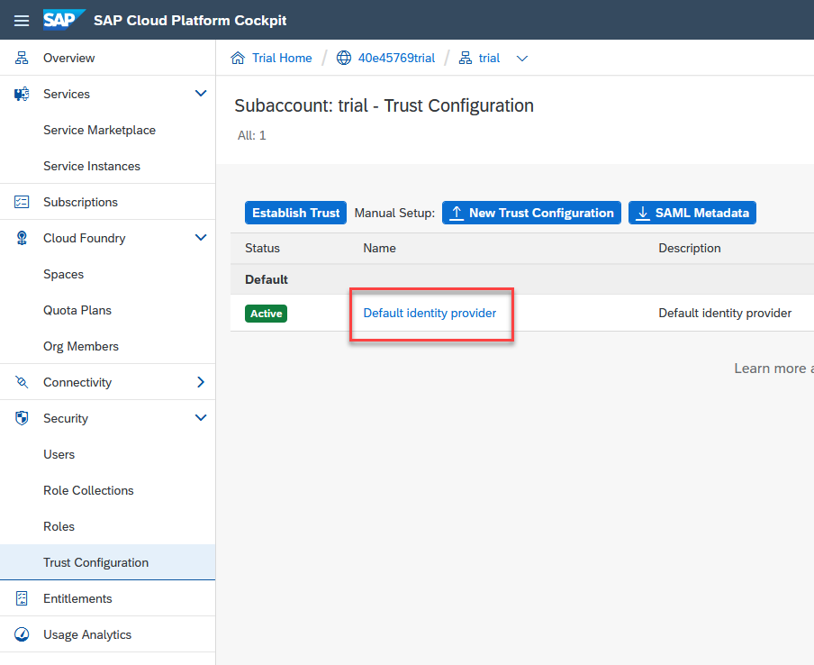  

5. Enter your email address, and click *Show Assignments*.
    >If the user is new to your subaccount, click *Add User* in the confirmation dialog.

     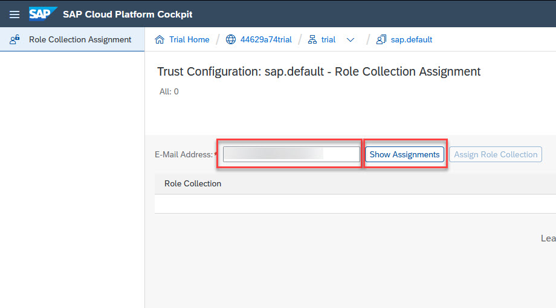  

6. Click *Assign Role Collection*.
    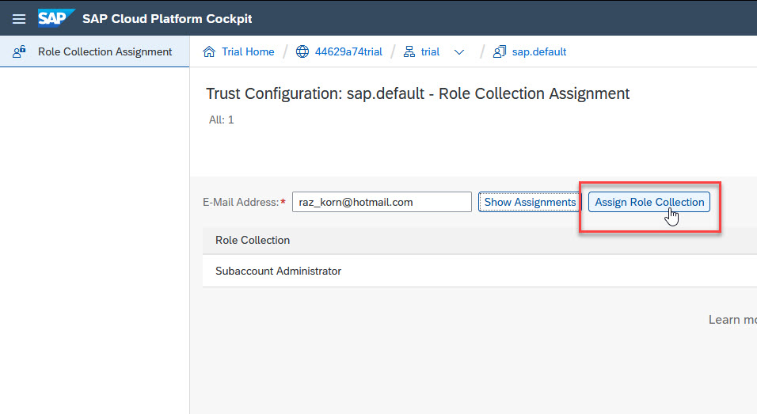  

7. From the drop-down list, select *CICD Service Administrator*.
    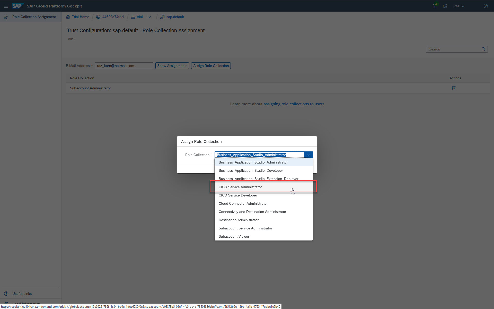  

8. Click *Assign Role Collection*.  
    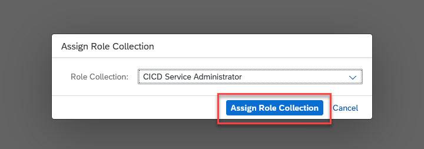  

    >Verify that the *CICD Service Administrator* appears in the *Role Collections* list.
    > 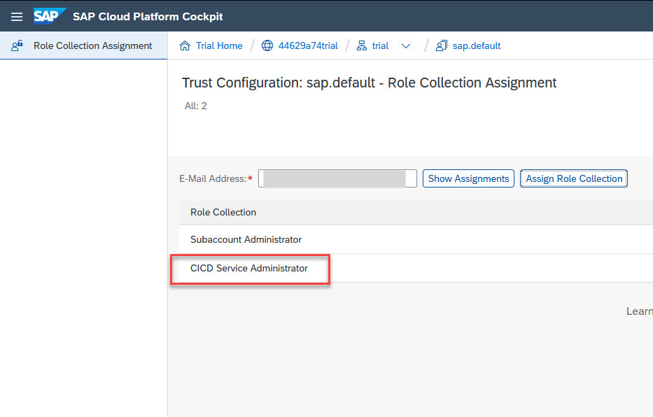 

## Exercise 9.2 - Configure Credentials in SAP Continuous Integration and Delivery

After completing these steps, you will have configured credentials for connecting SAP Continuous Integration and Delivery to other services.

1. In your SAP BTP subaccount, click *Subscriptions*.

2. In the *Extension Suite - Development Efficiency* category, locate the *Continuous Integration & Delivery* tile.

3. Click *Go to Application*.

4. Use your SAP BTP credentials to log in to the application.

5. If your GitHub repository is *private*, configure credentials for it.    
    >If your GitHub repository is *public*, you can skip this step.

    >In the *Credentials* tab in SAP Continuous Integration and Delivery, click *+* *(Create Credentials)*.
    >  
  
    >| Parameter | Value |
    >|:-----|:----------|
    >| Name | github |
    >| Type | Basic Authentication |
    >| Username | Your GitHub username |
    >| Password | Your GitHub personal access token |

    > 

    >*Name* must be unique in your SAP BTP subaccount. In this example, the name is *github*.
  
6. Go to the *Credentials* tab and click *+* *(Create Credentials)* to create credentials for deploying to the SAP BTP, Cloud Foundry runtime.
      

    >| Parameter | Value |
    >|:-----|:----------|
    >| Name | cfdeploy |
    >| Type | Basic Authentication |
    >| Username | Your SAP BTP username |
    >| Password | Your SAP BTP password |

    > 

    >*Name* must be unique in your SAP BTP subaccount. In this example, the name is *cfdeploy*.

## Exercise 9.3 - Configure a CI/CD Job

After completing these steps, you will have configured a job in SAP Continuous Integration and Delivery.

1. In the *Jobs* tab in SAP Continuous Integration and Delivery, click *+* to open the *Create Job* view.
    

2. For *General Information*, select the following:
    >| Parameter | Value | 
    >|:-----|:----------|
    >| Job Name * | Procurement |
    >| Repository | See below |
    >| Branch ** | main |
    >| Pipeline | SAP Fiori in the Cloud Foundry environment |
    >| Version | (default) |
    >| State | ON (default)) |
     

    >\* For *Job Name*, enter name that is unique in your SAP BTP subaccount. In this example, the name of the job is *Procurement*.

    >\*\* For *Branch*, enter the GitHub branch from which you want to receive push events.

2. For *General Information > Repository*, select the following:
    >| Parameter | Value | 
    >|:-----|:----------|
    >| Name | products-inventory |
    >| Clone URL | URL of your GitHub repository |
    >| Credentials * | URL of your GitHub repository |
    >| Cloud Connector | empty (default) |
    >| Webhook Event receiver > Type | GitHub (default) |
    >| Webhook Event receiver > Webhook Credential | <GENERATE> (default) |
    >| Webhook Event receiver > State | ON (default) |
     

    >\* If your GitHub repository is private, for *Credentials*, enter the credentials to access your GitHub Repository, which you've created in exercise 9.2.5. If your GitHub repository isn't private, leave this field empty.

     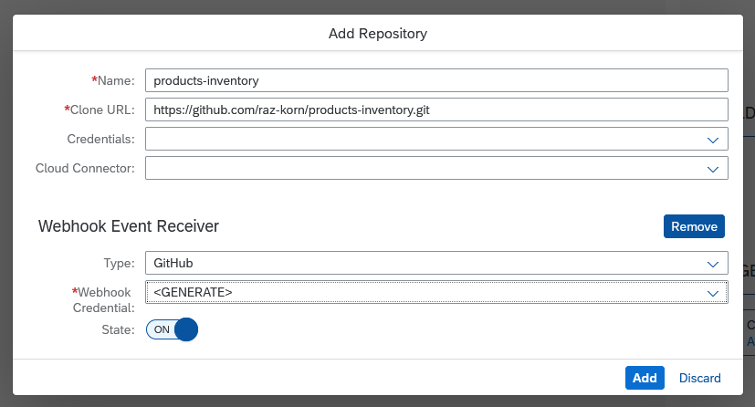  

3. Following the above steps, the *General Information* of the *Create Job* view should look as follows:
      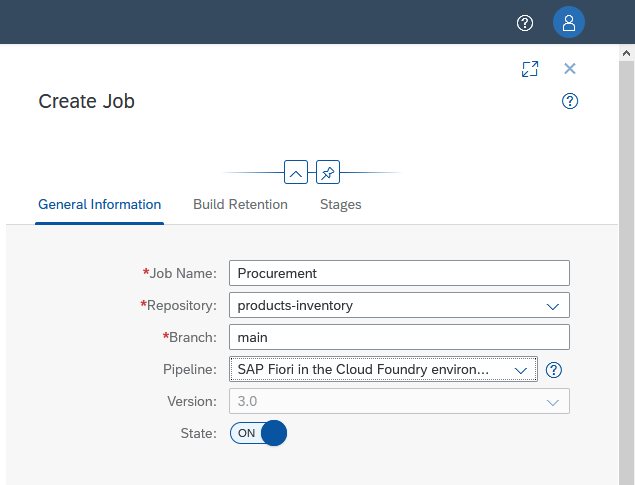  

3. For *Build Retention*, keep the defaults.
      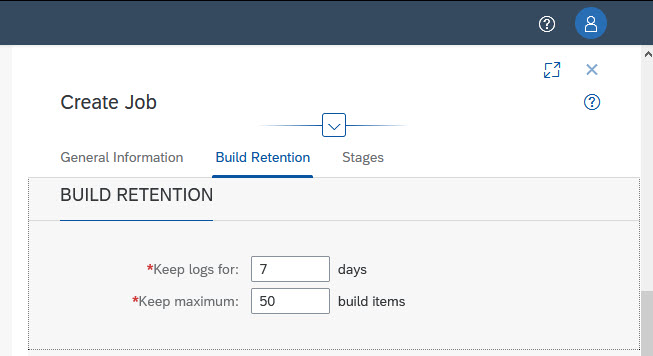  

4. For *Stages*, select the following:
    >| Parameter | Value | 
    >|:-----|:----------|
    >| Build | On (default) |
    >| Test | Off (default) |
    >| Malware Scan | On (default) |
    >| Deploy | On |
    >| Upload to Transport Management Service | Off (default) |
     

    >To make the parameters available, you may need to click the information message in the *Stages* section or click the *Stages* tab title.

      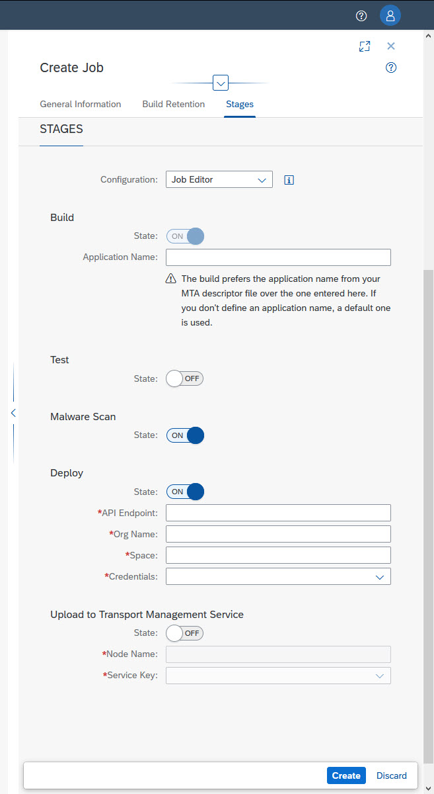  

5. Provide the needed information for the *Deploy* task. You can get your API endpoint (e.g. for EU trial ), org name, and space name from your subaccount overview in the SAP Cloud Platform cockpit:
    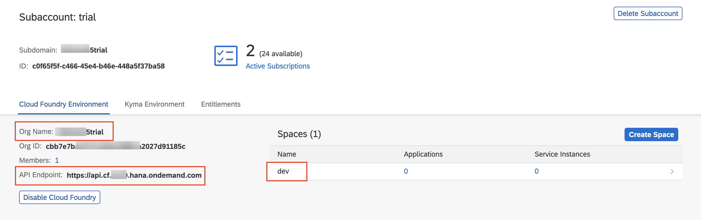  

    >EU trial API Endpoint: https://api.cf.eu10.hana.ondemand.com

    >US trial API Endpoint: https://api.cf.us10.hana.ondemand.com

    >If you get an error indication - remove the `/` at the end.

6. Click the *cfdeploy* credentials that you created in a previous step.
    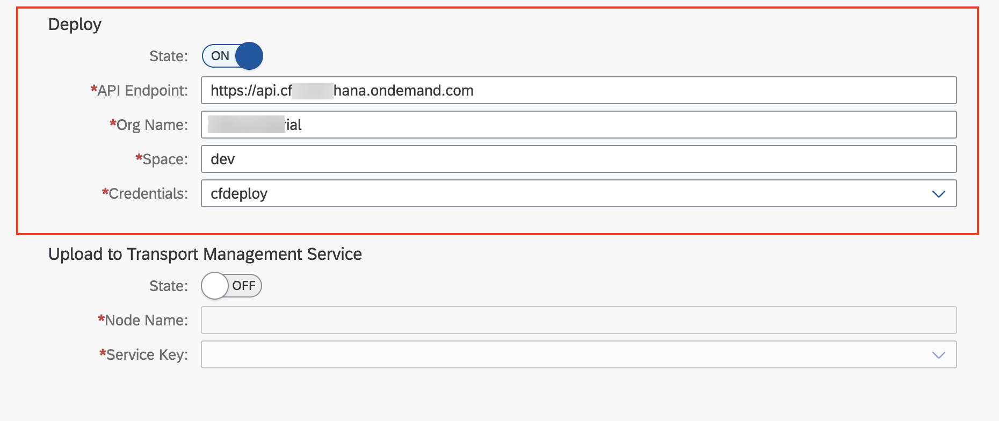  

7. Click *Create*.

## Exercise 9.4 - Configure a GitHub Webhook

1. Open the detail view of an existing job in the *Jobs* tab and under *General Information*, and click *Webhook Data*.
    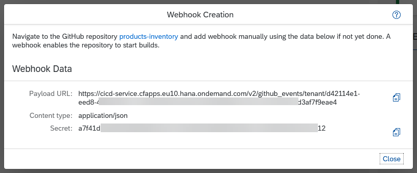  

2. In your project's GitHub repository, go to the *Settings* tab.

3. In the navigation pane, click *Webhooks*.

4. Click *Add webhook*.
      

5. Enter the *Payload URL*, *Content type*, and *Secret* from the *Webhook Creation* pop-up in SAP Continuous Integration and Delivery. For all other settings, leave the default values.

6. Click *Add webhook*.
      

## Summary

You've enabled the SAP Continuous Integration and Delivery service and created a predefined continuous integration and delivery pipeline. You've configured a GitHub webhook that links between the GitHub repository you created in a previous exercise and the pipeline. Now, whenever the GitHub repository updates, a build of the pipeline is triggered, which automatically builds, tests, and deploys your app to your space in SAP BTP, Cloud Foundry runtime.

Continue to - [Exercise 10 - Connect Your Project to SAP Continuous Integration and Delivery - Update Internationalization (i18n)](../ex10/README.md).
