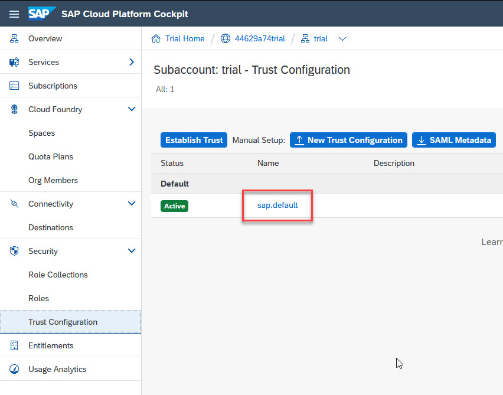
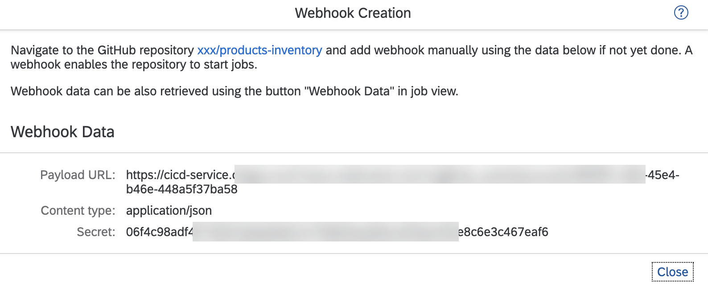

# Exercise 9 - Connect Your Project to SAP Cloud Platform Continuous Integration and Delivery Service - Set Up the Service

In this exercise, you will enable SAP Cloud Platform Continuous Integration and Delivery, and configure and run a predefined continuous integration and delivery (CI/CD) pipeline that automatically tests, builds, and deploys your code changes.

## Exercise 9.1 - Enable SAP Cloud Platform Continuous Integration and Delivery

After completing these steps, you will have subscribed to SAP Cloud Platform Continuous Integration and Delivery and assigned the *Administrator* role to your user.

1. In your SAP Cloud Platform trial subaccount, navigate to the *Subscriptions* tab.
Here, you can find the Continuous Integration & Delivery service:
      

2. Click the service tile, and then click *Subscribe*.
      

3. In your SAP Cloud Platform subaccount, click *Security* → *Trust Configuration*.
      

4. Click the name of your identity provider.
      

5. Enter your email address, and click *Show Assignments*.
  >If the user is new to your subaccount, click *Add User* in the confirmation dialog.
      

6. Click *Assign Role Collection*.
      

7. From the drop-down list, select *CICD Service Administrator*.
      

8. Click *Assign Role Collection*.  
      

  >Verify that the *CICD Service Administrator* appears in the *Role Collections* list.
  >  

## Exercise 9.2 - Configure Credentials in SAP Cloud Platform Continuous Integration and Delivery

After completing these steps, you will have configured credentials for connecting SAP Cloud Platform Continuous Integration and Delivery to other services.

1. In your SAP Cloud Platform subaccount, click *Subscriptions*.

2. In the *Extension Suite - Development Efficiency* category, locate the *Continuous Integration & Delivery* tile.

3. Click *Go to Application*.

4. Use your SAP Cloud Platform credentials to log in to the application.

5. If your GitHub repository is *private*, configure credentials for it.    
  >If your GitHub repository isn't private, you can skip this step.

  >In the *Credentials* tab in SAP Cloud Platform Continuous Integration and Delivery, click *+* *(Create Credentials)*.
  >  
  
  >| Parameter | Value |
  >|:-----|:----------|
  >| Name | github |
  >| Type | Basic Authentication |
  >| Username | Your Github username |
  >| Password | Your GitHub personal access token |
  > 

  >*Name* must be unique in your SAP Cloud Platform subaccount. In this example, the name is *github*.
  
6. Go to the *Credentials* tab and click *+* *(Create Credentials)* to create credentials for deploying to the SAP Cloud Platform Cloud Foundry environment.
      

  >| Parameter | Value |
  >|:-----|:----------|
  >| Name | cfdeploy |
  >| Type | Basic Authentication |
  >| Username | Your SAP Cloud Platform username |
  >| Password | Your SAP Cloud Platform password |
  > 

  >*Name* must be unique in your SAP Cloud Platform subaccount. In this example, the name is *cfdeploy*.

## Exercise 9.3 - Configure a CI/CD Job

After completing these steps, you will have configured a job in SAP Cloud Platform Continuous Integration and Delivery.

1. In the *Jobs* tab in SAP Cloud Platform Continuous Integration and Delivery, click *+* to open the *Create Job* view.
    

2. For *General Information*, select the following:
  >| Parameter | Value | 
  >|:-----|:----------|
  >| Job Name * | Procurement |
  >| Repository URL | URL of your GitHub repository |
  >| Repository Credentials ** |  |
  >| Branch | main |
  >| Pipeline | sap-ui5-cf |
  >| Build | On |
  >| Deploy | On |

  >\* For *Job Name*, enter name that is unique in your SAP Cloud Platform subaccount. In this example, the name of the job is *Procurement*.

  >\*\* If your GitHub repository is private, for *Repository Credentials*, enter the credentials to access your GitHub Repository, which you've created in exercise 9.2.5. If your GitHub repository isn't private, leave this field empty.

3. For *Branch*, enter the GitHub branch from which you want to receive push events.

4. As *Pipeline*, click *sap-ui5-cf*.

5. In the *Stages* section, for the *Build* stage, verify that the *state* is set to *On*. This is the *Build* stage default value.

6. Turn on the *Deploy* task.
      

7. Provide the needed information for the *Deploy* task. You can get your API endpoint (e.g. for EU trial ), org name, and space name from your subaccount overview in the SAP Cloud Platform cockpit:
      

  >EU trial API Endpoint: https://api.cf.eu10.hana.ondemand.com
  >US trial API Endpoint: https://api.cf.us10.hana.ondemand.com

8. Click the *cfdeploy* credentials that you created in a previous step.
      

9. Click *Create*.

10. Whenever you create the first job for a GitHub repository, the *Webhook Creation* pop-up appears, which provides you with the data needed to define a webhook in GitHub. Alternatively, you can open the detail view of an existing job in the *Jobs* tab and under *General Information*, and click *Webhook Data*.
      

13. In your project's GitHub repository, go to the *Settings* tab.

14. In the navigation pane, click *Webhooks*.

15. Click *Add webhook*.
      

16. Enter the *Payload URL*, *Content type*, and *Secret* from the *Webhook Creation* pop-up in SAP Cloud Platform Continuous Integration and Delivery. For all other settings, leave the default values.

8. Click *Add webhook*.
      

## Summary

You've created a project in GitHub to store your source code, and successfully configured a predefined continuous integration and delivery pipeline that whenever the repository updates, the pipeline automatically builds, tests, and deploys your app to your SAP Cloud Platform, Cloud Foundry space.

Continue to - [Exercise 10 - Connect Your Project to SAP Cloud Platform Continuous Integration and Delivery - Update Internationalization (i18n)](../ex10/README.md).